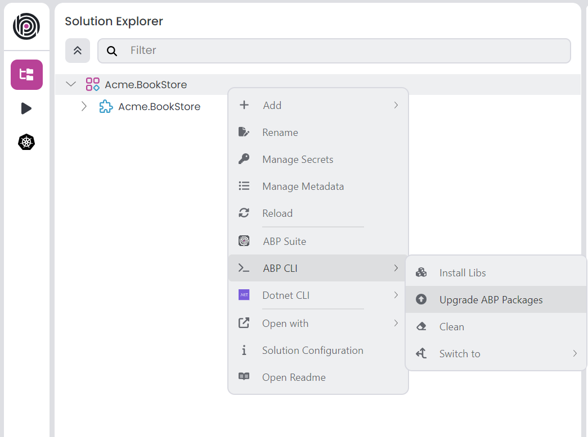

# ABP.IO Platform 9.1 Final Has Been Released!

We are glad to announce that [ABP](https://abp.io/) 9.1 stable version has been released today. 

## What's New With Version 9.1?

All the new features were explained in detail in the [9.1 RC Announcement Post](https://abp.io/community/articles/abp-platform-9.1-rc-has-been-released-wws5l00k), so there is no need to review them again. You can check it out for more details. 

## Getting Started with 9.1

### Creating New Solutions

You can check the [Get Started page](https://abp.io/get-started) to see how to get started with ABP. You can either download [ABP Studio](https://abp.io/get-started#abp-studio-tab) (**recommended**, if you prefer a user-friendly GUI application - desktop application) or use the [ABP CLI](https://abp.io/docs/latest/cli) to create new solutions.

By default, ABP Studio uses stable versions to create solutions. Therefore, it will be creating the solution with the latest stable version, which is v9.1 for now, so you don't need to specify the version.

### How to Upgrade an Existing Solution

You can upgrade your existing solutions with either ABP Studio or ABP CLI. In the following sections, both approaches are explained:

### Upgrading via ABP Studio

If you are already using the ABP Studio, you can upgrade it to the latest version to align it with ABP v9.1. ABP Studio periodically checks for updates in the background, and when a new version of ABP Studio is available, you will be notified through a modal. Then, you can update it by confirming the opened modal. See [the documentation](https://abp.io/docs/latest/studio/installation#upgrading) for more info.

After upgrading the ABP Studio, then you can open your solution in the application, and simply click the **Upgrade ABP Packages** action button to instantly upgrade your solution:



### Upgrading via ABP CLI

Alternatively, you can upgrade your existing solution via ABP CLI. First, you need to install the ABP CLI or upgrade it to the latest version.

If you haven't installed it yet, you can run the following command:

```bash
dotnet tool install -g Volo.Abp.Studio.Cli
```

Or to update the existing CLI, you can run the following command:

```bash
dotnet tool update -g Volo.Abp.Studio.Cli
```

After installing/updating the ABP CLI, you can use the [`update` command](https://abp.io/docs/latest/CLI#update) to update all the ABP related NuGet and NPM packages in your solution as follows:

```bash
abp update
```

You can run this command in the root folder of your solution to update all ABP related packages.

## Migration Guides

There are a few breaking changes in this version that may affect your application. Please read the migration guide carefully, if you are upgrading from v9.0: [ABP Version 9.1 Migration Guide](https://abp.io/docs/latest/release-info/migration-guides/abp-9-1)

## Community News

### New ABP Community Articles

As always, exciting articles have been contributed by the ABP community. I will highlight some of them here:

* [URL-Based Localization](https://abp.io/community/articles/urlbased-localization-3ivzinbb) by [Alper Ebiçoğlu](https://twitter.com/alperebicoglu)
* [Building a CRUD API with ABP Framework, ASP.NET Core, and PostgreSQL](https://abp.io/community/articles/building-a-crud-api-with-abp-framework-asp.net-core-and-postgresql-elrj0old) by [Berkan Şaşmaz](https://github.com/berkansasmaz) 
* [Encryption and Decryption in ABP Framework](https://abp.io/community/articles/encryption-and-decryption-in-abp-framework-37uqhdwz) by [Liming Ma](https://github.com/maliming)
* [Migrate Your DB from the Web Application - Adding a DB Migration Controller](https://abp.io/community/articles/migrate-your-db-from-the-web-application-adding-a-db-migration-controller-in-abp-framework-x3u3uvk3) by [Alper Ebiçoğlu](https://twitter.com/alperebicoglu)
* [Containerization: Blazor WASM + JWT Web API => Docker](https://abp.io/community/articles/containerization-blazor-wasm-jwt-web-api-docker-i3eirlsf) by [Bart Van Hoey](https://abp.io/community/members/bartvanhoey)
* [Configuring Post-Logout Redirect URI in ABP Based Blazor Applications with OpenIddict](https://abp.io/community/articles/configuring-postlogout-redirect-uri-in-abp-based-blazor-applications-with-openiddict-1t84suxg) by [Engincan Veske](https://github.com/EngincanV)

Thanks to the ABP Community for all the content they have published. You can also [post your ABP related (text or video) content](https://abp.io/community/posts/create) to the ABP Community.

### ABP Community Talks 2025.2: Real World Problems and Solutions with AI


In this episode of ABP Community Talks (2025.2), Decision Tree joined us to explore how AI is being leveraged to solve real-world problems, showcasing a practical use case of AI applications.

> You can re-watch the talk from [here](https://www.youtube.com/watch?v=CXpWjxCIY_E).

## About the Next Version

The next feature version will be 9.2. You can follow the [release planning here](https://github.com/abpframework/abp/milestones). Please [submit an issue](https://github.com/abpframework/abp/issues/new) if you have any problems with this version.
