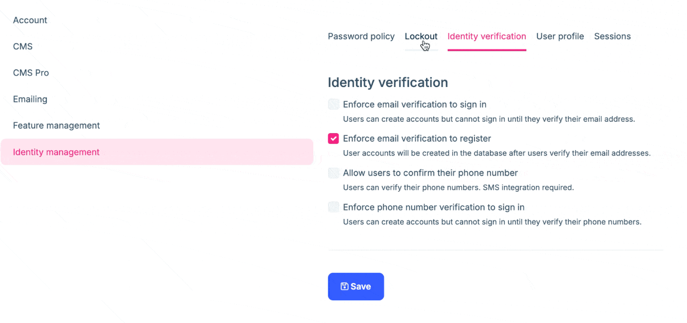

# ABP Platform 9.2 RC Has Been Released

We are happy to release [ABP](https://abp.io) version **9.2 RC** (Release Candidate). This blog post introduces the new features and important changes in this new version.

Try this version and provide feedback for a more stable version of ABP v9.2! Thanks to you in advance.

## Get Started with the 9.2 RC

You can check the [Get Started page](https://abp.io/get-started) to see how to get started with ABP. You can either download [ABP Studio](https://abp.io/get-started#abp-studio-tab) (**recommended**, if you prefer a user-friendly GUI application - desktop application) or use the [ABP CLI](https://abp.io/docs/latest/cli).

By default, ABP Studio uses stable versions to create solutions. Therefore, if you want to create a solution with a preview version, first you need to create a solution and then switch your solution to the preview version from the ABP Studio UI:


## Migration Guide

There are a few breaking changes in this version that may affect your application. Please read the migration guide carefully, if you are upgrading from v9.x or earlier: [ABP Version 9.2 Migration Guide](https://abp.io/docs/9.2/release-info/migration-guides/abp-9-2)

## What's New with ABP v9.2?

In this section, I will introduce some major features released in this version.
Here is a brief list of titles explained in the next sections:

* Added `ApplicationName` Property to Isolate Background Jobs & Background Workers
* Docs Module: Added "Alternative Words" to Filter Items
* Introducing the Bunny BLOB Storage Provider
* Upgraded `MongoDB.Driver` to v3.1.0
* Using Timezone Settings to Display Datetime
* Identity Pro Module: Require Email Verification to Register
* Switching users during OAuth login

### Added ApplicationName Property to Isolate Background Jobs & Background Workers

ABP's [Background Jobs Module](https://abp.io/docs/latest/modules/background-jobs) has been enhanced with a new `ApplicationName` property that helps isolate jobs and workers across multiple applications sharing the same database.

Previously, when different applications used the BackgroundJobs module and shared a database, an application might encounter jobs that didn't belong to it. This would lead to failed processing attempts and marking jobs as `IsAbandoned = true` with a "Undefined background job for the job name" error, preventing these jobs from ever being executed.

With the new `ApplicationName` property, applications now properly filter jobs at the repository level, ensuring each application only processes job types it recognizes. This prevents the incorrect abandonment of jobs and ensures consistent behavior in multi-application scenarios.

You can set `ApplicationName` of `AbpBackgroundJobWorkerOptions` to your application name to isolate jobs and workers across multiple applications sharing the same database:

```csharp
public override void PreConfigureServices(ServiceConfigurationContext context)
{
    PreConfigure<AbpBackgroundJobWorkerOptions>(options =>
    {
        options.ApplicationName = context.Services.GetApplicationName()!;
    });
}
```

> For more information, please refer to the [Background Jobs Module](https://abp.io/docs/latest/modules/background-jobs) documentation and the [PR](https://github.com/abpframework/abp/pull/22169) that added this feature.

### Docs Module: Added "Alternative Words" to Filter Items

[ABP's Docs Module](https://abp.io/docs/9.2/modules/docs) now supports "alternative words" to enhance the search functionality when filtering documentation items. This feature addresses a common user experience issue where users might search using terminology different from what appears in the documentation.

For example, when a user searches for "Error" in the documentation, they may actually be looking for content related to "Exception Handling." With this new feature, documentation items can now be configured with alternative keywords that are considered during filtering.

The implementation allows defining optional "keywords" for items in the navigation tree. For example:

```json
{
  "text": "Exception Handling",
  "path": "framework/fundamentals/exception-handling.md",
  "keywords": ["Error", "Another Value"]
}
```

When users search or filter content, the system now considers both the original text and these alternative keywords, improving discoverability of relevant documentation sections. This enhancement makes the documentation more accessible and user-friendly, especially for newcomers who might not be familiar with the exact terminology used in the ABP documentation.

### Introducing the Bunny BLOB Storage Provider

ABP v9.2 RC introduces a new BLOB storage provider for [Bunny Storage](https://bunny.net/storage/), a global edge storage solution. This addition expands ABP's BLOB Storage options beyond the existing providers like Azure, AWS, and others.

The [Bunny BLOB Storage Provider](https://abp.io/docs/9.2/framework/infrastructure/blob-storing/bunny) allows ABP applications to seamlessly integrate with Bunny's CDN-backed storage service, which offers high-performance content delivery through its global network.

To use this new provider, you'll need to:

* Run `abp add-package Volo.Abp.BlobStoring.Bunny` command.
* And then configure the provider in your module's `ConfigureServices` method:

```csharp
Configure<AbpBlobStoringOptions>(options =>
{
    options.Containers.ConfigureDefault(container =>
    {
        container.UseBunny(bunny =>
        {
            bunny.StorageZoneName = "your-storage-zone";
            bunny.ApiKey = "your-api-key";
            bunny.Region = "your-region"; // de, ny, la, sg, or sy
        });
    });
});
```

This integration provides ABP applications with an efficient and globally distributed storage solution, particularly beneficial for applications requiring fast content delivery across different geographical regions. To use this new provider and make the related configurations, you can refer to the [Bunny Storage Provider](https://abp.io/docs/9.2/framework/infrastructure/blob-storing/bunny) documentation always.

> This new BLOB Storage provider is contributed by [@suhaib-mousa](https://github.com/suhaib-mousa). Thanks to him for his contribution! 
> We are always happy to see the community contributing to the ABP Framework and encouraging them to contribute more.

### Upgraded `MongoDB.Driver` to `v3.1.0`

ABP v9.2 RC includes an upgrade to `MongoDB.Driver` version `3.1.0`. This significant version bump from previous releases brings several improvements and new features that benefit ABP applications using MongoDB as their database.

The upgrade provides:

* Async/Await Support: Write non-blocking, asynchronous code easily.
* Fluent API: Build queries and updates intuitively with Builders.
* LINQ Support: Use LINQ for querying MongoDB collections.
* and more ...

> For more information, please refer to the [MongoDB.Driver release notes](https://github.com/mongodb/mongo-csharp-driver/releases/tag/v3.1.0).

We have prepared a [migration guide](https://abp.io/docs/9.2/release-info/migration-guides/MongoDB-Driver-2-to-3) for this upgrade. Please refer to it to learn more about the changes and how to migrate your application.

### Using Timezone Settings to Display Datetime

A significant enhancement in ABP v9.2 is the ability to use timezone settings to display `DateTime` values according to the user's or application's configured timezone. Introduced in `v9.2.0-rc.2`, this feature addresses the common challenge of ensuring users see accurate time information, regardless of their geographical location.

Previously, `DateTime` values were often shown in the server's timezone or in UTC, which could cause confusion for users in different timezones. With this new feature, ABP applications can now respect the configured timezone and automatically convert and display datetime values accordingly.

**Before setting the timezone:**

Consider a scenario where you have a list of books, and the `CreationTime` property is displayed without any timezone consideration. It may appear in the server's default timezone:


*(Screenshot of a Books page showing the CreationTime in a default timezone.)*

**Setting the timezone:**

To set the timezone, start by configuring the `AbpClockOptions` in your module's `ConfigureServices` method:

```csharp
Configure<AbpClockOptions>(options =>
{
    options.Kind = DateTimeKind.Utc;
});
```

> By setting the `Kind` property of `AbpClockOptions` to `DateTimeKind.Utc`, ABP will normalize all datetime values. Times stored in the database and returned to the frontend will be in UTC. Additionally, the `SupportsMultipleTimezone` property of the `IClock` service will be **true**, and you’ll be able to configure the timezone from the UI under the _Settings_ page.

After setting the `Kind` property, you can run your application and configure the timezone from the UI under the _Settings_ page. For example, set the timezone to "Asia/Tokyo (+09:00)":


*(Screenshot showing the configuration setting for Abp.Timing.TimeZone, set to "Asia/Tokyo (+09:00)".)*

> ABP provides the `Abp.Timing.TimeZone` setting, which allows you to configure the desired timezone at the application, tenant, or user level and this setting can be configured in the UI under the _Settings_ page, inside of the _Time Zone_ tab.

**After setting the timezone:**

Once the timezone is configured, ABP automatically handles the conversion and display of `DateTime` values. The `CreationTime` on the _Books_ page will now be shown in the **"Asia/Tokyo"** timezone.


*(Screenshot of the _Books_ page after setting the timezone, showing the `CreationTime` adjusted to the "Asia/Tokyo" timezone.)*

This feature utilizes the `IClock` service, which provides methods like `ConvertToUserTime` and `ConvertToUtc` to facilitate timezone conversions. By configuring the `Abp.Timing.TimeZone` setting, developers can ensure a consistent and user-friendly experience across applications with a global user base.
> For a more detailed guide on implementing and using this feature, refer to the article: [Developing a Multi-Timezone Application Using the ABP Framework](https://abp.io/community/articles/developing-a-multitimezone-application-using-the-abp-framework-zk7fnrdq). It offers step-by-step instructions and examples for handling multi-timezone scenarios in ABP applications.

### Identity Pro Module: Require Email Verification to Register

[ABP Identity Pro module](https://abp.io/docs/9.2/modules/identity-pro) has been enhanced with a new feature that allows administrators to require email verification during the registration process. This security improvement ensures that users must verify their email addresses before their registration is considered complete. Enabling this feature is especially important for applications that want to prevent spam registrations.

Administrators can enable or disable this feature through the **Identity management -> Identity Verification (tab)** settings page (by checking the `Enforce email verification to register` checkbox):



### Switching users during OAuth login

If you have an OAuth/Auth Server application using the [ABP Account Pro module](https://abp.io/docs/9.2/modules/account-pro) , you can pass the `prompt=select_account` parameter to force the user to select an account.


For more information, please refer to the [Switching users during OAuth login](https://abp.io/docs/9.2/modules/account-pro#switching-users-during-oauth-login) documentation.

### New ABP Community Articles

There are exciting articles contributed by the ABP community as always. I will highlight some of them here:

* [Implementing CQRS with MediatR in ABP](https://abp.io/community/articles/implementing-cqrs-with-mediatr-in-abp-xiqz2iio) by [Engincan Veske](https://github.com/EngincanV)
* [Using Vue Components in a Razor Pages ABP Application](https://abp.io/community/articles/using-vue-components-in-a-razor-pages-abp-application-z3jr07tv) by [Enis Necipoglu](https://github.com/enisn)
* [Using ABP's AWS Blob Storing Provider with DigitalOcean Spaces](https://abp.io/community/articles/using-abps-aws-blob-storing-provider-with-digitalocean-spaces-7hlyb25g) by [Suhaib Mousa](https://abp.io/community/members/suhaib-mousa)
* [Video Post: Using Vue Components in a Razor Pages ABP Application](https://abp.io/community/articles/using-vue-components-in-a-razor-pages-abp-application-z3jr07tv) by [Enis Necipoglu](https://github.com/enisn)
* [Understanding the Embedded Files in ABP Framework](https://abp.io/community/articles/understanding-the-embedded-files-in-abp-framework-nsrp8aa9) by [Liming Ma](https://github.com/maliming)
* [How to Change the CurrentUser in ABP?](https://abp.io/community/articles/how-to-change-the-currentuser-in-abp-i3uu1m7g) by [Engincan Veske](https://github.com/EngincanV)


Thanks to the ABP Community for all the content they have published. You can also [post your ABP-related (text or video) content](https://abp.io/community/posts/create) to the ABP Community.

## Conclusion

This version comes with some new features and a lot of enhancements to the existing features. You can see the [Road Map](https://abp.io/docs/9.2/release-info/road-map) documentation to learn about the release schedule and planned features for the next releases. Please try ABP v9.2 RC and provide feedback to help us release a more stable version.

Thanks for being a part of this community!
