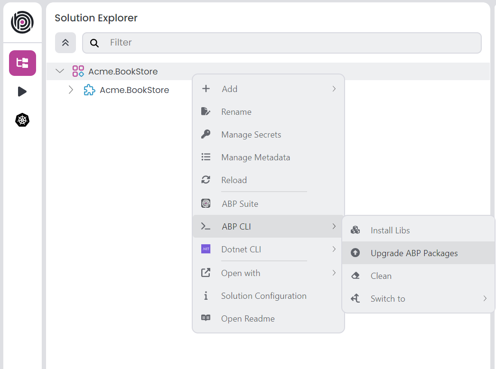

# ABP.IO Platform 9.2 Final Has Been Released!

We are glad to announce that [ABP](https://abp.io/) 9.2 stable version has been released today. 

## What's New With Version 9.2?

All the new features were explained in detail in the [9.2 RC Announcement Post](https://abp.io/community/articles/abp-platform-9.2-rc-has-been-released-jpq072nh), so there is no need to review them again. You can check it out for more details. 

## Getting Started with 9.2

### Creating New Solutions

You can check the [Get Started page](https://abp.io/get-started) to see how to get started with ABP. You can either download [ABP Studio](https://abp.io/get-started#abp-studio-tab) (**recommended**, if you prefer a user-friendly GUI application - desktop application) or use the [ABP CLI](https://abp.io/docs/latest/cli) to create new solutions.

### How to Upgrade an Existing Solution

You can upgrade your existing solutions with either ABP Studio or ABP CLI. In the following sections, both approaches are explained:

### Upgrading via ABP Studio

If you are already using the ABP Studio, you can upgrade it to the latest version. ABP Studio periodically checks for updates in the background, and when a new version of ABP Studio is available, you will be notified through a modal. Then, you can update it by confirming the opened modal. See [the documentation](https://abp.io/docs/latest/studio/installation#upgrading) for more info.

After upgrading the ABP Studio, then you can open your solution in the application, and simply click the **Upgrade ABP Packages** action button to instantly upgrade your solution:



### Upgrading via ABP CLI

Alternatively, you can upgrade your existing solution via ABP CLI. First, you need to install the ABP CLI or upgrade it to the latest version.

If you haven't installed it yet, you can run the following command:

```bash
dotnet tool install -g Volo.Abp.Studio.Cli
```

Or to update the existing CLI, you can run the following command:

```bash
dotnet tool update -g Volo.Abp.Studio.Cli
```

After installing/updating the ABP CLI, you can use the [`update` command](https://abp.io/docs/latest/CLI#update) to update all the ABP related NuGet and NPM packages in your solution as follows:

```bash
abp update
```

You can run this command in the root folder of your solution to update all ABP related packages.

## Migration Guides

There are a few breaking changes in this version that may affect your application. Please read the migration guide carefully, if you are upgrading from v9.x: [ABP Version 9.2 Migration Guide](https://abp.io/docs/9.2/release-info/migration-guides/abp-9-2)

## Community News

### New ABP Community Articles

As always, exciting articles have been contributed by the ABP community. I will highlight some of them here:

* [Liming Ma](https://github.com/maliming) has published 3 new articles:
    * [Integrating .NET AI Chat Template with ABP Framework](https://abp.io/community/articles/integrating-.net-ai-chat-template-with-abp-framework-qavb5p2j)
    * [Resolving Tenant from Route in ABP Framework](https://abp.io/community/articles/resolving-tenant-from-route-in-abp-framework-ah7oru97)
    * [Common Errors in JWT Bearer Authentication](https://abp.io/community/articles/common-errors-in-jwt-bearer-authentication-4u3wrbs5)
* [Engincan Veske](https://engincanveske.substack.com/) has published 3 new articles:
    * [Understanding HttpApi.Client Project & Remote Services in an ABP Based Application](https://abp.io/community/articles/http-api-client-and-remote-services-in-abp-based-application-xkknsp6m)
    * [Using Elsa 3 with the ABP Framework: A Comprehensive Guide](https://abp.io/community/articles/using-elsa-3-workflow-with-abp-framework-usqk8afg)
    * [Implementing Custom Tenant Logo Feature in ABP Framework: A Step-by-Step Guide](https://abp.io/community/articles/implementing-custom-tenant-logo-feature-in-abp-framework-a-stepbystep-guide-sba96ac9)
* [Berkan Şaşmaz](https://berkansasmaz.com/) has published 2 new articles:
    * [Understanding the Domain and Application Layers in ABP Framework](https://abp.io/community/articles/understanding-the-domain-and-application-layers-in-abp-1fipc4x4)
    * [How Do We Maintain Code Quality and Technical Debt in Our .NET Codebase?](https://abp.io/community/articles/how-do-we-maintain-code-quality-and-technical-debt-in-our-.net-codebase-z7glpya1)
* [Enis Necipoğlu](https://github.com/enisn) has published 2 new articles:
    * [White Labeling in ABP Framework](https://abp.io/community/articles/white-labeling-in-abp-framework-5trwmrfm) by [Enis Necipoğlu](https://github.com/enisn)
    * [You do it wrong! Customizing ABP Login Page Correctly](https://abp.io/community/articles/you-do-it-wrong-customizing-abp-login-page-correctly-bna7wzt5)
* [Ariful Islam](https://abp.io/community/members/arif) has published 2 new articles:
    * [Multi-Workspace Management for ABP Applications](https://abp.io/community/articles/multiworkspace-management-for-abp-applications-eghgty3j)
    * [Using Semantic Kernel in the ABP Framework](https://abp.io/community/articles/using-semantic-kernel-in-the-abp-framework-qo5cnuzs)
* [Guide to Add Custom Modules in ABP.IO App](https://abp.io/community/articles/guide-to-add-custom-modules-in-abp.io-app-sttetffa) by [Harsh Gupta](https://abp.io/community/members/harshgupta)
* [Debugging NuGet Packages in ABP.IO: A Complete Guide](https://abp.io/community/articles/debugging-nuget-packages-in-abp.io-a-complete-guide-h13y2033) by [Suhaib Mousa](https://suhaibmousa.com/)
* [Using Microsoft AI Extensions Library and OpenAI to Summarize User Comments](https://abp.io/community/articles/using-microsoft-ai-extensions-library-and-openai-to-summarize-user-comments-gj1lusg7) by [Halil Ibrahim Kalkan](https://twitter.com/hibrahimkalkan) 

Thanks to the ABP Community for all the content they have published. You can also [post your ABP related (text or video) content](https://abp.io/community/posts/create) to the ABP Community.

## About the Next Version

The next feature version will be 9.3. You can follow the [release planning here](https://github.com/abpframework/abp/milestones). Please [submit an issue](https://github.com/abpframework/abp/issues/new) if you have any problems with this version.
