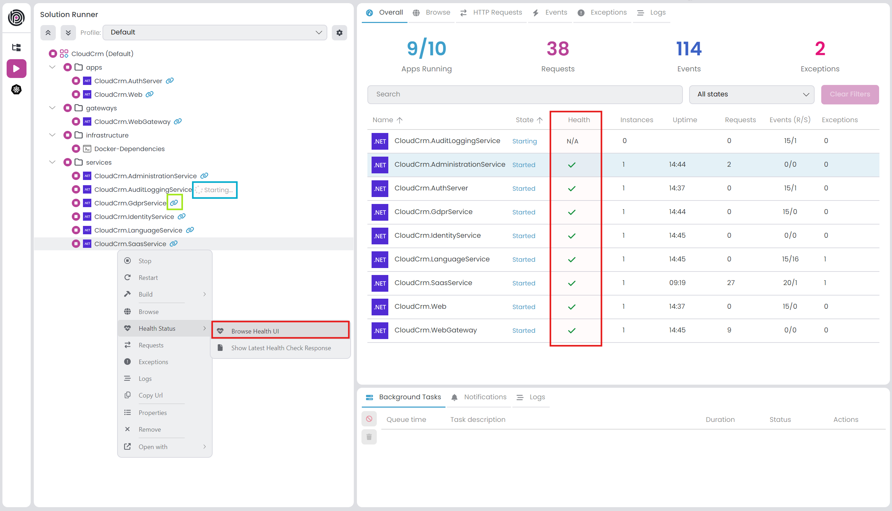
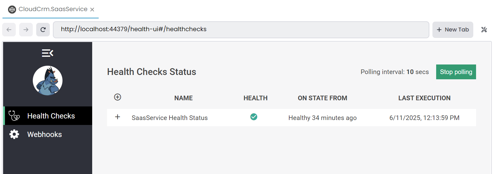
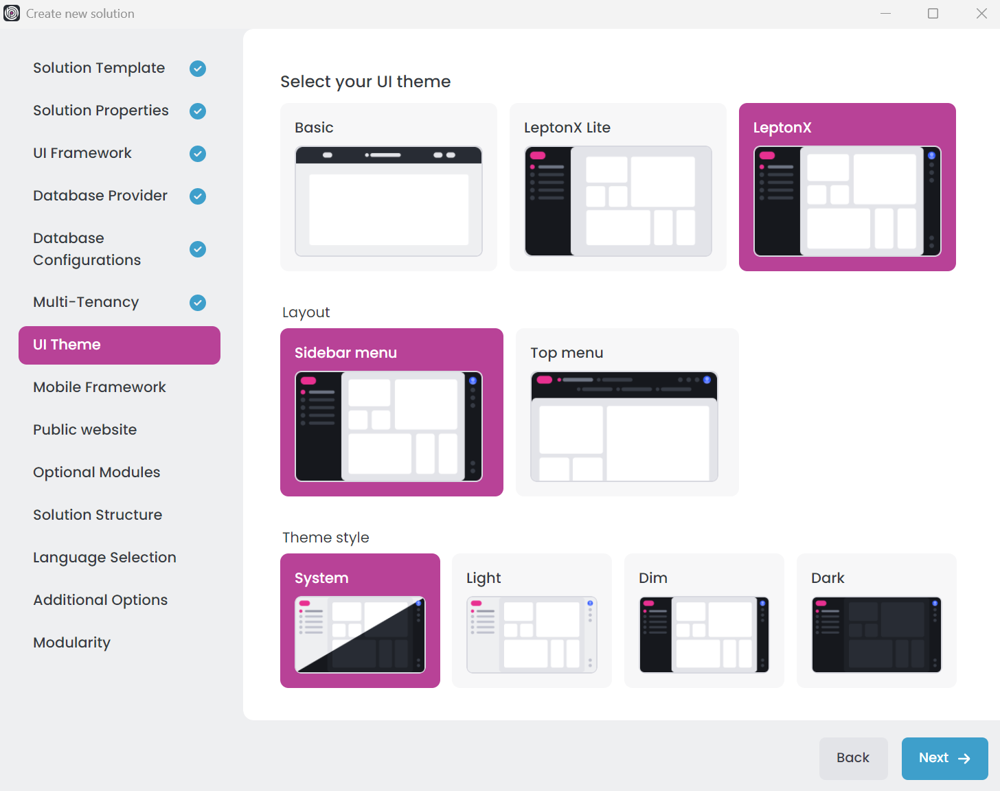
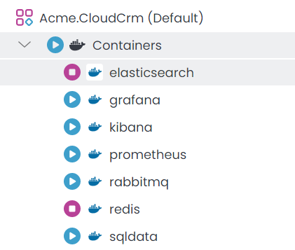
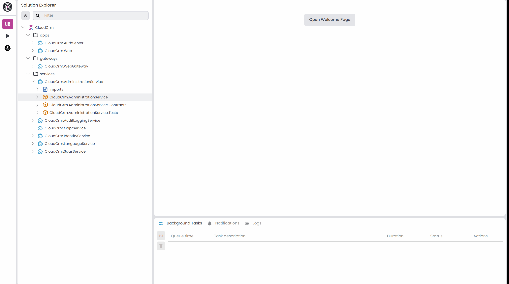
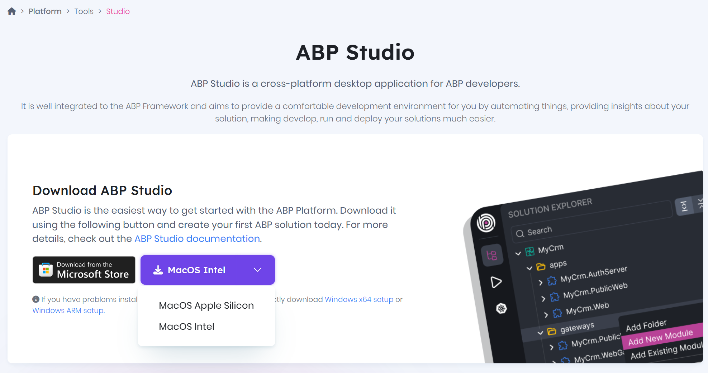
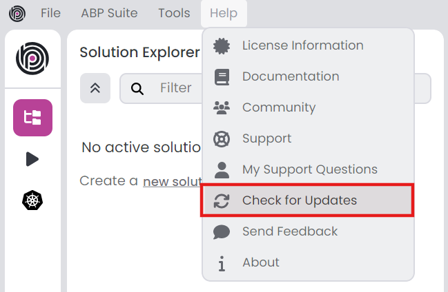

# Announcing ABP Studio 1.0 Stable Release 🚀

It's the moment you've been waiting for! We are thrilled to announce the stable release of ABP Studio v1.0. This milestone marks a significant step forward in our mission to provide a first-class, integrated development environment for ABP developers. Paired with the recently released [ABP v9.2](https://abp.io/community/articles/announcing-abp-9-2-stable-release-061qmtzb), ABP Studio v1.0 brings new features and improvements that will make your development work faster and more efficient.

For the past several months, our core ABP team has been hard at work, focusing on the features that matter most to you, our community of developers. This release is the peak of that effort, bringing a host of improvements and new capabilities to the forefront. Let's dive in and explore what's new in ABP Studio v1.0.

## What's New with ABP Studio v1.0?

ABP Studio v1.0 is all about enhancing your development experience, from project creation to deployment. Here, we'll walk you through some of the latest features we've implemented, along with other key enhancements that make this release truly special.

### ❤️ Solution Runner with Ready/Health Checks

ABP Studio's Solution Runner now provides visual health monitoring that makes tracking your applications' status easily. When you start an application, a spinner indicates it's "starting", then in the *Overall* tab, you can see the application's health (✅ for healthy, ⚠️ for unhealthy) that displays real-time health status:

With [pre-configured health checks](https://abp.io/docs/9.2/solution-templates/layered-web-application/health-check-configuration) in ABP solution templates including database connectivity tests, you get instant feedback on your applications' health. 

When health check UI is configured, you can access comprehensive health dashboards with a dedicated "Browse Health UI" command or see the last health response from the "Show Latest Health Check Response" command:

When you restart applications that are open in your browser, ABP Studio automatically refreshes the pages for you.

### 🎨 Theme Style Selection on Project Creation

When creating a new solution, you can now choose your theme, theme style, and layout right from the project creation wizard instead of having to configure these settings later. ABP Studio lets you pick from [ABP's officially provided themes including Basic, LeptonX Lite, and LeptonX](https://abp.io/docs/latest/ui-themes).

If you select Basic or LeptonX Lite themes, only the theme will be changed. However, if you select the LeptonX theme, you'll get additional options to fine-tune your setup:

- **Theme Style Configuration** - Pick from **System, Light, Dim, or Dark** styles to match how you like your development environment 
- **Layout Options** - **Sidebar menu** / **Top menu**

### 📦 "Container" Application Type for Solution Runner

ABP Studio v1.0 introduces a dedicated "Container" application type that gives you better control over your Docker containers directly from the Solution Runner. Instead of managing all your containers through PowerShell scripts or running them all together, you can now see and control each container individually in the Solution Runner panel.

This new feature replaces the previous _Infrastructure_ folder approach with a cleaner, more intuitive container section. You can now:

- **Start and stop containers individually** - No more starting all containers at once when you only need specific services
- **Monitor container status** - See which containers are running, stopped, or have issues directly in the UI
- **Manage container dependencies** - Control the order and timing of container startup based on your application needs

Whether you're working with databases, message brokers, or other containerized services, the new Container application type makes it much easier to manage your development environment. This is especially useful for microservice architectures where you might want to run only specific services during development or testing.

### ⚙️ Handle Multiple DbContexts When Adding/Removing/Applying Migrations

When working with ABP solutions that have multiple DbContexts (such as when using the separate tenant database option), ABP Studio now intelligently prompts you to select the appropriate DbContext for migration operations. This enhancement ensures you're always working with the correct database context and helps prevent common mistakes when managing multiple databases.

The context selection dialog appears automatically when you perform any of these Entity Framework operations:

- **Adding a new migration** - Choose which DbContext the new migration should target
- **Removing an existing migration** - Select the DbContext from which to remove the migration  
- **Updating the database** - Specify which database context should be updated

## Get Started with ABP Studio v1.0 Today!

ABP Studio v1.0 is built on the solid foundation of the [latest version of ABP Framework, which is v9.2](https://abp.io/community/articles/announcing-abp-9-2-stable-release-061qmtzb). This means that when you create a new project with ABP Studio, you're getting all the latest features, performance improvements, and bug fixes that come with v9.2. This includes updates to dependencies, enhancements to the core framework, and improvements to application modules. 

We are incredibly excited for you to get your hands on ABP Studio v1.0. We believe these new features will make a real difference in your day-to-day development workflow.

### ⬇️ Download ABP Studio 1.0

Ready to get started? You can download the stable v1.0 release right now from the official ABP Studio website: **[https://abp.io/studio](https://abp.io/studio)**

If you are an existing ABP Studio user, it's even easier. You don't need to download the installer again. Simply launch ABP Studio, and it will prompt you to update to the latest version directly from the UI.

> Alternatively, you can click to the *Help -> Check for Updates* context menu item to check for updates and install the latest version:
>
> 

### 🔮 What's Next?

ABP Studio v1.0 represents just the beginning of our journey. We're committed to continuously evolving the platform, adding features that directly address real-world development challenges and enhance your workflow. Our goal is to make ABP Studio the go-to development environment for .NET and ABP Framework developers.

We will keep releasing new versions with exciting features based on our roadmap and your valuable feedback. To give you a sneak peek into what's planned for future releases, you can expect to see:

- **Environment Variable Management:** A dedicated UI to easily manage environment variables for your solutions.
- **OpenTelemetry Integration:** We'll be integrating OpenTelemetry support directly into the startup templates, making distributed tracing and observability a seamless part of your application from day one.
- **and more...**

We are incredibly excited about the future of ABP Studio and can't wait to share the next set of features with you. Your comments and suggestions are invaluable to us. If you have any feedback, please drop a comment below.

Thank you for being part of our community and happy coding!

**The Volosoft Team**
