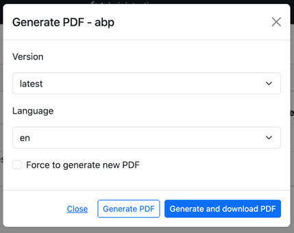
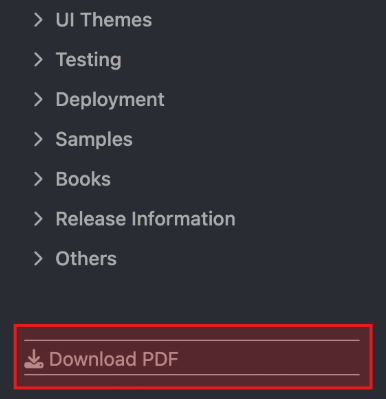
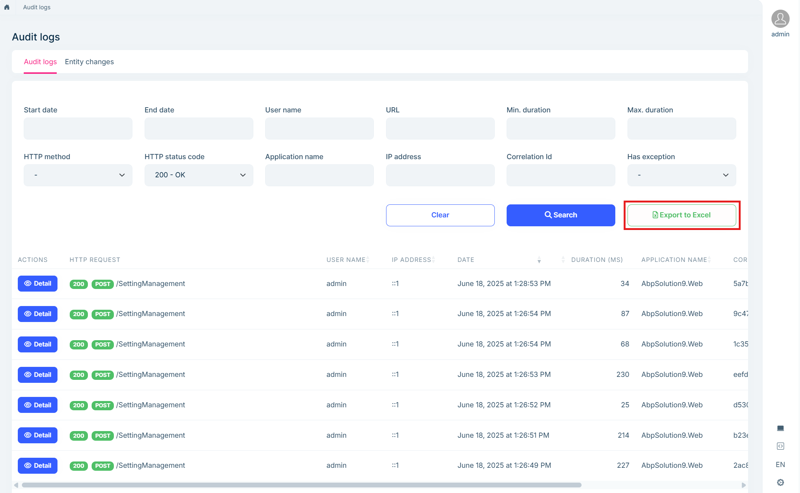
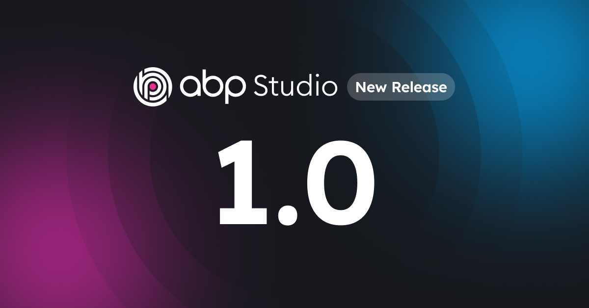
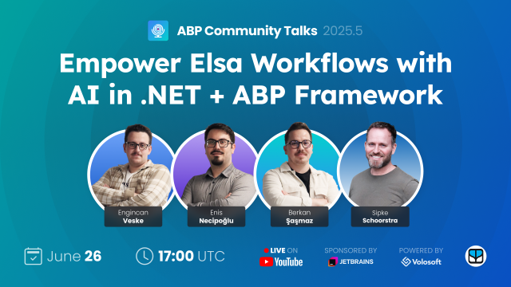

# ABP Platform 9.3 RC Has Been Released

We are happy to release [ABP](https://abp.io) version **9.3 RC** (Release Candidate). This blog post introduces the new features and important changes in this new version.

Try this version and provide feedback for a more stable version of ABP v9.3! Thanks to you in advance.

## Get Started with the 9.3 RC

You can check the [Get Started page](https://abp.io/get-started) to see how to get started with ABP. You can either download [ABP Studio](https://abp.io/get-started#abp-studio-tab) (**recommended**, if you prefer a user-friendly GUI application - desktop application) or use the [ABP CLI](https://abp.io/docs/latest/cli).

By default, ABP Studio uses stable versions to create solutions. Therefore, if you want to create a solution with a preview version, first you need to create a solution and then switch your solution to the preview version from the ABP Studio UI:


## Migration Guide

There are a few breaking changes in this version that may affect your application. Please read the migration guide carefully, if you are upgrading from v9.2 or earlier: [ABP Version 9.3 Migration Guide](https://abp.io/docs/9.3/release-info/migration-guides/abp-9-3)

## What's New with ABP v9.3?

In this section, I will introduce some major features released in this version.
Here is a brief list of titles explained in the next sections:

* Cron Expression Support for Background Workers
* Docs Module: PDF Export
* Angular UI: Standalone Package Structure
* Upgraded to Blazorise v1.7.7
* Audit Logging Module: Excel Export

### Cron Expression Support for Background Workers

We've enhanced the [Background Workers System](https://abp.io/docs/9.3/framework/infrastructure/background-workers) by adding support for Cron expressions when using [Hangfire](https://abp.io/docs/9.3/framework/infrastructure/background-workers/hangfire) or [Quartz](https://abp.io/docs/9.3/framework/infrastructure/background-workers/quartz) as the background worker manager. This new feature provides more flexibility in scheduling background tasks compared to the simple period-based timing system.

Now you can define complex scheduling patterns using standard Cron expressions. For example, you can schedule a task to run: "Every day at midnight", "Every Monday at 9 AM", or "First day of every month".

Here's how you can use it in your background worker:

```csharp
public class MyPeriodicBackgroundWorker : AsyncPeriodicBackgroundWorkerBase
{
    public MyPeriodicBackgroundWorker(
        AbpAsyncTimer timer,
        IServiceScopeFactory serviceScopeFactory)
        : base(timer, serviceScopeFactory)
    {
        // You can either use Period for simple intervals
        Timer.Period = 600000; //10 minutes

        // 👇 or use CronExpression for more complex scheduling 👇
        CronExpression = "0 0/10 * * * ?"; //Run every 10 minutes
    }

    protected async override Task DoWorkAsync(
        PeriodicBackgroundWorkerContext context)
    {
        // Your background work...
    }
}
```

The `CronExpression` property takes precedence over the `Period` property when both are set. This feature is available when you use either the [Hangfire](https://abp.io/docs/9.3/framework/infrastructure/background-workers/hangfire) or [Quartz](https://abp.io/docs/9.3/framework/infrastructure/background-workers/quartz) background worker managers.

> See the [Background Workers documentation](https://abp.io/docs/9.3/framework/infrastructure/background-workers) for more information about configuring and using background workers with Cron expressions.

### Docs Module: PDF Export

We're excited to introduce a new feature in the Docs Module that allows users to export documentation as PDF files. This feature makes it easier for users to access documentation offline or share it with team members who might not have immediate access to the online documentation system.

**Administrators can generate PDF files from the back-office side**:



and **then a "Download PDF" button appears in the document system** (as shown in the image below - the bottom right of the navigation menu -), allowing users to download the compiled documentation as a PDF file:



The feature supports multiple versions of documentation, different language variants, and ensures proper formatting of all content including code blocks and technical documentation.

### Angular UI: Standalone Package Structure

ABP v9.3 introduces support for Angular's standalone components architecture while maintaining **full compatibility with existing module-based applications**. This update aligns with Angular's strategic direction toward standalone components as the recommended approach for building Angular applications.

The key improvements include:

* **Dual-support routing configurations** that work seamlessly with both module-based and standalone approaches
* **ABP Suite integration** for generating code that supports standalone components
* **Updated schematics** that provide templates for both development patterns

This enhancement gives developers the flexibility to choose their preferred Angular architecture. Existing module-based applications **continue to work without modifications**, while new projects can leverage the standalone approach for simplified dependency management, reduced boilerplate code, and better lazy-loading capabilities.

> For developers interested in migrating to standalone components or starting new projects, we'll be publishing a comprehensive blog post with detailed guidance and best practices. In the meantime, you can check [#22829](https://github.com/abpframework/abp/pull/22829) for implementation details of the standalone package structure and make the necessary changes to your project.

### Upgraded to Blazorise v1.7.7

Upgraded the [Blazorise](https://blazorise.com/) library to v1.7.7 for Blazor UI. If you are upgrading your project to v9.3.0, please ensure that all the Blazorise-related packages are using v1.7.7 in your application. Otherwise, you might get errors due to incompatible versions.

> See [#23013](https://github.com/abpframework/abp/pull/23013) for the updated NuGet packages.

### Audit Logging Module: Excel Export

In this version, we've added Excel export capabilities to the [Audit Logging Module](https://abp.io/docs/latest/modules/audit-logging-pro), allowing administrators to export audit logs and entity changes to Excel files for further analysis or reporting purposes.



This feature enables users to:

- Export audit logs with filtering options
- Export entity changes with detailed information
- Receive email notifications when exports are completed or fail
- Download exported files via secure links

The export process runs in the background, and once completed, users receive an email with a download link. This approach ensures that even large audit log exports don't block the UI or time out during processing.

You can configure various aspects of this feature using the `AuditLogExcelFileOptions` in your module's configuration:

```csharp
Configure<AuditLogExcelFileOptions>(options =>
{
    // How long to keep exported files before cleanup
    options.FileRetentionHours = 48;
    
    // Base URL for download links in notification emails
    options.DownloadBaseUrl = "https://yourdomain.com";
    
    // Configure the cleanup worker schedule
    options.ExcelFileCleanupOptions.Period = (int)TimeSpan.FromHours(24).TotalMilliseconds;
    
    // Use cron expression for more advanced scheduling (requires Hangfire or Quartz)
    options.ExcelFileCleanupOptions.CronExpression = "0 2 * * *"; // Run at 2 AM daily
});
```

The module includes pre-configured email templates for notifications about completed or failed exports, ensuring users are always informed about the status of their export requests.

> **Note**: This feature requires a configured BLOB storage provider to store the generated Excel files. See the [BLOB Storing documentation](https://abp.io/docs/9.3/framework/infrastructure/blob-storing) for more information.

For more details about the Audit Logging Module and its Excel export capabilities, please refer to the [official documentation](https://abp.io/docs/9.3/modules/audit-logging-pro).

## Community News

### Announcing ABP Studio 1.0 General Availability 🚀



We are thrilled to announce that ABP Studio has reached version 1.0 and is now generally available! This marks a significant milestone for our integrated development environment designed specifically for ABP developers. The stable release brings several powerful features including:

* Enhanced Solution Runner with health monitoring capabilities
* Theme style selection during project creation (Basic, LeptonX Lite, and LeptonX Themes)
* New "Container" application type for better Docker container management
* Improved handling of multiple DbContexts for migration operations

> For a detailed overview of these features and to learn more about what's coming next, check out our [announcement post](https://abp.io/community/articles/announcing-abp-studio-1-0-general-availability-82yw62bt).

### ABP Community Talks 2025.05: Empower Elsa Workflows with AI in .NET + ABP Framework

In this episode of ABP Community Talks, 2025.05, we are thrilled to host [**Sipke Schoorstra**](https://github.com/sfmskywalker), the creator of the [Elsa Workflows](https://docs.elsaworkflows.io/) library! This month's session is all about **"Empower Elsa Workflows with AI in .NET + ABP Framework"**.



Sipke will join us to demonstrate how you can leverage AI within Elsa Workflows using .NET and the ABP Framework. The session will explore practical techniques and showcase how to integrate AI capabilities to enhance and automate your business processes within the Elsa workflow engine.

> 👉 Don't miss this opportunity to learn directly from the creator of Elsa and see real-world examples of building intelligent, automated workflows! You can register from [here](https://kommunity.com/volosoft/events/abp-community-talks-202505empower-elsa-workflows-with-ai-in-netabp-framework-3965dd32).

### ABP Bootcamp: Mastering Infrastructure & Features

We are excited to announce the very first **ABP Bootcamp: Mastering Infrastructure & Features**! This is a live training program designed to give you hands-on, practical experience with ABP's core infrastructure and features.


Join the ABP Bootcamp to learn directly from the core team in a focused, hands-on program designed for busy developers. Over four days, you'll gain a deep understanding of ABP's infrastructure, best practices, and practical skills you can immediately apply to your projects.

> **Seats are limited!** Don't miss this opportunity to level up your ABP skills with direct guidance from the experts.
>
> 👉 [See full details and reserve your seat!](https://abp.io/bootcamp)

### New ABP Community Articles

There are exciting articles contributed by the ABP community as always. I will highlight some of them here:

* [Prabhjot Singh](https://abp.io/community/members/prabhjot) has published 3 new articles:
    * [Accessing Multiple Remote ABP based Backends Using HttpApi.Client](https://abp.io/community/articles/consume-multi-backends-using-clients-6f4vcggh)
    * [Adopting the new .slnx format to organize applications and services](https://abp.io/community/articles/adopting-the-new-.slnx-format-to-organize-applications-6cm3vl8k)
    * [Replacing Dynamic client proxies with Static client proxies](https://abp.io/community/articles/replacing-dynamic-client-proxies-with-static-client-proxies-g30lf0vx)
* [Liming Ma](https://github.com/maliming) has published 2 new articles:
    * [Resolving Tenant from Route in ABP Framework](https://abp.io/community/articles/resolving-tenant-from-route-in-abp-framework-ah7oru97)
    * [Integrating .NET AI Chat Template with ABP Framework](https://abp.io/community/articles/integrating-.net-ai-chat-template-with-abp-framework-qavb5p2j)    
* [Engincan Veske](https://engincanveske.substack.com/) has published 2 new articles:
    * [Understanding HttpApi.Client Project & Remote Services in an ABP Based Application](https://abp.io/community/articles/http-api-client-and-remote-services-in-abp-based-application-xkknsp6m)
    * [Using Elsa 3 with the ABP Framework: A Comprehensive Guide](https://abp.io/community/articles/using-elsa-3-workflow-with-abp-framework-usqk8afg)
* [Enis Necipoğlu](https://github.com/enisn) has published 2 new articles:
    * [White Labeling in ABP Framework](https://abp.io/community/articles/white-labeling-in-abp-framework-5trwmrfm) by [Enis Necipoğlu](https://github.com/enisn)
    * [You do it wrong! Customizing ABP Login Page Correctly](https://abp.io/community/articles/you-do-it-wrong-customizing-abp-login-page-correctly-bna7wzt5)
* [New in ABP Studio: Docker Container Management](https://abp.io/community/articles/abp-studio-docker-container-management-ex7r27y8) by [Yunus Emre Kalkan](https://github.com/yekalkan)
* [Solving MongoDB GUID Issues After an ABP Framework Upgrade](https://abp.io/community/articles/solving-mongodb-guid-issues-after-an-abp-framework-upgrade-tv8waw1n) by [Burak Demir](https://abp.io/community/members/burakdemir)


Thanks to the ABP Community for all the content they have published. You can also [post your ABP-related (text or video) content](https://abp.io/community/posts/create) to the ABP Community.

## Conclusion

This version comes with some new features and a lot of enhancements to the existing features. You can see the [Road Map](https://abp.io/docs/9.3/release-info/road-map) documentation to learn about the release schedule and planned features for the next releases. Please try ABP v9.3 RC and provide feedback to help us release a more stable version.

Thanks for being a part of this community!