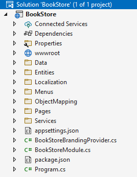
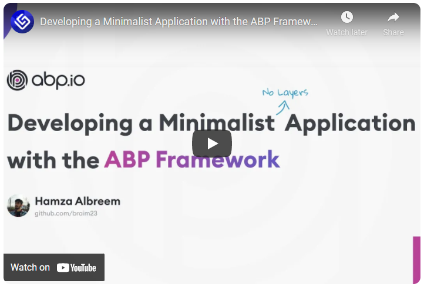
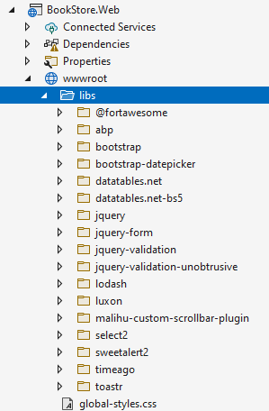
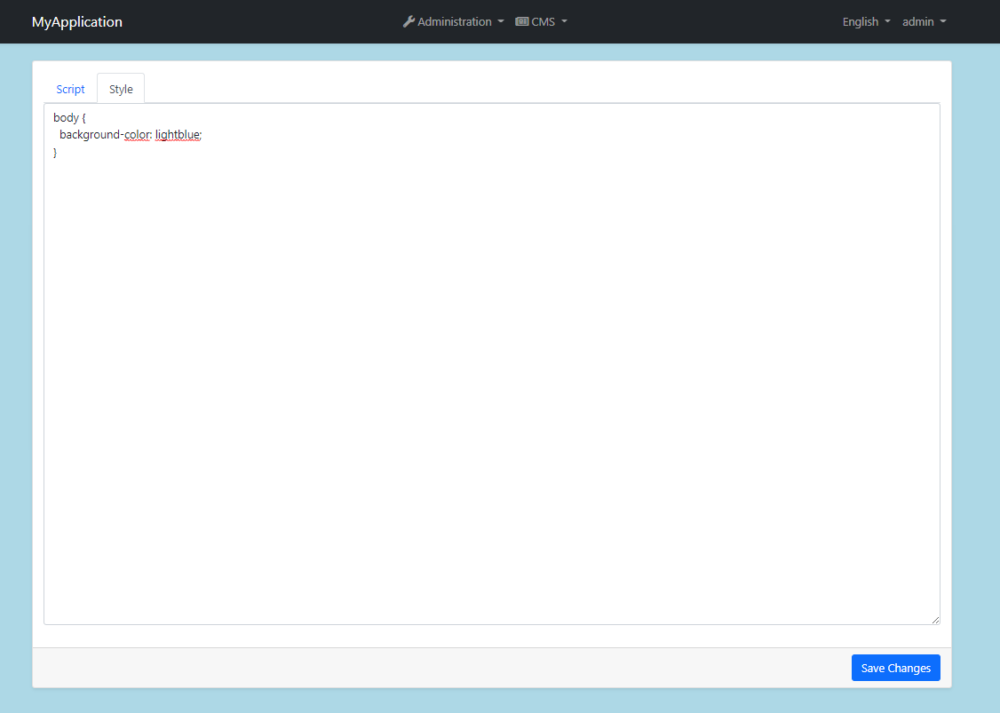
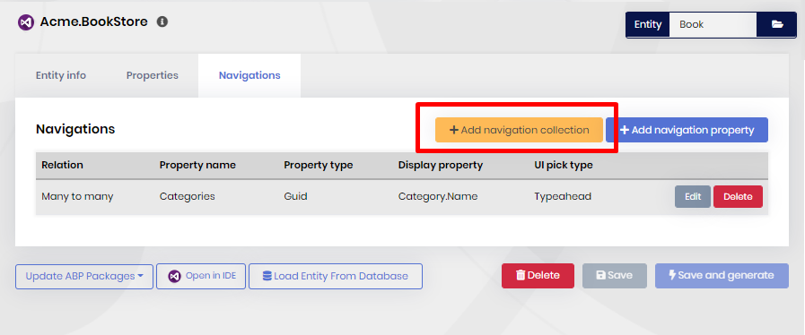

Today, we are happy to release the [ABP Framework](https://abp.io/) and  [ABP Commercial](https://commercial.abp.io/) version **5.2 RC** (Release Candidate). This blog post introduces the new features and important changes in this new version.

> **The planned release date for the [5.2.0 Stable](https://github.com/abpframework/abp/milestone/66) version is April 05, 2022**.

Please try this version and provide feedback for a more stable ABP version 5.2! Thank you all.

## Get Started with the 5.2 RC

Follow the steps below to try the version 5.2.0 RC today:

1) **Upgrade** the ABP CLI to version `5.2.0-rc.1` using a command line terminal:

````bash
dotnet tool update Volo.Abp.Cli -g --version 5.2.0-rc.1
````

​	**or install** it if you haven't before:

````bash
dotnet tool install Volo.Abp.Cli -g --version 5.2.0-rc.1
````

2) Create a **new application** with the `--preview` option:

````bash
abp new BookStore --preview
````

See the [ABP CLI documentation](https://docs.abp.io/en/abp/latest/CLI) for all the available options.

> You can also use the *Direct Download* tab on the [Get Started](https://abp.io/get-started) page by selecting the **Preview checkbox**.

You can use any IDE that supports .NET 6.x, like **[Visual Studio 2022](https://visualstudio.microsoft.com/downloads/)**.

## Migration Guides

Please see the migration guides if you are upgrading from 5.x versions:

* [ABP Framework 5.x to 5.2 migration guide](https://docs.abp.io/en/abp/5.2/Migration-Guides/Abp-5_2)
* [ABP Commercial 5.x to 5.2 migration guide](https://docs.abp.io/en/commercial/5.2/migration-guides/index)

## What's New with ABP Framework 5.2?

In this section, I will introduce some major features released with this version. Here, a brief list of titles explained in the next sections:

* Single-layer Solution Template
* API Versioning
* libs Folder Has been Removed from Source Control
* Hiding the Default ABP Endpoints from Swagger UI
* Custom Global CSS and JavaScript for the CMS Kit module
* Other news


Let's begin with the first item.

### Single-layer Solution Template

ABP's [application startup template](https://docs.abp.io/en/abp/latest/Startup-Templates/Application) is a well-organized and layered solution to create maintainable business applications. However, some developers find it a little bit complex for simple and short-term applications. For such applications, we've created a new startup template that has no layering and built as simple as possible. It has the same functionality, features and modules on runtime, but the development model is minimal and everything is in the single project (`csproj`), as shown in the following figure:



Use the `app-nolayers` as the template name while creating your solution:

````bash
abp new BookStore -t app-nolayers --preview
````

[ABP Commercial](https://commercial.abp.io/) developers can use the `app-nolayers-pro` as the startup template:

````csharp
abp new BookStore -t app-nolayers-pro --preview
````

> There is a bug for the `app-nolayers-pro` related to the licensing system, which will be fixed with 5.2.0-rc.2: `appsettings.secrets.json` is missing in the project folder (should be near to `appsettings.json` and contains the license code normally). As a workaround, create a new solution with the layered startup template, find and copy that file to the single-layer solution.

One note about the single-layer project is it doesn't have Blazor WebAssembly UI, because it requires 3 projects at least (one server-side, one UI and one shared library project between these two). We will consider to add Blazor UI support based on your feedback. You can continue to develop Blazor WASM projects using the standard layered solution template.

#### Database Migrations for EF Core

After creating your solution, you need to create the database before running the application. We've added a parameter to the application that can be specified to migrate the database and seed the initial data. Open the project's directory (that contains the `csproj` file) in a command-line terminal and type the following command:

````bash
dotnet run --migrate-database
````

It will run, migrate the database and exit. You can then run the application as normal.

You could use the standard `dotnet ef database update` command (or `Update-Database` command in Visual Studio's Package Manager Console). It can successfully create the database tables. However, it doesn't seed the initial data that is necessary to run the application.

To keep the solution simple, we haven't added an external application (like the `DbMigrator` in the layered application startup template) to migrate the database.

Using the same application to migrate the database is simple and useful for development environment, and it can also be used in production environment. However, there are other ways of migrating a database. Please read more on [Microsoft's documentation](https://docs.microsoft.com/en-us/ef/core/managing-schemas/migrations).

#### Other UI and Database Options

The new single-layer solution template also supports Angular and Blazor UI, and MongoDB for the database side. For the UI, you can use `mvc` (default), `angular` or `blazor-server` with the `-u` (or `--ui`) parameter. For the database provider, you can use `ef` (default) or `mongodb` with the `-d` (or `--database-provider`) parameter. Example:

````bash
abp new BookStore -t app-nolayers -u angular -d mongodb --preview
````

This will create a single layer template with Angular as the UI framework and MongoDB as the database provider.

#### Single-Layer Tutorial

[Hamza Albreem](https://twitter.com/st_braim) has created a video tutorial to explain how to develop a simple application with this startup template.



You can [watch it here](https://community.abp.io/posts/developing-a-minimalist-application-with-the-abp-framework-mvad01ca).

### API Versioning

API versioning has always been possible with the ABP Framework, but we haven't had a documentation for it. With version 5.2, we've created a document to explain how to implement API versioning for your applications and add versioning support to your standard application service classes. See the [documentation here](https://docs.abp.io/en/abp/5.2/API/API-Versioning).

### libs Folder Has been Removed from Source Control

> **NOTICE: This can be a breaking change for your development environment and CI/CD pipelines. So, please read it carefully and take the necessary actions.**

When you create solutions with MVC (Razor Pages) or Blazor Server UI, your application will have a `wwwroot/libs` folder in the UI project as shown below:



The `libs` folder contains all the client-side (mostly JavaScript and CSS) library dependencies. For example, in the figure above, the `bootstap` folder contains the necessary files for the Bootstrap library. The folder's content is copied from the `node_modules` folder (it only copies the minimum files to make the library work, not the whole folder) with ABP CLI's `abp install-libs` command.

Before version 5.2, the `libs` folder was coming with the startup template and committed into your source control system (e.g. Git). With version 5.2, this folder is excluded from the source control by default, so every developer getting the solution must run `abp install-libs` in the UI project's root directory to install these libraries. This approach saves a huge amount of size of the solution. For example, the initial size of an MVC UI application reduces from `9.83MB`  to `0.23MB` (you read it right!).

When you create a new solution with ABP CLI, `abp install-libs` command is automatically executed, so your application directly works. However, if your teammates (or CI/CD system) get the solution from the source control, they should run the `abp install-libs` before running the solution. If you don't want that, you can simply remove the `**/wwwroot/libs/*` line from the `.gitignore` file in the root folder of your solution, then the `libs` folder is added to your source control again (if you are using a source control system other than Git, you should apply your system's rules to include/exclude that folder).

### Hiding the Default ABP Endpoints from Swagger UI

[Engincan Veske](https://twitter.com/EngincanVeske) had written [an article](https://community.abp.io/posts/how-to-hide-abp-related-endpoints-on-swagger-ui-mb2w01fe) to explain how to hide ABP's default endpoints from Swagger UI. Then We thought that could be a good built-in option in the ABP Framework and added a `HideAbpEndpoints` method to the `AddAbpSwaggerGen` method, which can be used as in the following code example:

````csharp
services.AddAbpSwaggerGen(
    options => 
    {
        //... other options
        
        //Hides ABP Related endpoints on Swagger UI
        options.HideAbpEndpoints();
    }
)
````

After that, ABP's default endpoints will still be functional, but will be hidden in Swagger UI.

### Custom Global CSS and JavaScript for the CMS Kit module

We are improving the [CMS Kit module](https://docs.abp.io/en/abp/5.2/Modules/Cms-Kit/Index) and adding new features constantly. A new feature with version 5.2 is a global resources system, where you can write custom JavaScript or CSS code on the application's UI (added a new page for it), which will be immediately available in all your application pages:



In this way, you can customize your application's look and behavior on runtime. See [the documentation](https://docs.abp.io/en/abp/5.2/Modules/Cms-Kit/Global-Resources) for more information.

> Note that the [pages](https://docs.abp.io/en/abp/5.2/Modules/Cms-Kit/Pages) feature already have a page-basis script/style editor. But this new feature allows you to write script/style that is applied to all pages of your application.

### Other news

* Upgraded the [Blazorise](https://blazorise.com/) library to v1.0 for Blazor UI. After the upgrade, ensure that all Blazorise-related packages are using v1.0 in your application.

If you want to see more details, you can check [the release on GitHub](https://github.com/abpframework/abp/releases/tag/5.2.0-rc.1), that contains a list of all issues and pull requests closed with this version.

## What's New with ABP Commercial 5.2?

We've also made many enhancements for [ABP Commercial](https://commercial.abp.io/), and also made the necessary changes and improvements to align with the v5.2 release of the ABP Framework. For example, the **single-layer solution template** is also available for ABP Commercial as explained above.

### Many to Many Relations on Code Generation

One exciting new feature with ABP Commercial v5.2 is supporting many-to-many entity relations while generating CRUD code with [ABP Suite](https://commercial.abp.io/tools/suite).

When you open ABP Suite v5.2, you will see an "Add navigation collection" button in the Navigation tab. Here, you can click that button, select the target entity and other options:



With this new feature, you can automatically generate advanced user interfaces without touching the code, then customize the generated code to implement your business logic.

## Community News

We organized the 3rd live [ABP Community Talks](https://community.abp.io/events) event on February 23rd. ABP community has a good interest in these events and we will continue to organize such a live event in every month. March's event will be announced in a few days. [Follow us on twitter](https://twitter.com/abpframework).

[ABP Community](https://community.abp.io/) website is being a huge resource of articles and video tutorials on the ABP Framework and .NET. There have been 93 articles/tutorials submitted so far. Here's a list of a few contents posted in the last weeks:

* [Ahmet Urel](https://twitter.com/YellowDraqon) submitted a series of articles to demonstrate the usage of [MudBlazor](https://www.mudblazor.com/) library with the ABP Framework Blazor UI: [Part 1](https://community.abp.io/posts/mudblazor-theme-in-abp-blazor-webassembly-ae23zz17), [Part 2](https://community.abp.io/posts/mudblazor-theme-in-abp-blazor-webassembly-part-2-tkvrvyvm) and [Part 3](https://community.abp.io/posts/mudblazor-theme-in-abp-blazor-webassembly-part-3-c8hwx00l).
* [Enis Necipoğlu](https://twitter.com/EnisNecipoglu) has created two articles for ABP & **.NET MAUI** integration: See [Part 1](https://community.abp.io/posts/integrating-maui-client-via-using-openid-connect-aqjjwsdf) and [Part 2](https://community.abp.io/posts/using-abp-client-proxies-in-maui-with-openid-connect-em7x1s8k). [Bart Van Hoey](https://twitter.com/bartvanhoey) also created [an article](https://community.abp.io/posts/abp-framework-consumed-by-a-.net-maui-app-e74fmblw) for .NET MAUI and the ABP Framework.
* [Enis Necipoğlu](https://twitter.com/EnisNecipoglu) has also created [an article](https://community.abp.io/posts/using-autofilterer-with-abp-framework-uuqv81jm) to demonstrate how to use his own open source [AutoFilterer](https://github.com/enisn/AutoFilterer) library with the ABP Framework.
* [Jonathan Potts](https://github.com/jonathanpotts) has created his first ABP Community article that shows how to use Bootswatch themes with the ABP Framework. [See it here](https://community.abp.io/posts/customizing-the-abp-basic-theme-with-bootswatch-4luoqzr0).

Thanks to all the contributors. It is appreciated if you want to submit your post and share your knowledge with the ABP community: https://community.abp.io/posts/create

## Conclusion

This version was mostly about minor features and enhancements for existing features, and getting the framework, architecture and solution structure more mature. Currently, we are working on middle and long term features, changes and goals. You can find most of them on the [road map here](https://docs.abp.io/en/abp/5.2/Road-Map).

The planned release date for the [5.2.0 Stable](https://github.com/abpframework/abp/milestone/66) version is April 05, 2022. Please try the ABP v5.2 RC and provide feedback to have a more stable release.
