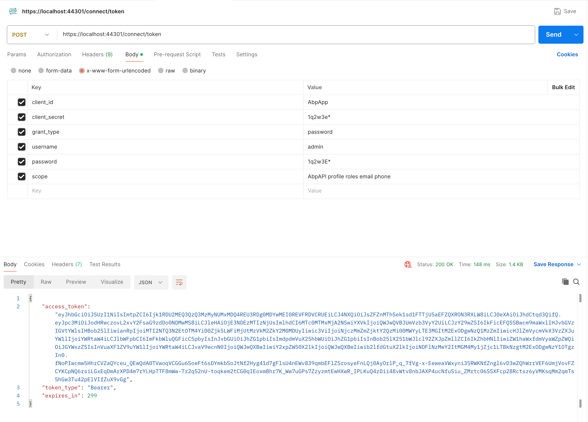
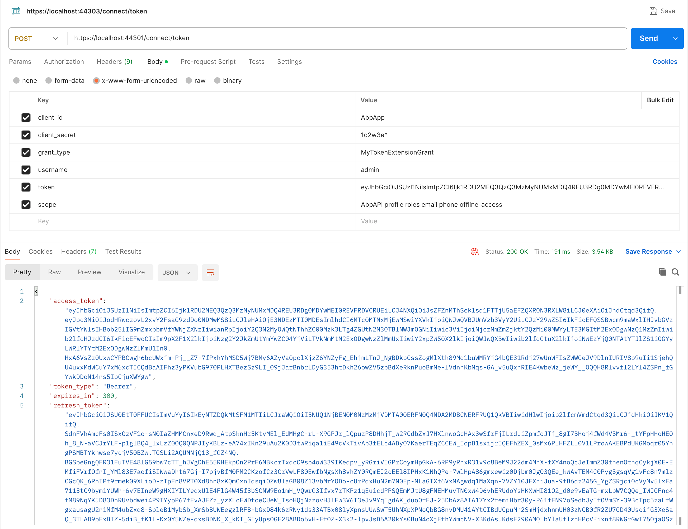
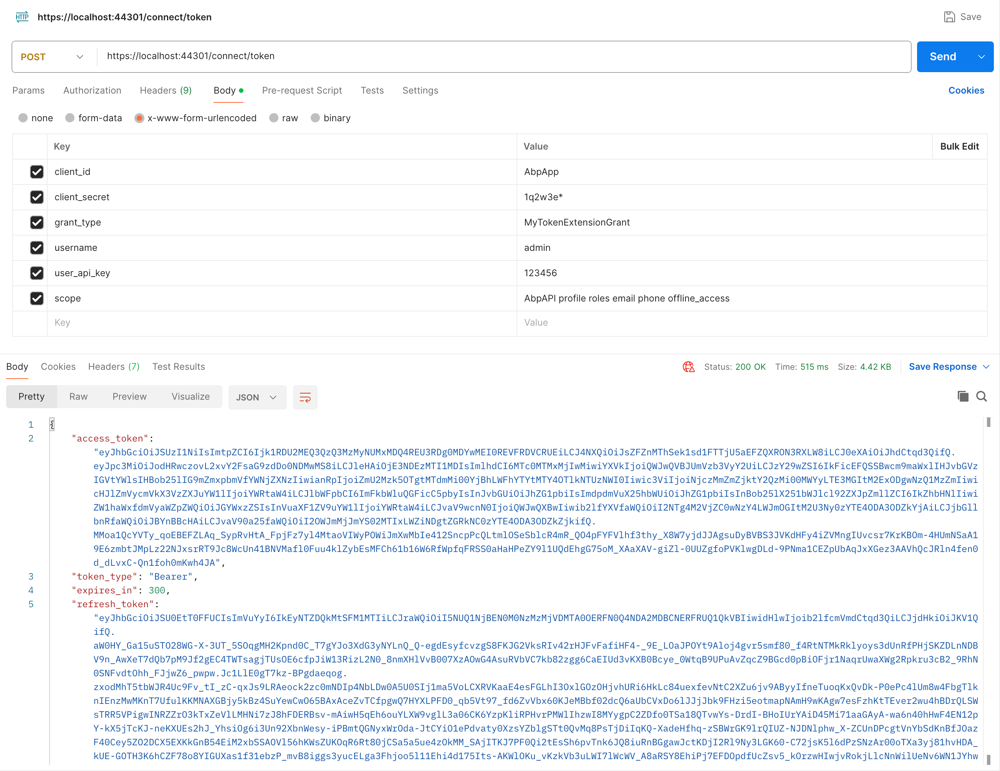

# How to add a custom grant type in OpenIddict

## ITokenExtensionGrant

Create a `MyTokenExtensionGrant` class that inherits `ITokenExtensionGrant`, and then register it with the framework. 

```cs
public override void PreConfigureServices(ServiceConfigurationContext context)
{
    //...
    PreConfigure<OpenIddictServerBuilder>(builder =>
    {
        builder.Configure(openIddictServerOptions =>
        {
            openIddictServerOptions.GrantTypes.Add(MyTokenExtensionGrant.ExtensionGrantName);
        });
    });
    //...
}

public override void ConfigureServices(ServiceConfigurationContext context)
{
    //...
    Configure<AbpOpenIddictExtensionGrantsOptions>(options =>
    {
        options.Grants.Add(MyTokenExtensionGrant.ExtensionGrantName, new MyTokenExtensionGrant());
    });
    //...
}
```

## Generate a new token response

In the `MyTokenExtensionGrant` class below we have two methods to get a new token using a user token or user API key. You can choose one of them based on your business.

These methods are just examples. Please add more logic to validate input data.

```cs
using System.Collections.Immutable;
using System.Security.Principal;
using Microsoft.AspNetCore.Authentication;
using Microsoft.AspNetCore.Identity;
using Microsoft.AspNetCore.Mvc;
using OpenIddict.Abstractions;
using OpenIddict.Server;
using OpenIddict.Server.AspNetCore;
using Volo.Abp.Identity;
using Volo.Abp.OpenIddict;
using Volo.Abp.OpenIddict.ExtensionGrantTypes;
using IdentityUser = Volo.Abp.Identity.IdentityUser;
using SignInResult = Microsoft.AspNetCore.Mvc.SignInResult;

namespace OpenIddict.Demo.Server.ExtensionGrants;

public class MyTokenExtensionGrant : ITokenExtensionGrant
{
    public const string ExtensionGrantName = "MyTokenExtensionGrant";

    public string Name => ExtensionGrantName;

    public async Task<IActionResult>  HandleAsync(ExtensionGrantContext context)
    {
        // You can get a new token using any of the following methods based on your business.
        // They are just examples. You can implement your own logic here.

        return await HandleUserAccessTokenAsync(context);
        return await HandleUserApiKeyAsync(context);
    }

    public async Task<IActionResult>  HandleUserAccessTokenAsync(ExtensionGrantContext context)
    {
        var userToken = context.Request.GetParameter("token").ToString();

        if (string.IsNullOrEmpty(userToken))
        {
            return new ForbidResult(
                new[] {OpenIddictServerAspNetCoreDefaults.AuthenticationScheme},
                properties: new AuthenticationProperties(new Dictionary<string, string>
                {
                    [OpenIddictServerAspNetCoreConstants.Properties.Error] = OpenIddictConstants.Errors.InvalidRequest
                }!));
        }

        // We will validate the user token
        // The Token is issued by the OpenIddict server, So we can validate it using the introspection endpoint

        var transaction = await context.HttpContext.RequestServices.GetRequiredService<IOpenIddictServerFactory>().CreateTransactionAsync();
        transaction.EndpointType = OpenIddictServerEndpointType.Introspection;
        transaction.Request = new OpenIddictRequest
        {
            ClientId = context.Request.ClientId,
            ClientSecret = context.Request.ClientSecret,
            Token = userToken
        };

        var notification = new OpenIddictServerEvents.ProcessAuthenticationContext(transaction);
        var dispatcher = context.HttpContext.RequestServices.GetRequiredService<IOpenIddictServerDispatcher>();
        await dispatcher.DispatchAsync(notification);

        if (notification.IsRejected)
        {
            return new ForbidResult(
                new []{ OpenIddictServerAspNetCoreDefaults.AuthenticationScheme },
                properties: new AuthenticationProperties(new Dictionary<string, string>
                {
                    [OpenIddictServerAspNetCoreConstants.Properties.Error] = notification.Error ?? OpenIddictConstants.Errors.InvalidRequest,
                    [OpenIddictServerAspNetCoreConstants.Properties.ErrorDescription] = notification.ErrorDescription,
                    [OpenIddictServerAspNetCoreConstants.Properties.ErrorUri] = notification.ErrorUri
                }));
        }

        var principal = notification.GenericTokenPrincipal;
        if (principal == null)
        {
            return new ForbidResult(
                new []{ OpenIddictServerAspNetCoreDefaults.AuthenticationScheme },
                properties: new AuthenticationProperties(new Dictionary<string, string>
                {
                    [OpenIddictServerAspNetCoreConstants.Properties.Error] = notification.Error ?? OpenIddictConstants.Errors.InvalidRequest,
                    [OpenIddictServerAspNetCoreConstants.Properties.ErrorDescription] = notification.ErrorDescription,
                    [OpenIddictServerAspNetCoreConstants.Properties.ErrorUri] = notification.ErrorUri
                }));
        }

        // We have validated the user token and got the user id

        var userId = principal.FindUserId();
        var userManager = context.HttpContext.RequestServices.GetRequiredService<IdentityUserManager>();
        var user = await userManager.GetByIdAsync(userId.Value);
        var userClaimsPrincipalFactory = context.HttpContext.RequestServices.GetRequiredService<IUserClaimsPrincipalFactory<IdentityUser>>();
        var claimsPrincipal = await userClaimsPrincipalFactory.CreateAsync(user);

        // Prepare the scopes
        var scopes = GetScopes(context);

        claimsPrincipal.SetScopes(scopes);
        claimsPrincipal.SetResources(await GetResourcesAsync(context, scopes));
        await context.HttpContext.RequestServices.GetRequiredService<AbpOpenIddictClaimsPrincipalManager>().HandleAsync(context.Request, principal);
        return new SignInResult(OpenIddictServerAspNetCoreDefaults.AuthenticationScheme, claimsPrincipal);
    }


    protected async Task<IActionResult> HandleUserApiKeyAsync(ExtensionGrantContext context)
    {
        var userApiKey = context.Request.GetParameter("user_api_key").ToString();

        if (string.IsNullOrEmpty(userApiKey))
        {
            return new ForbidResult(
                new[] {OpenIddictServerAspNetCoreDefaults.AuthenticationScheme},
                properties: new AuthenticationProperties(new Dictionary<string, string>
                {
                    [OpenIddictServerAspNetCoreConstants.Properties.Error] = OpenIddictConstants.Errors.InvalidRequest
                }!));
        }

        // Here we can validate the user API key and get the user id
        if (false) // Add your own logic here
        {
            // If the user API key is invalid
            return new ForbidResult(
                new[] {OpenIddictServerAspNetCoreDefaults.AuthenticationScheme},
                properties: new AuthenticationProperties(new Dictionary<string, string>
                {
                    [OpenIddictServerAspNetCoreConstants.Properties.Error] = OpenIddictConstants.Errors.InvalidRequest
                }!));
        }

        // Add your own logic to get the user by API key
        var userManager = context.HttpContext.RequestServices.GetRequiredService<IdentityUserManager>();
        var user = await userManager.FindByNameAsync("admin");
        if (user == null)
        {
            return new ForbidResult(
                new[] {OpenIddictServerAspNetCoreDefaults.AuthenticationScheme},
                properties: new AuthenticationProperties(new Dictionary<string, string>
                {
                    [OpenIddictServerAspNetCoreConstants.Properties.Error] = OpenIddictConstants.Errors.InvalidRequest
                }!));
        }

        // Create a principal for the user
        var userClaimsPrincipalFactory = context.HttpContext.RequestServices.GetRequiredService<IUserClaimsPrincipalFactory<IdentityUser>>();
        var claimsPrincipal = await userClaimsPrincipalFactory.CreateAsync(user);

        // Prepare the scopes
        var scopes = GetScopes(context);

        claimsPrincipal.SetScopes(scopes);
        claimsPrincipal.SetResources(await GetResourcesAsync(context, scopes));
        await context.HttpContext.RequestServices.GetRequiredService<AbpOpenIddictClaimsPrincipalManager>().HandleAsync(context.Request, claimsPrincipal);
        return new SignInResult(OpenIddictServerAspNetCoreDefaults.AuthenticationScheme, claimsPrincipal);
    }

    private ImmutableArray<string> GetScopes(ExtensionGrantContext context)
    {
        // Prepare the scopes
        // The scopes must be defined in the OpenIddict server

        // If you want to get the scopes from the request, you have to add `scope` parameter in the request
        // scope: AbpAPI profile roles email phone offline_access

        //var scopes = context.Request.GetScopes();

        // If you want to set the scopes here, you can use the following code
        var scopes = new[] { "AbpAPI", "profile", "roles", "email", "phone", "offline_access" }.ToImmutableArray();

        return scopes;
    }

    private async Task<IEnumerable<string>> GetResourcesAsync(ExtensionGrantContext context, ImmutableArray<string> scopes)
    {
        var resources = new List<string>();
        if (!scopes.Any())
        {
            return resources;
        }

        await foreach (var resource in context.HttpContext.RequestServices.GetRequiredService<IOpenIddictScopeManager>().ListResourcesAsync(scopes))
        {
            resources.Add(resource);
        }
        return resources;
    }
}
```

### Get a new token using user access token

* Get a user token using the `password` grant type.



*  Use the user token to get a new token using the `HandleUserAccessTokenAsync` method.



### Get a new token using user API key

*  Directly get a new token using the `HandleUserApiKeyAsync` method.




## Source code

https://github.com/abpframework/abp/blob/dev/modules/openiddict/app/OpenIddict.Demo.Server/ExtensionGrants/MyTokenExtensionGrant.cs

