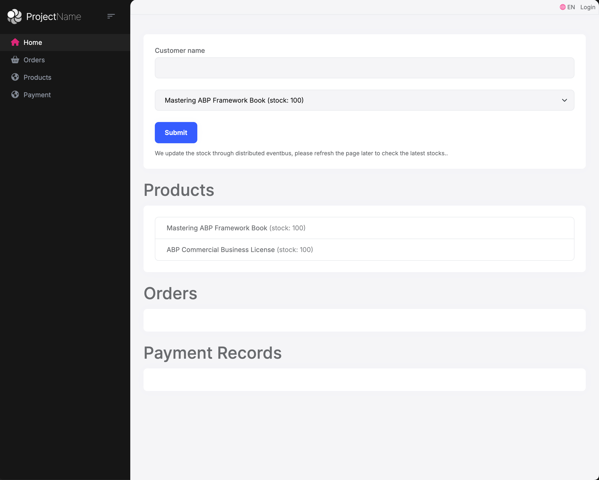
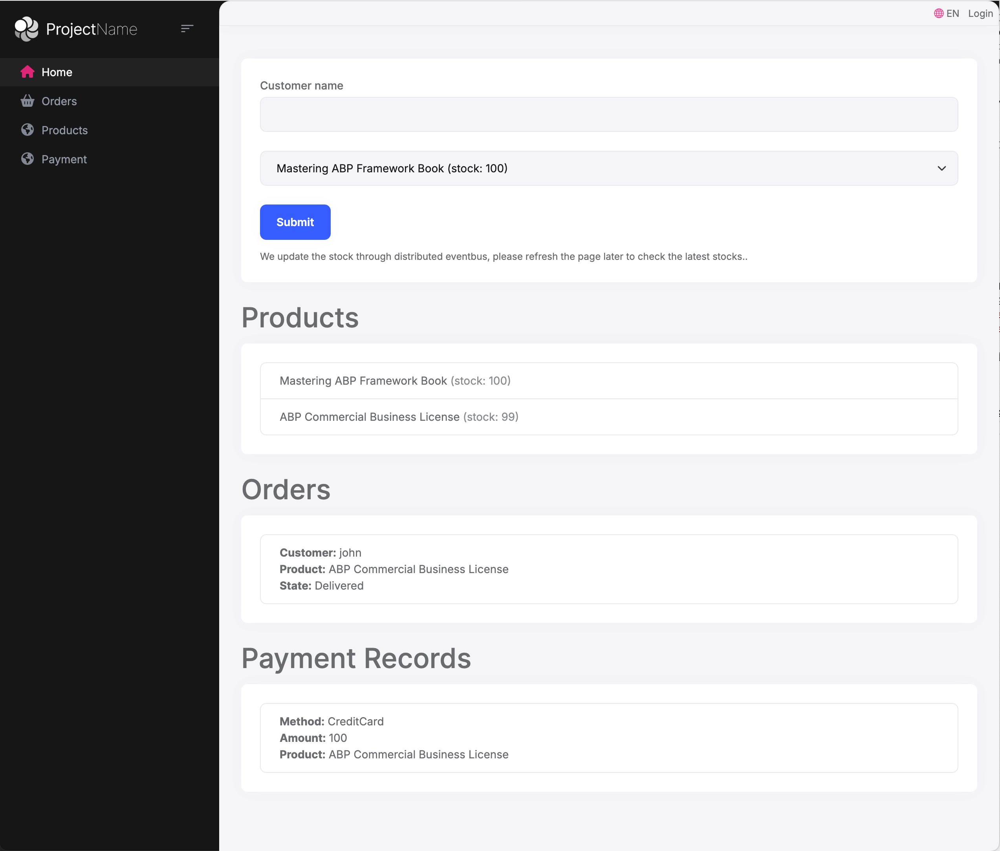

# Using Outbox/Inbox Pattern for Reliable Event Handling in a Multi-Module Monolithic Application

This article explains how to implement reliable event handling using the `Outbox/Inbox` pattern in a modular monolithic application with multiple databases. We'll use the `ModularCRM` project as an example (how that project was created is explained in [this document](https://abp.io/docs/latest/tutorials/modular-crm)).

## Project Background

`ModularCRM` is a monolithic application that integrates multiple ABP framework open-source modules, including:

- `Account`
- `Identity`
- `Tenant Management` 
- `Permission Management`
- `Setting Management`
- And other open-source modules

Besides the ABP framework modules, the project contains three business modules:

- Order module (`Ordering`), using `MongoDB` database
- Product module (`Products`), using `SQL Server` database
- Payment module (`Payment`), using `MongoDB` database

The project configures separate database connection strings for `ModularCRM` and the three business modules in `appsettings.json`:

```json
{
  "ConnectionStrings": {
    "Default": "Server=localhost,1434;Database=ModularCrm;User Id=sa;Password=1q2w3E***;TrustServerCertificate=true",
    "Products": "Server=localhost,1434;Database=ModularCrm_Products;User Id=sa;Password=1q2w3E***;TrustServerCertificate=true",
    "Ordering": "mongodb://localhost:27017/ModularCrm_Ordering?replicaSet=rs0",
    "Payment": "mongodb://localhost:27017/ModularCrm_Payment?replicaSet=rs0"
  }
}
```

## Business Scenario

These modules communicate through the ABP framework's `DistributedEventBus` to implement the following business flow:

> This is a simple example flow. Real business flows are more complex. The sample code is for demonstration purposes.

1. Order module: Publishes `OrderPlacedEto` event when an order is placed
2. Product module: Subscribes to `OrderPlacedEto` event and reduce product stock
3. Payment module: Subscribes to `OrderPlacedEto` event, processes payment, then publishes `PaymentCompletedEto` event
4. Order module: Subscribes to `PaymentCompletedEto` event and updates order status to `Delivered`

When implementing this flow, we need to ensure:

- Transaction consistency between order creation and event publishing
- Transaction consistency when modules process messages
- Reliable message delivery (including persistence, confirmation, and retry mechanisms)

Using only the ABP framework's `DistributedEventBus` cannot meet these requirements, so we need to add a new mechanism.

## Outbox/Inbox Pattern Solution

To meet these requirements, we use the `Outbox/Inbox` pattern:

### Outbox Pattern

- Saves distributed events with database operations in the same transaction
- Sends events to distributed message service through background jobs
- Ensures consistency between data updates and event publishing
- Prevents message loss during system failures

### Inbox Pattern

- First saves received distributed events to the database
- Processes events in a transactional way
- Ensures messages are processed only once by saving processed message records
- Maintains processing state for reliable handling

> For how to enable and configure `Outbox/Inbox` in projects and modules, see: https://abp.io/docs/latest/framework/infrastructure/event-bus/distributed#outbox-inbox-for-transactional-events

### Module Configuration

Each module needs to configure separate `Outbox/Inbox`. Since it's a monolithic application, all message processing classes are in the same project, so we need to configure `Outbox/Inbox` for each module with `Selector/EventSelector` to ensure that the module only sends and receives the messages it cares about, avoiding message duplication processing.

**ModularCRM Main Application Configuration**

It will send and receive messages from all ABP framework open-source modules.

```csharp
// This selector will match all abp built-in modules and the current module.
Func<Type, bool> abpModuleSelector = type => type.Namespace != null && (type.Namespace.StartsWith("Volo.") || type.Assembly == typeof(ModularCrmModule).Assembly);

Configure<AbpDistributedEventBusOptions>(options =>
{
    options.Inboxes.Configure("ModularCrm", config =>
    {
        config.UseDbContext<ModularCrmDbContext>();
        config.EventSelector = abpModuleSelector;
        config.HandlerSelector = abpModuleSelector;
    });

    options.Outboxes.Configure("ModularCrm", config =>
    {
        config.UseDbContext<ModularCrmDbContext>();
        config.Selector = abpModuleSelector;
    });
});
```

**Order Module Configuration**

It only sends `OrderPlacedEto` events and receives `PaymentCompletedEto` events and executes `OrderPaymentCompletedEventHandler`.

```csharp
Configure<AbpDistributedEventBusOptions>(options =>
{
    options.Inboxes.Configure(OrderingDbProperties.ConnectionStringName, config =>
    {
        config.UseMongoDbContext<IOrderingDbContext>();
        config.EventSelector = type => type == typeof(PaymentCompletedEto);
        config.HandlerSelector = type => type == typeof(OrderPaymentCompletedEventHandler);
    });

    options.Outboxes.Configure(OrderingDbProperties.ConnectionStringName, config =>
    {
        config.UseMongoDbContext<IOrderingDbContext>();
        config.Selector = type => type == typeof(OrderPlacedEto);
    });
});
```

**Product Module Configuration**

It only receives `EntityCreatedEto<UserEto>` and `OrderPlacedEto` events and executes `ProductsOrderPlacedEventHandler` and `ProductsUserCreatedEventHandler`. It does not send any events now.

```csharp
Configure<AbpDistributedEventBusOptions>(options =>
{
    options.Inboxes.Configure(ProductsDbProperties.ConnectionStringName, config =>
    {
        config.UseDbContext<IProductsDbContext>();
		config.EventSelector = type => type == typeof(EntityCreatedEto<UserEto>) || type == typeof(OrderPlacedEto);
        config.HandlerSelector = type => type == typeof(ProductsOrderPlacedEventHandler) || type == typeof(ProductsUserCreatedEventHandler);
    });

    // Outboxes are not used in this module
	options.Outboxes.Configure(ProductsDbProperties.ConnectionStringName, config =>
	{
		config.UseDbContext<IProductsDbContext>();
		config.Selector = type => false;
	});
});
```

**Payment Module Configuration**

It only sends `PaymentCompletedEto` events and receives `OrderPlacedEto` events and executes `PaymentOrderPlacedEventHandler`.

```csharp
Configure<AbpDistributedEventBusOptions>(options =>
{
    options.Inboxes.Configure(PaymentDbProperties.ConnectionStringName, config =>
    {
        config.UseMongoDbContext<IPaymentMongoDbContext>();
        config.EventSelector = type => type == typeof(OrderPlacedEto);
        config.HandlerSelector = type => type == typeof(PaymentOrderPlacedEventHandler);
    });

    options.Outboxes.Configure(PaymentDbProperties.ConnectionStringName, config =>
    {
        config.UseMongoDbContext<IPaymentMongoDbContext>();
        config.Selector = type => type == typeof(PaymentCompletedEto);
    });
});
```

## Running ModularCRM Simulation Business Flow

1. Run the following command in the `ModularCrm` directory:

```
# Start SQL Server and MongoDB databases in Docker
docker-compose up -d

# Restore and install project npm dependencies
abp install-lib              

# Migrate databases
dotnet run --project ModularCrm --migrate-database 

# Start the application
dotnet run --project ModularCrm
```

2. Navigate to `https://localhost:44303/` to view the application homepage



3. Enter a customer name and select a product, then submit an order. After a moment, refresh the page to see the order, product, and payment information.



Application logs display the complete processing flow:

```
[Ordering Module] Order created:  OrderId: b7ad3f47-0e77-bb81-082f-3a1834503e88, ProductId: 0f95689f-4cb6-36f5-68bd-3a18344d32c9, CustomerName: john

[Products Module] OrderPlacedEto event received: OrderId: b7ad3f47-0e77-bb81-082f-3a1834503e88, CustomerName: john, ProductId: 0f95689f-4cb6-36f5-68bd-3a18344d32c9
[Products Module] Stock count decreased for ProductId: 0f95689f-4cb6-36f5-68bd-3a18344d32c9

[Payment Module] OrderPlacedEto event received: OrderId: b7ad3f47-0e77-bb81-082f-3a1834503e88, CustomerName: john, ProductId: 0f95689f-4cb6-36f5-68bd-3a18344d32c9
[Payment Module] Payment processing completed for OrderId: b7ad3f47-0e77-bb81-082f-3a1834503e88

[Ordering Module] PaymentCompletedEto event received: OrderId: b7ad3f47-0e77-bb81-082f-3a1834503e88, PaymentId: d0a41ead-ee0f-714c-e254-3a1834504d65, PaymentMethod: CreditCard, PaymentAmount: ModularCrm.Payment.Payment.PaymentCompletedEto
[Ordering Module] Order state updated to Delivered for OrderId: b7ad3f47-0e77-bb81-082f-3a1834503e88
```

In addition, when a new user registers, the product module will also receive the `EntityCreatedEto<UserEto>` event, and we will send an email to the new user, just to demonstrate the `Outbox/Inbox Selector` mechanism.

```
[Products Module] UserCreated event received: UserId: "9a1f2bd0-5b28-210a-9e56-3a18344d310a", UserName: admin
[Products Module] Sending a popular products email to admin@abp.io...
```

## Summary

By introducing the `Outbox/Inbox` pattern, we have achieved:

1. Transactional message sending and receiving
2. Reliable message processing mechanism
3. Modular event processing in a multi-database environment

ModularCRM project not only implements reliable message processing but also demonstrates how to handle multi-database scenarios gracefully in a monolithic application. Project source code: https://github.com/abpframework/abp-samples/tree/master/ModularCrm-OutboxInbox-Pattern

## Reference

- [Outbox/Inbox for transactional events](https://abp.io/docs/latest/framework/infrastructure/event-bus/distributed#outbox-inbox-for-transactional-events)
- [ConnectionStrings](https://abp.io/docs/latest/framework/fundamentals/connection-strings)
- [ABP Studio: Single Layer Solution Template](https://abp.io/docs/latest/solution-templates/single-layer-web-application)
