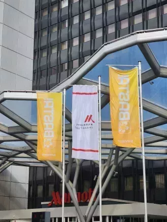
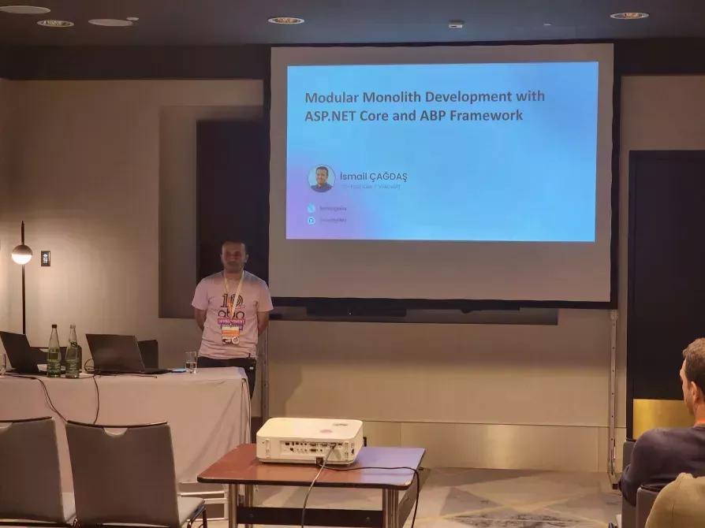
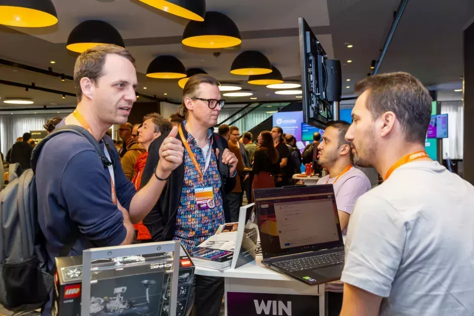

Our team had an amazing time at BASTA\! Frankfurt 2025, held from March 3 to 8 at the Frankfurt am Main Marriott Hotel. As a sponsor for this major conference for asp.net web developers, we were thrilled to connect with so many talented participants.

**Event Highlights**  

The conference hosted many talented developers as speakers. One of them was İsmail Çağdaş who’s a lead developer from ABP team who talked about the concepts of monoliths and microservices. He explained how modular monoliths combine the strengths of these two architectures, using the ABP Framework as an example to showcase its modularity features and demonstrate how to build and develop a modular monolith application. 

**ABP’S Presence**  

At our booth we displayed the latest features of the ABP Framework and gathered valuable feedback from especially dotnet developers. So many attendees showed interest in ABP which was very exciting. It was great engaging with so many participants who wanted to learn more about how ABP provides the infrastructure and tools to create business solutions.

We're also very grateful to our booth neighbor, Xceed and it was a lot of fun connecting with them during the conference. For those who don’t know, Xceed provides comprehensive UI components that allow developers to focus on innovation and their business requirements.

**Networking and Community Engagement**

We organized two raffles during the event, where attendees had the chance to win 2 great prizes. One attendee won a LEGO set and another won an Amazon Kindle. We were happy to see many people attending our raffles, it definitely made this event more fun. Congratulations to the winners and thanks to those who participated\!

**Looking Ahead**

BASTA\! Frankfurt 2025 strengthened our commitment to the developer community. We want to continue our support for asp.net core developers, helping them create asp.net applications and optimize their workflows for web applications.

**Gratitude and Future Events**

Thank you to the organizers, speakers, and attendees for making BASTA\! Frankfurt 2025 such a fantastic experience. We look forward to future events and continued contributions to the net framework developers. 

We look forward to sharing more updates with you soon. We hope to see you at our next event\!
