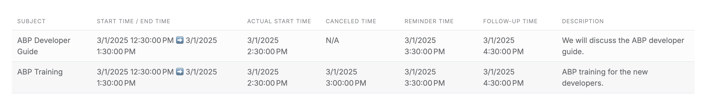
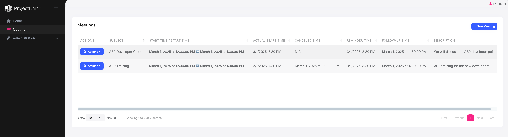
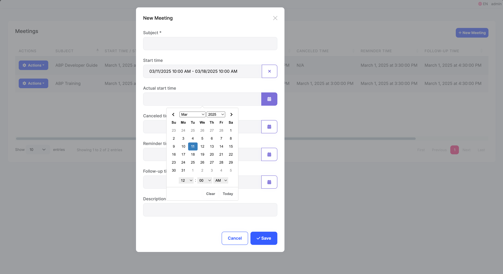
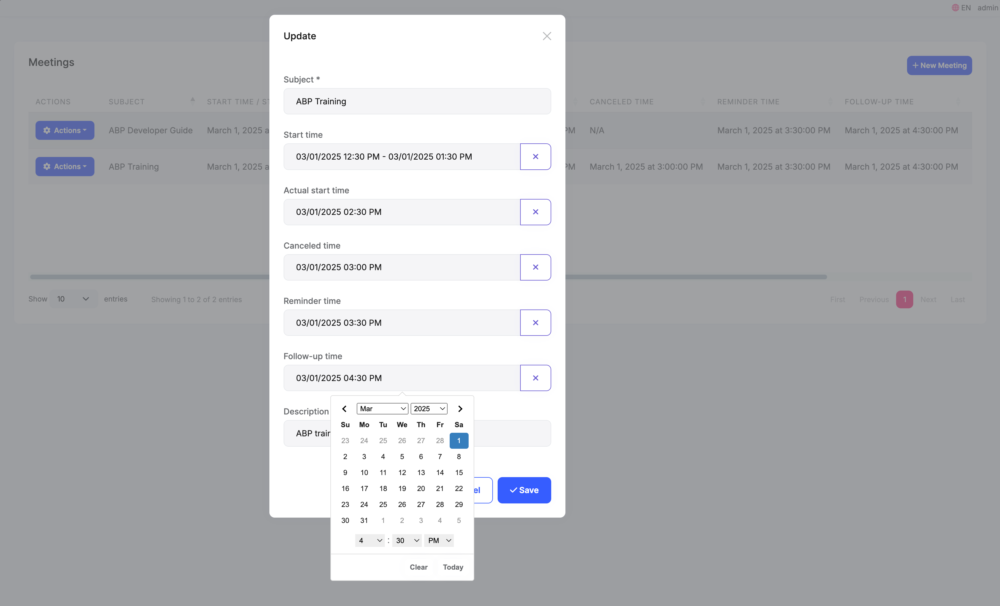
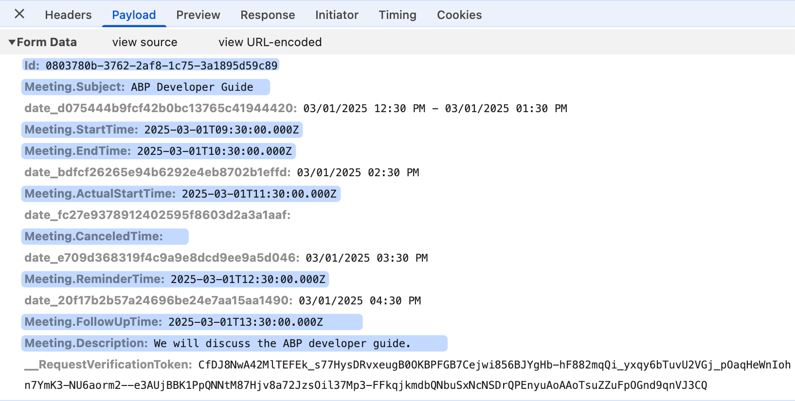
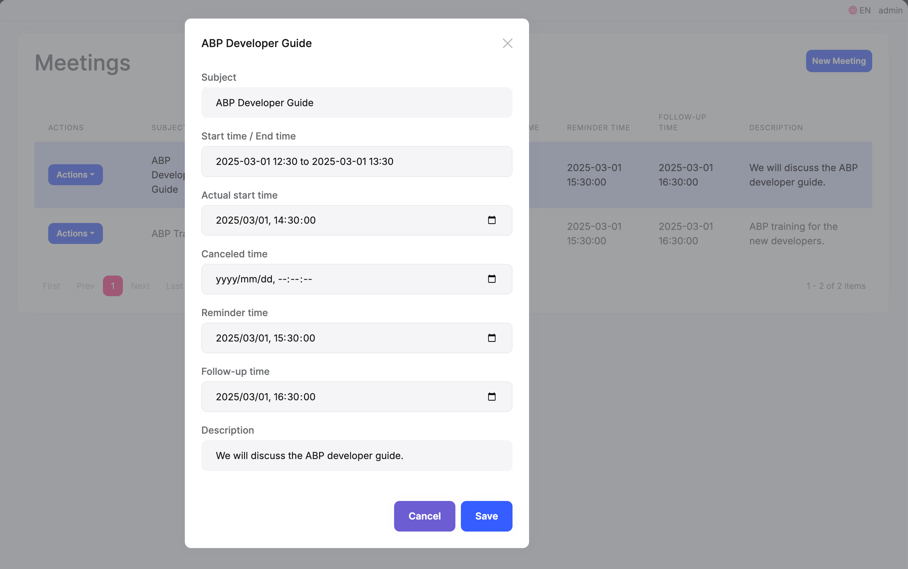
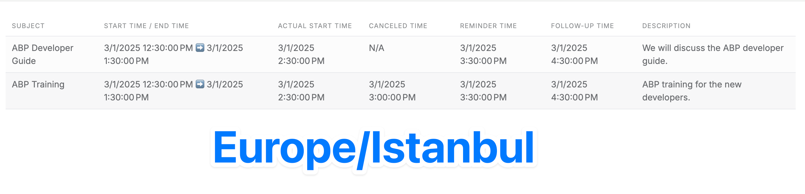
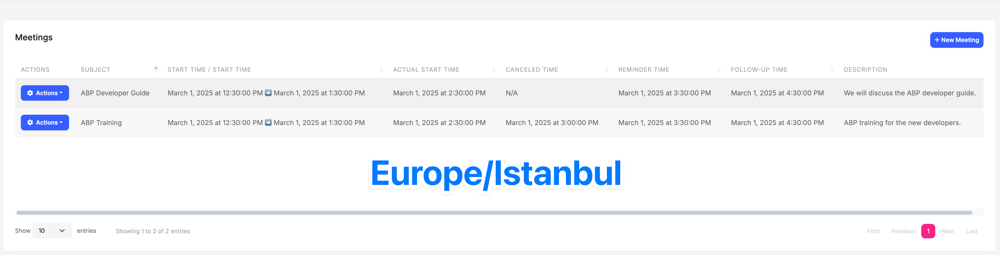
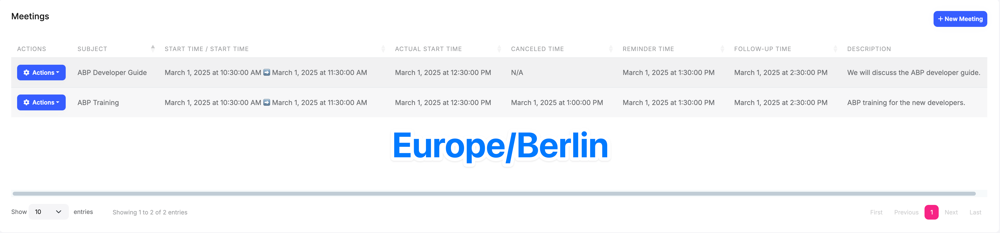

# Developing a Multi-Timezone Application Using the ABP Framework

When developing multi-timezone applications, we need to handle users from different time zones and make sure they see the correct time. The system also needs to support users changing their timezone (like when traveling or moving) and make sure all time displays update correctly to show accurate time information.

All these scenarios require us to handle timezone conversions correctly in our application. The ABP framework provides a complete solution for these challenges.

In this article, we'll show you step by step how to handle multi-timezone in the ABP framework.

## Timezone Settings

The ABP framework provides a setting called `Abp.Timing.TimeZone` for setting and getting the timezone of users, tenants, or applications. The default value is `UTC`. Check out the [Timing documentation](https://abp.io/docs/latest/framework/infrastructure/timing) for more information.

## ISO 8601 Date Time Format

Different countries and regions may use different time formats:

* Year-Month-Day (YYYY-MM-DD): Mainly used in China, Japan, Korea, Canada (official standard), Germany (ISO standard), ISO 8601 international standard, etc. Example: 2025-03-11
* Day-Month-Year (DD-MM-YYYY): Mainly used in UK, India, Australia, New Zealand, most European countries (like France, Germany, Italy, Spain), some South American countries, etc. Example: 11-03-2025 or 11/03/2025
* Month-Day-Year (MM-DD-YYYY): Mainly used in USA, Philippines, some parts of Canada, etc. Example: 03-11-2025 or 03/11/2025
* Day.Month.Year (DD.MM.YYYY): Mainly used in Germany, Russia, Switzerland, Hungary, Czech Republic, etc. Example: 11.03.2025

Also, different countries/regions might use different separators (like slash /, hyphen -, dot .), and some countries use different month abbreviations or full names (like March 11, 2025).

ISO 8601 uses a standard format to avoid confusion between different date formats and ensure global compatibility.

It has 4 parts:

* Date part: `YYYY-MM-DD`
* `T` as a separator
* Time part: `HH:MM:SS`
* Timezone part: `Z` or `+/-HH:MM` 

You'll usually see formats like: `YYYY-MM-DDTHH:MM:SSZ` or `YYYY-MM-DDTHH:MM:SS+/-HH:MM`, for example: `2025-03-11T10:30:00Z` or `2025-03-11T22:30:00+03:00`

When our application needs to handle multiple timezones, we usually use ISO 8601 to represent time.

## Enabling Multi-Timezone Support

When we set the `Kind` of `AbpClockOptions` to `DateTimeKind.Utc`, the ABP framework will normalize all times. Times written to the database and returned to the frontend will be in `UTC`. the `SupportsMultipleTimezone` property will be `true` in the `IClock` service.

```csharp
Configure<AbpClockOptions>(options =>
{
    options.Kind = DateTimeKind.Utc;
});
```

### Using DateTime to Store Time

Assuming the `DateTime` stored in the database is `2025-03-01 10:30:00`, then the time returned to the front end will be `2025-03-01T10:30:00Z`. This is a time in ISO 8601 format. Because `DateTime` does not have timezone information, the framework will assume it is `UTC` time.

### Using DateTimeOffset to Store Time

If you use `DateTimeOffset` to store time, the ABP framework will not normalize `DateTimeOffset`, but will return it directly to the front end.

Assuming the `DateTimeOffset` stored in the database is `2025-03-01 13:30:00 +03:00`, then the time returned to the front end will be `2025-03-01T13:30:00+03:00`. This is also a time in ISO 8601 format.

We recommend using `DateTimeOffset` to store time because it has timezone information.

## Timezone Conversion

### Converting UTC Time to User Time

The `IClock` service has 2 methods to convert a given `UTC` time to the user time:

```csharp
DateTime ConvertTo(DateTime dateTime)
DateTimeOffset ConvertTo(DateTimeOffset dateTimeOffset)
```

> If `SupportsMultipleTimezone` is `false` or `dateTime.Kind` is not `Utc` or no timezone is set, it will return the given `DateTime` or `DateTimeOffset` without any changes.

**Example:**

If the user's timezone is `Europe/Istanbul`

```csharp
// 2025-03-01T05:30:00Z
var utcTime = new DateTime(2025, 3, 1, 5, 30, 0, DateTimeKind.Utc);

var userTime = Clock.ConvertTo(utcTime);

// Europe/Istanbul has 3 hours difference with UTC. So, the result will be 3 hours later.
userTime.Kind.ShouldBe(DateTimeKind.Unspecified);
userTime.ToString("O").ShouldBe("2025-03-01T08:30:00");
```

```csharp
// 2025-03-01T05:30:00Z
var utcTime = new DateTimeOffset(new DateTime(2025, 3, 1, 5, 30, 0, DateTimeKind.Utc), TimeSpan.Zero);

var userTime = Clock.ConvertTo(utcTime);

// Europe/Istanbul has 3 hours difference with UTC. So, the result will be 3 hours later.
userTime.Offset.ShouldBe(TimeSpan.FromHours(3));
userTime.ToString("O").ShouldBe("2025-03-01T08:30:00.0000000+03:00");
```

### Converting User Time to UTC

The `IClock` service has 1 method to convert a given user time to UTC.

```csharp
DateTime ConvertFrom(DateTime dateTime)
```

> If `SupportsMultipleTimezone` is `false` or `dateTime.Kind` is `Utc` or no timezone is set, it will return the given `DateTime` without any changes.

**Example:**

If the user's timezone is `Europe/Istanbul`

```csharp
// 2025-03-01T05:30:00
var userTime = new DateTime(2025, 3, 1, 5, 30, 0, DateTimeKind.Unspecified); //Same as Local

var utcTime = Clock.ConvertFrom(userTime);

// Europe/Istanbul has 3 hours difference with UTC. So, the result will be 3 hours earlier.
utcTime.Kind.ShouldBe(DateTimeKind.Utc);
utcTime.ToString("O").ShouldBe("2025-03-01T02:30:00.0000000Z");
```

## Handling Timezone in Different UIs

We'll use the `TimeZoneApp` project to demonstrate handling timezone in different UIs. It has a `Meeting` entity, with several time properties.

```csharp
public class Meeting : AggregateRoot<Guid>
{
    public string Subject { get; set; }

    public DateTime StartTime { get; set; }

    public DateTime EndTime { get; set; }

    public DateTime ActualStartTime { get; set; }

    public DateTime? CanceledTime { get; set; }

    public DateTimeOffset ReminderTime { get; set; }

    public DateTimeOffset? FollowUpTime { get; set; }

    public string Description { get; set; }
}
```

`TimeZoneApp` project is an ABP layered architecture project, it sets a global `Europe/Istanbul` timezone, it contains 4 websites

* `API.Host`: API website, it does not have UI, it returns data in JSON format
* `AuthServer`: Authentication server, it uses Razor Pages as UI
* `Web`: Razor Pages website, it uses JavaScript to manage Meeting creation and editing and display
* `Blazor`: Blazor Server website, it uses Blazor to manage Meeting creation and editing and display

All 4 applications are enabled for multi-timezone support, and use the `UseAbpTimeZone` middleware.

> Blazor WASM and Angular do not need to use the `UseAbpTimeZone` middleware


### DateTime in API Response

In the API response, we usually use the ISO 8601 format time, as you can see, after enabling multi-timezone support, the API returns time to the front end as UTC time.

`2025-03-01T09:30:00Z` and `2025-03-01T12:30:00+00:00` are ISO 8601 format time.

```json
[
  {
    "subject": "ABP Developer Guide",
    "startTime": "2025-03-01T09:30:00Z",
    "endTime": "2025-03-01T10:30:00Z",
    "actualStartTime": "2025-03-01T11:30:00Z",
    "canceledTime": null,
    "reminderTime": "2025-03-01T12:30:00+00:00",
    "followUpTime": "2025-03-01T13:30:00+00:00",
    "description": "We will discuss the ABP developer guide.",
    "id": "2af0abd3-be06-ecff-5d4c-3a1895ac7950"
  },
  {
    "subject": "ABP Training",
    "startTime": "2025-03-01T09:30:00Z",
    "endTime": "2025-03-01T10:30:00Z",
    "actualStartTime": "2025-03-01T11:30:00Z",
    "canceledTime": "2025-03-01T12:00:00Z",
    "reminderTime": "2025-03-01T12:30:00+00:00",
    "followUpTime": "2025-03-01T13:30:00+00:00",
    "description": "ABP training for the new developers.",
    "id": "290b0cb6-3e50-6324-1e79-3a1895ac795f"
  }
]
```

### Handling Timezone in MVC/Razor Pages

In the `AuthServer` project, we handle time conversion in a simple way:
1. First, we get the `Meeting` entities from the database using `IRepository<Meeting, Guid>`. At this point, all `DateTime` values are in UTC.
2. Then, when displaying the times in the view, we use `Clock.ConvertTo` to show them in the user's timezone.

> Note: The `ConvertTo` method will only convert times if multi-timezone support is enabled in the application.

```csharp
public class IndexModel : AbpPageModel
{
    public List<Meeting>? Meetings { get; set; }

    protected IRepository<Meeting, Guid> MeetingRepository { get; }

    public IndexModel(IRepository<Meeting, Guid> meetingRepository)
    {
        MeetingRepository = meetingRepository;
    }

    public async Task OnGetAsync()
    {
        Meetings = await MeetingRepository.GetListAsync();
    }
}
```

```html
<div class="container">
	<abp-row>
		<div class="table-responsive">
			<table class="table table-striped table-hover mt-3">
				<thead>
				<tr>
					<th>@L["Subject"]</th>
					<th>@L["StartTime"] / @L["EndTime"]</th>
					<th>@L["ActualStartTime"]</th>
					<th>@L["CanceledTime"]</th>
					<th>@L["ReminderTime"]</th>
					<th>@L["FollowUpTime"]</th>
					<th>@L["Description"]</th>
				</tr>
				</thead>
				<tbody>
				@foreach (var meeting in Model.Meetings)
				{
					<tr>
						<td>@meeting.Subject</td>
						<td>@Clock.ConvertTo(meeting.StartTime) ➡️ @Clock.ConvertTo(meeting.EndTime)</td>
						<td>@Clock.ConvertTo(meeting.ActualStartTime)</td>
						<td>@(meeting.CanceledTime.HasValue ? Clock.ConvertTo(meeting.CanceledTime.Value) : "N/A")</td>
						<td>@Clock.ConvertTo(meeting.ReminderTime).DateTime</td>
						<td>@(meeting.FollowUpTime.HasValue ? Clock.ConvertTo(meeting.FollowUpTime.Value).DateTime : "N/A")</td>
						<td>@meeting.Description</td>
					</tr>
				}
				</tbody>
			</table>
		</div>
	</abp-row>
</div>
```



### Handling Timezone in JavaScript

In the `Web` project, we use JavaScript to handle timezone.

#### Displaying Time in UI

* `timeZoneApp.meetings.meeting.getList` gets all `Meeting` entities and displays them in `DataTables`
* `abp.clock.normalizeToLocaleString()` is the ABP JavaScript API, it converts `UTC` time to the current user's timezone, and then calls its `toLocaleString` method to format time
* `dataFormat: "datetime"` is the ABP DataTable extension method, it calls the `abp.clock.normalizeToLocaleString` method to convert and format time

> If the current application is not enabled for multi-timezone support, then the `abp.clock.normalizeToLocaleString` method will not convert the time, it will just call the `Date` object's `toLocaleString` method.

```js
var dataTable = $('#MeetingsTable').DataTable(
	abp.libs.datatables.normalizeConfiguration({
		serverSide: true,
		paging: true,
		order: [[1, "asc"]],
		searching: false,
		scrollX: true,
		ajax: abp.libs.datatables.createAjax(timeZoneApp.meetings.meeting.getList),
		columnDefs: [
			{
				title: l('Actions'),
				rowAction: {
					items:
						[
							{
								text: l('Edit'),
								visible: abp.auth.isGranted('TimeZoneApp.Meetings.Edit'),
								action: function (data) {
									editModal.open({ id: data.record.id });
								},
							},
							{
								text: l('Delete'),
								visible: abp.auth.isGranted('TimeZoneApp.Meetings.Delete'),
								confirmMessage: function (data) {
									return l('MeetingDeletionConfirmationMessage', data.record.subject);
								},
								action: function (data) {
									timeZoneApp.meetings.meeting
										.delete(data.record.id)
										.then(function() {
											abp.notify.info(l('SuccessfullyDeleted'));
											dataTable.ajax.reload();
										});
								}
							}
						]
				}
			},
			{
				title: l('Subject'),
				data: "subject"
			},
			{
				title: l('StartTime') + ' / ' + l('StartTime'),
				data: "startTime",
				render: function (data, type, row) {
					return abp.clock.normalizeToLocaleString(row.startTime) + ' ➡️ ' + abp.clock.normalizeToLocaleString(row.endTime);
				}
			},
			{
				title: l('ActualStartTime'),
				data: "actualStartTime",
				dataFormat: "datetime"
			},
			{
				title: l('CanceledTime'),
				data: "canceledTime",
				render: function (data, type, row) {
					return data ? abp.clock.normalizeToLocaleString(data) : 'N/A';
				}
			},
			{
				title: l('ReminderTime'),
				data: "reminderTime",
				dataFormat: "datetime"
			},
			{
				title: l('FollowUpTime'),
				data: "followUpTime",
				render: function (data, type, row) {
					return data ? abp.clock.normalizeToLocaleString(data) : 'N/A';
				}
			},
			{
				title: l('Description'),
				data: "description"
			}
		]
	})
);
```

Below is the screenshot of `DataTables`:




#### Creating and Editing Meeting

We use `JavaScript` to create and edit `Meeting`.

ABP's [TagHelper](https://abp.io/docs/latest/framework/ui/mvc-razor-pages/tag-helpers) can automatically create forms based on the model, it will generate corresponding HTML tags based on the attributes in the model. For `DateTime` and `DateTimeOffset` attributes, it will generate and initialize a [DateTimePicker](https://www.daterangepicker.com/) component.

**CreateModal** and **EditModal** :

```html
<abp-dynamic-form abp-model="Meeting" asp-page="/Meetings/CreateModal"> 
    <abp-modal>
        <abp-modal-header title="@L["NewMeeting"].Value"></abp-modal-header>
        <abp-modal-body>
            <abp-form-content />
        </abp-modal-body>
        <abp-modal-footer buttons="@(AbpModalButtons.Cancel|AbpModalButtons.Save)"></abp-modal-footer>
    </abp-modal>
</abp-dynamic-form>
```

```html
<abp-dynamic-form abp-model="Meeting" asp-page="/Meetings/EditModal">
    <abp-modal>
        <abp-modal-header title="@L["Update"].Value"></abp-modal-header>
        <abp-modal-body>
            <abp-input asp-for="Id" />
            <abp-form-content />
        </abp-modal-body>
        <abp-modal-footer buttons="@(AbpModalButtons.Cancel|AbpModalButtons.Save)"></abp-modal-footer>
    </abp-modal>
</abp-dynamic-form>
```

You can see that the time in the control has been converted to the current user's timezone.





When we submit the form, we need to convert the time to `UTC`. In the `JavaScript` of the `Create` and `Edit` pages, we use the `handleDatepicker` this `jQuery` extension method to handle time in the form, it internally gets the user's local time from the selector `input[type="hidden"][data-hidden-datepicker]`, and then uses the `abp.clock.normalizeToString` method to convert the date field in the form to the `ISO 8601` format `UTC` time string.

> If the current application is not enabled for multi-timezone support, then the `abp.clock.normalizeToString` method will not convert the time, it will just convert to the ISO 8601 format time string without timezone.

```js
var abp = abp || {};
$(function () {
    abp.modals.meetingCreate = function () {
        var initModal = function (publicApi, args) {
            var $form = publicApi.getForm();
            $form.find('button[type="submit"]').on('click', function (e) {
                $form.handleDatepicker('input[type="hidden"][data-hidden-datepicker]');
            });
        };

        return {
            initModal: initModal
        }
    };
});
```

The requested data is as follows:

```csharp
Request URL: Meetings/EditModal
Request Method: POST
Payload:
	Id: 0803780b-3762-2af8-1c75-3a1895d59c89
	Meeting.Subject: ABP Developer Guide
	Meeting.StartTime: 2025-03-01T09:30:00.000Z
	Meeting.EndTime: 2025-03-01T10:30:00.000Z
	Meeting.ActualStartTime: 2025-03-01T11:30:00.000Z
	Meeting.CanceledTime: 
	Meeting.ReminderTime: 2025-03-01T12:30:00.000Z
	Meeting.FollowUpTime: 2025-03-01T13:30:00.000Z
	Meeting.Description: We will discuss the ABP developer guide.
```



In short, we use the `abp.clock.normalizeToLocaleString` method to display time, and use the `abp.clock.normalizeToString` method to modify the time to be submitted. If you submit data via `ajax`, please remember to use the `abp.clock.normalizeToString` method to convert time.

### Handling Timezone in Blazor

We cannot automatically complete some work in `Blazor UI`, we need to inject `IClock` and use the `ConvertTo` and `ConvertFrom` methods to display and create/update entities.

Below is a complete `Meeting` page, please refer to the usage of `Clock` in it.

```csharp
@page "/meetings"
@using Volo.Abp.Application.Dtos
@using Microsoft.Extensions.Localization
@using TimeZoneApp.Meetings
@using TimeZoneApp.Localization
@using TimeZoneApp.Permissions
@using Volo.Abp.AspNetCore.Components.Web
@inject IStringLocalizer<TimeZoneAppResource> L
@inject AbpBlazorMessageLocalizerHelper<TimeZoneAppResource> LH
@inherits AbpCrudPageBase<IMeetingAppService, MeetingDto, Guid, PagedAndSortedResultRequestDto, CreateUpdateMeetingDto>

<Card>
    <CardHeader>
        <Row Class="justify-content-between">
            <Column ColumnSize="ColumnSize.IsAuto">
                <h2>@L["Meetings"]</h2>
            </Column>
            <Column ColumnSize="ColumnSize.IsAuto">
                @if (HasCreatePermission)
                {
                    <Button Color="Color.Primary" Clicked="OpenCreateModalAsync">@L["NewMeeting"]</Button>
                }
            </Column>
        </Row>
    </CardHeader>
    <CardBody>
        <DataGrid TItem="MeetingDto"
                  Data="Entities"
                  ReadData="OnDataGridReadAsync"
                  TotalItems="TotalCount"
                  ShowPager="true"
                  PageSize="PageSize">
            <DataGridColumns>
                <DataGridEntityActionsColumn TItem="MeetingDto" @ref="@EntityActionsColumn">
                    <DisplayTemplate>
                        <EntityActions TItem="MeetingDto" EntityActionsColumn="@EntityActionsColumn">
                            <EntityAction TItem="MeetingDto"
                                          Text="@L["Edit"]"
                                          Visible=HasUpdatePermission
                                          Clicked="() => OpenEditModalAsync(context)" />
                            <EntityAction TItem="MeetingDto"
                                          Text="@L["Delete"]"
                                          Clicked="() => DeleteEntityAsync(context)"
                                          Visible=HasDeletePermission
                                          ConfirmationMessage="()=>GetDeleteConfirmationMessage(context)" />
                        </EntityActions>
                    </DisplayTemplate>
                </DataGridEntityActionsColumn>
                <DataGridColumn TItem="MeetingDto"
                                Field="@nameof(MeetingDto.Subject)"
                                Caption="@L["Subject"]"></DataGridColumn>
                <DataGridColumn TItem="MeetingDto"
                                Field="@nameof(MeetingDto.StartTime)"
                                Caption="@(L["StartTime"] + "/" + L["EndTime"])">
                    <DisplayTemplate>
                        @Clock.ConvertTo(context.StartTime).ToString("yyyy-MM-dd HH:mm:ss") ➡️ @Clock.ConvertTo(context.EndTime).ToString("yyyy-MM-dd HH:mm:ss")
                    </DisplayTemplate>
                </DataGridColumn>
                <DataGridColumn TItem="MeetingDto"
                                Field="@nameof(MeetingDto.ActualStartTime)"
                                Caption="@L["ActualStartTime"]">
                    <DisplayTemplate>
                        @Clock.ConvertTo(context.ActualStartTime).ToString("yyyy-MM-dd HH:mm:ss")
                    </DisplayTemplate>
                </DataGridColumn>
                <DataGridColumn TItem="MeetingDto"
                                Field="@nameof(MeetingDto.CanceledTime)"
                                Caption="@L["CanceledTime"]">
                    <DisplayTemplate>
                        @(context.CanceledTime.HasValue ? Clock.ConvertTo(context.CanceledTime.Value).ToString("yyyy-MM-dd HH:mm:ss") : "N/A")
                    </DisplayTemplate>
                </DataGridColumn>
                <DataGridColumn TItem="MeetingDto"
                                Field="@nameof(MeetingDto.ReminderTime)"
                                Caption="@L["ReminderTime"]">
                    <DisplayTemplate>
                        @(Clock.ConvertTo(context.ReminderTime).ToString("yyyy-MM-dd HH:mm:ss") )
                          </DisplayTemplate>
                </DataGridColumn>
                <DataGridColumn TItem="MeetingDto"
                                Field="@nameof(MeetingDto.FollowUpTime)"
                                Caption="@L["FollowUpTime"]">
                    <DisplayTemplate>
                        @(context.FollowUpTime.HasValue ? Clock.ConvertTo(context.FollowUpTime.Value).ToString("yyyy-MM-dd HH:mm:ss") : "N/A")
                    </DisplayTemplate>
                </DataGridColumn>
                <DataGridColumn TItem="MeetingDto"
                                Field="@nameof(MeetingDto.Description)"
                                Caption="@L["Description"]">
                </DataGridColumn>
            </DataGridColumns>
        </DataGrid>
    </CardBody>
</Card>

<Modal @ref="@CreateModal">
    <ModalContent IsCentered="true">
        <Form>
            <ModalHeader>
                <ModalTitle>@L["NewMeeting"]</ModalTitle>
                <CloseButton Clicked="CloseCreateModalAsync"/>
            </ModalHeader>
            <ModalBody>
                <Validations @ref="@CreateValidationsRef" Model="@NewEntity" ValidateOnLoad="false">
                    <Validation MessageLocalizer="@LH.Localize">
                        <Field>
                            <FieldLabel>@L["Subject"]</FieldLabel>
                            <TextEdit @bind-Text="@NewEntity.Subject">
                                <Feedback>
                                    <ValidationError/>
                                </Feedback>
                            </TextEdit>
                        </Field>
                    </Validation>
                    <Field>
                        <FieldLabel>@L["StartTime"] / @L["EndTime"]</FieldLabel>
                        <DatePicker TValue="DateTime?" @bind-Dates="SelectedDates" InputMode="DateInputMode.DateTime" SelectionMode="DateInputSelectionMode.Range" />
                    </Field>
                    <Field>
                        <FieldLabel>@L["ActualStartTime"]</FieldLabel>
                        <DateEdit TValue="DateTime" @bind-Date="NewEntity.ActualStartTime" InputMode="DateInputMode.DateTime"/>
                    </Field>
                    <Field>
                        <FieldLabel>@L["CanceledTime"]</FieldLabel>
                        <DateEdit TValue="DateTime?" @bind-Date="NewEntity.CanceledTime" InputMode="DateInputMode.DateTime"/>
                    </Field>
                    <Field>
                        <FieldLabel>@L["ReminderTime"]</FieldLabel>
                        <DateEdit TValue="DateTimeOffset" @bind-Date="NewEntity.ReminderTime" InputMode="DateInputMode.DateTime"/>
                    </Field>
                    <Field>
                        <FieldLabel>@L["FollowUpTime"]</FieldLabel>
                        <DateEdit TValue="DateTimeOffset?" @bind-Date="NewEntity.FollowUpTime" InputMode="DateInputMode.DateTime"/>
                    </Field>
                    <Validation MessageLocalizer="@LH.Localize">
                        <Field>
                            <FieldLabel>@L["Description"]</FieldLabel>
                            <TextEdit @bind-Text="@NewEntity.Description">
                                <Feedback>
                                    <ValidationError/>
                                </Feedback>
                            </TextEdit>
                        </Field>
                    </Validation>
                </Validations>
            </ModalBody>
            <ModalFooter>
                <Button Color="Color.Secondary"
                        Clicked="CloseCreateModalAsync">@L["Cancel"]</Button>
                <Button Color="Color.Primary"
                        Type="@ButtonType.Submit"
                        PreventDefaultOnSubmit="true"
                        Clicked="CreateEntityAsync">@L["Save"]</Button>
            </ModalFooter>
        </Form>
    </ModalContent>
</Modal>

<Modal @ref="@EditModal">
    <ModalContent IsCentered="true">
        <Form>
            <ModalHeader>
                <ModalTitle>@EditingEntity.Subject</ModalTitle>
                <CloseButton Clicked="CloseEditModalAsync"/>
            </ModalHeader>
            <ModalBody>
                <Validations @ref="@EditValidationsRef" Model="@EditingEntity" ValidateOnLoad="false">
                    <Validation MessageLocalizer="@LH.Localize">
                        <Field>
                            <FieldLabel>@L["Subject"]</FieldLabel>
                            <TextEdit @bind-Text="@EditingEntity.Subject">
                                <Feedback>
                                    <ValidationError/>
                                </Feedback>
                            </TextEdit>
                        </Field>
                    </Validation>
                    <Field>
                        <FieldLabel>@L["StartTime"] / @L["EndTime"]</FieldLabel>
                        <DatePicker TValue="DateTime?" @bind-Dates="SelectedDates" InputMode="DateInputMode.DateTime" SelectionMode="DateInputSelectionMode.Range" />
                    </Field>
                    <Field>
                        <FieldLabel>@L["ActualStartTime"]</FieldLabel>
                        <DateEdit TValue="DateTime" @bind-Date="EditingEntity.ActualStartTime" InputMode="DateInputMode.DateTime"/>
                    </Field>
                    <Field>
                        <FieldLabel>@L["CanceledTime"]</FieldLabel>
                        <DateEdit TValue="DateTime?" @bind-Date="EditingEntity.CanceledTime" InputMode="DateInputMode.DateTime"/>
                    </Field>
                    <Field>
                        <FieldLabel>@L["ReminderTime"]</FieldLabel>
                        <DateEdit TValue="DateTimeOffset" @bind-Date="EditingEntity.ReminderTime" InputMode="DateInputMode.DateTime"/>
                    </Field>
                    <Field>
                        <FieldLabel>@L["FollowUpTime"]</FieldLabel>
                        <DateEdit TValue="DateTimeOffset?" @bind-Date="EditingEntity.FollowUpTime" InputMode="DateInputMode.DateTime"/>
                    </Field>
                    <Validation MessageLocalizer="@LH.Localize">
                        <Field>
                            <FieldLabel>@L["Description"]</FieldLabel>
                            <TextEdit @bind-Text="@EditingEntity.Description">
                                <Feedback>
                                    <ValidationError/>
                                </Feedback>
                            </TextEdit>
                        </Field>
                    </Validation>
                </Validations>
            </ModalBody>
            <ModalFooter>
                <Button Color="Color.Secondary"
                        Clicked="CloseEditModalAsync">@L["Cancel"]</Button>
                <Button Color="Color.Primary"
                        Type="@ButtonType.Submit"
                        PreventDefaultOnSubmit="true"
                        Clicked="UpdateEntityAsync">@L["Save"]</Button>
            </ModalFooter>
        </Form>
    </ModalContent>
</Modal>


@code {
    IReadOnlyList<DateTime?> SelectedDates;

    public Meeting()
    {
        CreatePolicyName = TimeZoneAppPermissions.Meetings.Create;
        UpdatePolicyName = TimeZoneAppPermissions.Meetings.Edit;
        DeletePolicyName = TimeZoneAppPermissions.Meetings.Delete;
    }

    protected override async Task OpenCreateModalAsync()
    {
        await base.OpenCreateModalAsync();

        var now = DateTime.Now;
        SelectedDates = new List<DateTime?> { now.Date.AddHours(10),now.Date.AddDays(7).AddHours(10) };
        NewEntity.ActualStartTime = now.Date.AddHours(11);
        NewEntity.CanceledTime = now.Date.AddHours(12);
        NewEntity.ReminderTime = now.Date.AddHours(13);
        NewEntity.FollowUpTime = now.Date.AddHours(14);
    }

    protected override Task OnCreatingEntityAsync()
    {
        if (SelectedDates.Count == 2 && SelectedDates[0].HasValue && SelectedDates[1].HasValue)
        {
            NewEntity.StartTime = Clock.ConvertFrom(SelectedDates[0]!.Value);
            NewEntity.EndTime = Clock.ConvertFrom(SelectedDates[1]!.Value);
        }

        NewEntity.ActualStartTime = Clock.ConvertFrom(NewEntity.ActualStartTime);
        NewEntity.CanceledTime = NewEntity.CanceledTime.HasValue ? Clock.ConvertFrom(NewEntity.CanceledTime.Value) : null;

        NewEntity.ReminderTime = Clock.ConvertFrom(NewEntity.ReminderTime.DateTime);
        NewEntity.FollowUpTime = NewEntity.FollowUpTime.HasValue ? Clock.ConvertFrom(NewEntity.FollowUpTime.Value.DateTime) : null;

        return Task.CompletedTask;
    }

    protected override async Task OpenEditModalAsync(MeetingDto entity)
    {
        await base.OpenEditModalAsync(entity);

        SelectedDates = new List<DateTime?> { Clock.ConvertTo(EditingEntity.StartTime), Clock.ConvertTo(EditingEntity.EndTime) };
        EditingEntity.ActualStartTime = Clock.ConvertTo(EditingEntity.ActualStartTime);
        EditingEntity.CanceledTime = EditingEntity.CanceledTime.HasValue ? Clock.ConvertTo(EditingEntity.CanceledTime.Value) : null;
        EditingEntity.ReminderTime = Clock.ConvertTo(EditingEntity.ReminderTime);
        EditingEntity.FollowUpTime = EditingEntity.FollowUpTime.HasValue ? Clock.ConvertTo(EditingEntity.FollowUpTime.Value) : null;
    }

    protected override Task OnUpdatingEntityAsync()
    {
        if (SelectedDates.Count == 2 && SelectedDates[0].HasValue && SelectedDates[1].HasValue)
        {
            EditingEntity.StartTime = Clock.ConvertFrom(SelectedDates[0]!.Value);
            EditingEntity.EndTime = Clock.ConvertFrom(SelectedDates[1]!.Value);
        }

        EditingEntity.ActualStartTime = Clock.ConvertFrom(EditingEntity.ActualStartTime);
        EditingEntity.CanceledTime = EditingEntity.CanceledTime.HasValue ? Clock.ConvertFrom(EditingEntity.CanceledTime.Value) : null;

        return Task.CompletedTask;
    }
}
```




## Timezone Settings Change

If the timezone settings change, then all times will be converted to the new timezone. For example, if the current timezone changes from `Europe/Istanbul` to `Europe/Berlin`, then all times will be converted to the `Europe/Berlin` timezone.


`Europe/Istanbul`:





`Europe/Berlin`:




## Timezone in Anonymous Request

If the current user is not logged in, then we can only use the default timezone, but this might not be suitable for some anonymous users. The best way is to use the timezone of the anonymous user's browser.

ABP's MVC, Blazor will detect the timezone of anonymous users during initialization and write it to the request's Cookie or Header/QueryString/Form. This allows the backend to get the timezone of anonymous users and use it to display time.

This work is done by the `UseAbpTimeZone` middleware. If the request is anonymous, then it will try to get the timezone from the request's Cookie or Header/QueryString/Form, if it cannot get it, then it will use the default timezone. For authenticated requests, it will use the timezone setting of the current user.

> The timezone key is `__timezone`

## TimeZoneApp Source Code

You can download and view the [TimeZoneApp source code](https://github.com/maliming/TimeZone) for detailed implementation.

## Summary

Through this article, we learned how to handle timezone in different types of UIs. I hope this article is helpful to you. If you have any questions, please contact me at any time.

