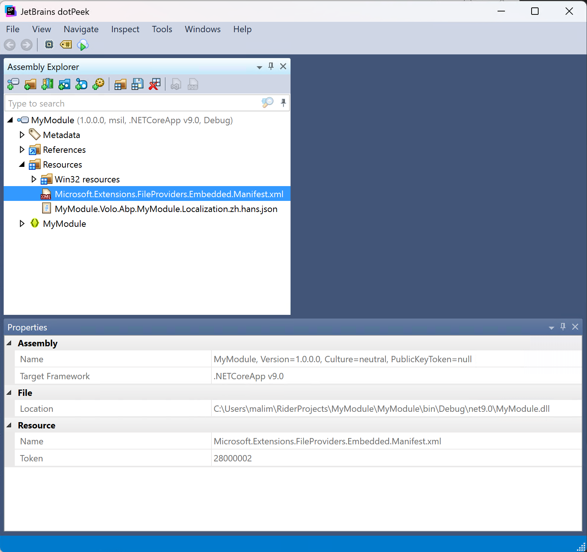

# Understanding the Embedded Files in ABP Framework

Embedded Files functionality in .NET applications allows external files (like configuration files, images, etc.) to be directly embedded into assemblies (.exe or .dll). This simplifies deployment, prevents file loss or tampering, improves security and performance, and reduces path and dependency management issues. Through embedded resources, programs can access these files more conveniently without additional file operations.

## Embedding Files in Your Project

We embed `Volo\Abp\MyModule\Localization\*.json` files into the assembly in our `MyModule.csproj`.

```xml
<Project Sdk="Microsoft.NET.Sdk">

    <PropertyGroup>
        <TargetFramework>net9.0</TargetFramework>
        <OutputType>Exe</OutputType>
        <Nullable>enable</Nullable>
    </PropertyGroup>

    <ItemGroup>
        <PackageReference Include="Microsoft.Extensions.Hosting" Version="9.0.0" />
        <PackageReference Include="Volo.Abp.VirtualFileSystem" Version="9.0.0"  />
    </ItemGroup>

    <ItemGroup>
        <None Remove="Volo\Abp\MyModule\Localization\*.json" />
        <EmbeddedResource Include="Volo\Abp\MyModule\Localization\*.json" />
    </ItemGroup>

</Project>
```

If we check the `en.json` file in our IDE, we'll see it's embedded in the assembly.


When we decompile the built `MyModule.dll` file, we can also see the `en.json` file.


## Accessing Embedded Files in Code

```csharp
public class Program
{
    public static async Task<int> Main(string[] args)
    {
        var embeddedFiles = typeof(Program).Assembly.GetManifestResourceNames();
        foreach (var embeddedFile in embeddedFiles)
        {
            Console.WriteLine(embeddedFile);
            var fileStream = typeof(Program).Assembly.GetManifestResourceStream(embeddedFile);
            if (fileStream != null)
            {
                using var reader = new System.IO.StreamReader(fileStream);
                var content = await reader.ReadToEndAsync();
                Console.WriteLine(content);
            }
        }
    }
}
```
This code will output the embedded file names and their contents.

```
MyModule.Volo.Abp.MyModule.Localization.en.json

{
  "key":"value"
}
```

## Integrating with ABP Virtual File System

The ABP Virtual File System makes it possible to manage files that don't physically exist on the file system (disk). It's mainly used to embed (js, css, image..) files into assemblies and use them like physical files at runtime.

The following code shows how to add embedded files from the current application assembly to the ABP virtual file system:

```csharp
[DependsOn(typeof(AbpVirtualFileSystemModule))]
public class MyModule : AbpModule
{
    public override void ConfigureServices(ServiceConfigurationContext context)
    {
        Configure<AbpVirtualFileSystemOptions>(options =>
        {
            options.FileSets.AddEmbedded<MyModule>();
        });
    }
}
```

ABP creates an `AbpEmbeddedFileProvider` to access the embedded files.

The full name of `en.json` is `MyModule.Volo.Abp.MyModule.Localization.en.json`. Without directory information, ABP uses `.` to split and assume directory information. This creates the following directory structure in the virtual file system:

```
[Dir] [/MyModule]
[Dir] [/MyModule/Volo]
[Dir] [/MyModule/Volo/Abp]
[Dir] [/MyModule/Volo/Abp/MyModule]
[Dir] [/MyModule/Volo/Abp/MyModule/Localization]
[File] [/MyModule/Volo/Abp/MyModule/Localization/en.json]
```

Now you can inject `IVirtualFileProvider` to access embedded files using the directory/file structure above.

## Manifest Embedded File Provider

You might have noticed that using `.` to split and assume directory information can cause confusion if filenames contain dots.

For example, if your filename is `zh.hans.json`, ABP will generate the following directory structure, which isn't what we want:

```
[Dir] [/MyModule]
[Dir] [/MyModule/Volo]
[Dir] [/MyModule/Volo/Abp]
[Dir] [/MyModule/Volo/Abp/MyModule]
[Dir] [/MyModule/Volo/Abp/MyModule/Localization]
[Dir] [/MyModule/Volo/Abp/MyModule/Localization/zh]
[File] [/MyModule/Volo/Abp/MyModule/Localization/zh/hans.json]
```

Microsoft provides the `Microsoft.Extensions.FileProviders.Manifest` library to solve this problem.

We need to add this package dependency and set `<GenerateEmbeddedFilesManifest>true</GenerateEmbeddedFilesManifest>` in our project:

```xml
<Project Sdk="Microsoft.NET.Sdk">

    <PropertyGroup>
        <TargetFramework>net9.0</TargetFramework>
        <OutputType>Exe</OutputType>
        <Nullable>enable</Nullable>
        <GenerateEmbeddedFilesManifest>true</GenerateEmbeddedFilesManifest>
    </PropertyGroup>

    <ItemGroup>
        <PackageReference Include="Microsoft.Extensions.Hosting" Version="9.0.0" />
        <PackageReference Include="Volo.Abp.VirtualFileSystem" Version="9.0.0"  />
        <PackageReference Include="Microsoft.Extensions.FileProviders.Manifest" Version="9.0.0" />
    </ItemGroup>

    <ItemGroup>
        <None Remove="Volo\Abp\MyModule\Localization\*.json" />
        <EmbeddedResource Include="Volo\Abp\MyModule\Localization\*.json" />
    </ItemGroup>

</Project>
```

After rebuilding the project, when we decompile `MyModule.dll`, we'll see an additional `Microsoft.Extensions.FileProviders.Embedded.Manifest.xml` file.



This manifest file stores all the directory and file information of embedded resources. When ABP finds this file, it will use `ManifestEmbeddedFileProvider` instead of `AbpEmbeddedFileProvider` to access embedded files:

```xml
<?xml version="1.0" encoding="utf-8" standalone="yes"?>
<Manifest>
    <ManifestVersion>1.0</ManifestVersion>
    <FileSystem>
        <File Name="Microsoft.Extensions.FileProviders.Embedded.Manifest.xml">
            <ResourcePath>Microsoft.Extensions.FileProviders.Embedded.Manifest.xml</ResourcePath>
        </File>
        <Directory Name="Volo">
            <Directory Name="Abp">
                <Directory Name="MyModule">
                    <Directory Name="Localization">
                        <File Name="zh.hans.json">
                            <ResourcePath>MyModule.Volo.Abp.MyModule.Localization.zh.hans.json</ResourcePath>
                        </File>
                    </Directory>
                </Directory>
            </Directory>
        </Directory>
    </FileSystem>
</Manifest>
```

## Parameters of AddEmbedded Method

The `AddEmbedded` method can take two parameters:

### baseNamespace

This may only be needed if you haven't used the `Manifest Embedded File Provider` and your project's `root namespace` isn't empty. In this case, set your root namespace here.

The `root namespace` is your project's name by default. You can change it or set it to empty in the `csproj` file.

```xml
<Project Sdk="Microsoft.NET.Sdk">
    <PropertyGroup>
        <RootNamespace>MyModule</RootNamespace>
    </PropertyGroup>
</Project>
```

```xml
<Project Sdk="Microsoft.NET.Sdk">
    <PropertyGroup>
        <RootNamespace></RootNamespace>
    </PropertyGroup>
</Project>
```

```csharp
Configure<AbpVirtualFileSystemOptions>(options =>
{
    options.FileSets.AddEmbedded<MyModule>(baseNamespace: "MyModule");
});
```

```
[Dir] [/Volo]
[Dir] [/Volo/Abp]
[Dir] [/Volo/Abp/MyModule]
[Dir] [/Volo/Abp/MyModule/Localization]
[File] [/Volo/Abp/MyModule/Localization/en.json]
```

### baseFolder

If you don't want to expose all embedded files in the project, but only want to expose a specific folder (and sub folders/files), you can set the base folder relative to your project root folder.

> baseFolder is only effective when using `Manifest Embedded File Provider`.

You can set the `baseFolder` parameter to `/Volo/Abp/MyModule`, resulting in this directory structure:

```csharp
Configure<AbpVirtualFileSystemOptions>(options =>
{
    options.FileSets.AddEmbedded<MyModule>(baseFolder: "/Volo/Abp/MyModule");
});
```

```
[Dir] [Localization]
[File] [Localization/en.json]
```

## Summary

We recommend using the `Manifest Embedded File Provider` in your projects and libraries. Hope this article has been helpful.

## References

[ABP Virtual File System](https://abp.io/docs/latest/framework/infrastructure/virtual-file-system)

[Manifest Embedded File Provider](https://learn.microsoft.com/en-us/aspnet/core/fundamentals/file-providers#manifest-embedded-file-provider)
