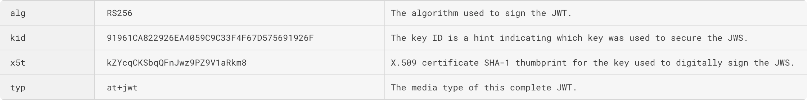
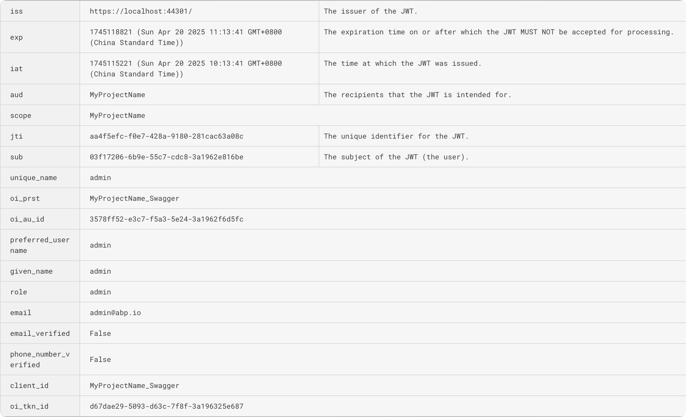

# Common errors in JWT Bearer

When implementing JWT Bearer authentication in an ABP(tiered) application, you might occasionally encounter errors starting with `IDX`. These errors are related to JWT Bearer Token validation and this article will help you understand and resolve them.

This article will introduce the principles of JWT Bearer authentication and provide some common error reasons and solutions.

## Enable JWT Bearer authentication

Your API project usually contains the following code, which enables JWT Bearer authentication and makes it as the default authentication scheme.

We simply configure the JWT's `Authority` and `Audience` properties, and it will work fine.

```csharp
context.Services.AddAuthentication(JwtBearerDefaults.AuthenticationScheme)
	.AddJwtBearer(options =>
	{
		options.Authority = "https://localhost:44301/"; //configuration["AuthServer:Authority"];
		options.Audience = "MyProjectName";
	});
```

> `AddJwtBearer` and `AddAbpJwtBearer` will do the same thing, but `AddAbpJwtBearer` is recommended.

## JWT authentication process

Let's take a look at how the above code works.

A JWT Token usually consists of three parts: `Header`, `Payload`, and `Signature`.

- `Header`: Contains the type and signing algorithm of the token
- `Payload`: Contains the claims of the token, including `sub`, `aud`, `exp`, `iat`, `iss`, `jti`, `preferred_username`, `given_name`, `role`, `email`, etc.
- `Signature`: The cryptographic signature of the token used to verify its authenticity

Here is an example of a JWT Token issued by `AuthServer(OpenIddict)`:

The `Header` part:



The `Payload` part:



### TokenValidationParameters

In the `JwtBearerOptions`, there is a `TokenValidationParameters` property, which is used to validate the JWT Token.

The default implementation for JWT Token validation is `JsonWebTokenHandler`, which comes from the [Microsoft.IdentityModel.JsonWebTokens](https://github.com/AzureAD/azure-activedirectory-identitymodel-extensions-for-dotnet/) package.

We didn't set the `TokenValidationParameters` property in the code above, so the default values below will be used:

```csharp
//...
TokenValidationParameters.ValidateAudience = true
TokenValidationParameters.ValidAudience = "MyProjectName"
TokenValidationParameters.ValidAudiences = null

TokenValidationParameters.ValidateIssuer = true
TokenValidationParameters.ValidIssuer = null
TokenValidationParameters.ValidIssuers = null
//...
```

### JWT Bearer Token Validation Process

During JWT Bearer authentication, API website will get the token from the HTTP request and validate it.

The `JsonWebTokenHandler` will get the `OpenID Connect` metadata from the `AuthServer`, it will be used in the validation process, the current metadata request address is: https://localhost:44301/.well-known/openid-configuration , it is a fixed address calculated from the `Authority` property.

First, the token's Signature is verified using the public key obtained from `OpenID Connect` metadata(https://localhost:44301/.well-known/jwks).

Then, the payload is validated. The payload is a JSON object containing essential information such as the `token type`, `expiration time`, `issuer`, and `audience` etc.

Most of the validation problems we may encounter are payload validation failures, for example:

#### Lifetime

If the token in your request has expired, the validation will fail. You will see the exception information like `IDX10230` in the log.

#### Audience

The `ValidAudience` of `TokenValidationParameters` is `MyProjectName`, the `aud` in the payload of the token is also `MyProjectName`, if the token does not contain `aud` or the `aud` does not match, the validation will fail. You may see the exception information like `IDX10206`, `IDX10277` or `IDX10208`.

> If the `ValidateAudience` of `TokenValidationParameters` is `false`, then the `aud` will not be validated.

#### Issuer

The default value of `TokenValidationParameters.ValidateIssuer` is `true`, it requires the token's payload to contain the `issuer` field, and it must match one of `TokenValidationParameters.ValidIssuer` or `TokenValidationParameters.ValidIssuers`.

> The default value of `ValidIssuer` or `ValidIssuers` is `null`, it will use the `issuer` from the `OpenID Connect` metadata as the default value.

1. If the token's payload does not contain the `issuer` field, you may see the error `IDX10211`.
2. If the API website cannot get the `OpenID Connect` metadata from AuthServer website, the validation will fail. You may see the error `IDX10204`, the full exception message is: `IDX10204: Unable to validate issuer. validationParameters.ValidIssuer is null or whitespace AND validationParameters.ValidIssuers is null or empty.`
3. If the `issuer` does not match, the validation will fail. You may see the error `IDX10205` in the log.

> If the `ValidateIssuer` of `TokenValidationParameters` is `false`, then the `issuer` will not be validated.

> Please note that `OpenIddict` will use the current HTTP request information as the value of `issuer`. If the AuthServer website is deployed behind a reverse proxy or similar deployment configurations, the `issuer` in the token may not be the value you expect. In this case, please specify it manually.

```csharp
PreConfigure<OpenIddictServerBuilder>(serverBuilder =>
{
	serverBuilder.SetIssuer("https://localhost:44301/");
});
```

## Troubleshooting

To troubleshoot any `IDX` errors during JWT authentication, you can enable detailed logging by configuring the `identitymodel` logs as follows:

```csharp
using System.Diagnostics.Tracing;
using Microsoft.IdentityModel.Logging;

public class Program
{
    public async static Task<int> Main(string[] args)
    {
        IdentityModelEventSource.ShowPII = true;
        IdentityModelEventSource.Logger.LogLevel = EventLevel.Verbose;
        var wilsonTextLogger = newTextWriterEventListener("Logs/identitymodel.txt");
        wilsonTextLogger.EnableEvents(IdentityModelEventSource.Logger, EventLevel.Verbose);

		//...
    }
}
```

Additionally, you can enable `OpenIddict`'s `Verbose` logs for more detailed debugging information:

```csharp
var loggerConfiguration = new LoggerConfiguration()
    .MinimumLevel.Debug()
    .MinimumLevel.Override("Microsoft.EntityFrameworkCore", LogEventLevel.Warning)
    .MinimumLevel.Override("OpenIddict", LogEventLevel.Verbose)
    .Enrich.FromLogContext()
    .WriteTo.Async(c => c.File("Logs/logs.txt"))
```

## Summary

For JWT authentication, you need to pay attention to the following key points:

1. Ensure your API website can communicate with the AuthServer properly
2. Verify that the `aud` claim in your token matches the expected audience
3. Confirm that the `issuer` claim in your token is valid and matches the configuration

You can customize the `JwtBearerOptions`'s `TokenValidationParameters` to modify the validation rules to meet your actual needs.

For example, if your `issuer` needs to support multiple subdomains, you can use the [Owl.TokenWildcardIssuerValidator](https://github.com/maliming/Owl.TokenWildcardIssuerValidator) library to customize the validation.

```csharp
services.AddAuthentication(JwtBearerDefaults.AuthenticationScheme)
    .AddJwtBearer(options =>
    {
        options.Authority = "https://abp.io";
        options.Audience = "abp_io";

        options.TokenValidationParameters.IssuerValidator = TokenWildcardIssuerValidator.IssuerValidator;
        options.TokenValidationParameters.ValidIssuers = new[]
        {
            "https://{0}.abp.io"
        };
    });
```

## References

- [Configure JWT bearer authentication in ASP.NET Core]([https://learn.microsoft.com/en-us/aspnet/core/security/authentication/jwt-auth?view=aspnetcore-8.0](https://learn.microsoft.com/en-us/aspnet/core/security/authentication/configure-jwt-bearer-authentication))
- [OpenIddict](https://github.com/openiddict/openiddict-core)
- [IdentityModel](https://github.com/AzureAD/azure-activedirectory-identitymodel-extensions-for-dotnet)
- [Owl.TokenWildcardIssuerValidator](https://github.com/maliming/Owl.TokenWildcardIssuerValidator)
