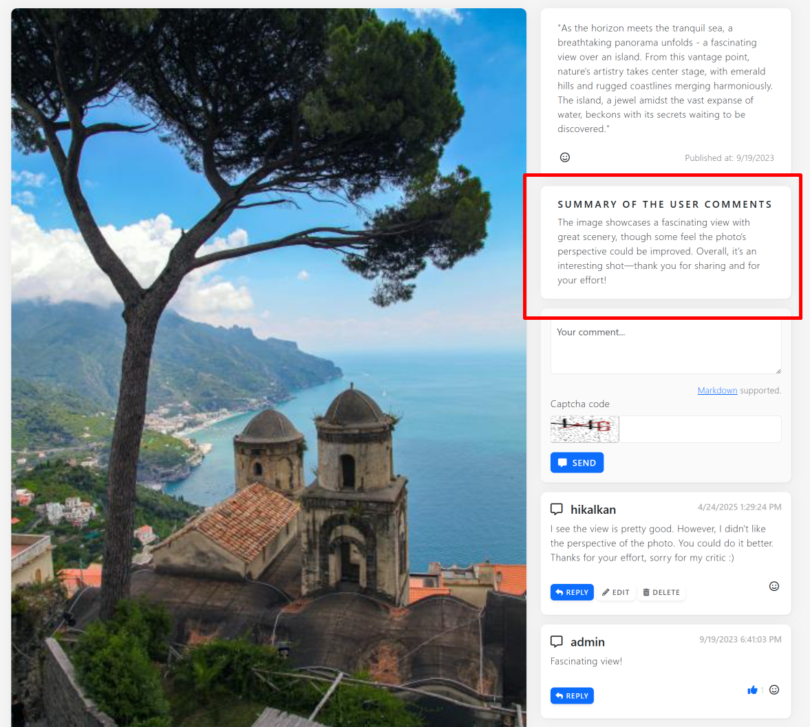
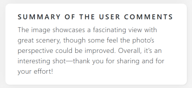

# Using Microsoft AI Extensions Library and OpenAI to Summarize User Comments

Either you are building an e-commerce application or a simple blog, **user comments** (about your products or blog posts) **can grow rapidly**, making it harder for users to get the gist of discussions at a glance. AI is a pretty good tool to solve the problem. By using AI, you can **summarize all the user comments** and show a single paragraph to your users, so they can easily understand the overall thought of users about the product or the blog post.

In this tutorial, we’ll walk through a real-life implementation of using AI to summarize multiple user comments in an application. I will implement the solution based on ABP's **[CMS Kit](https://abp.io/docs/latest/modules/cms-kit)** library, as it already features a **[commenting system](https://abp.io/docs/latest/modules/cms-kit/comments)** and a [demo application](https://cms-kit-demo.abpdemo.com/) that displays user comments on **[gallery images](https://cms-kit-demo.abpdemo.com/image-gallery)** (it has not a comment summary feature yet, we will implement it in this tutorial).

## A Screenshot

Here, an example screenshot from the application with the comment summary feature:



## Cloning the Repository

If you want to follow the development, you can clone the [CMS Kit Demo repository](https://github.com/abpframework/cms-kit-demo) to your computer and make it running by following the instructions on the [README file](https://github.com/abpframework/cms-kit-demo?tab=readme-ov-file#cms-kit-demo).

I suggest to you to play a little with [the application](https://cms-kit-demo.abpdemo.com/) (create a new user for yourself, add some comments to the images in the gallery), so you understand how it works.

## Preparing the Solution for AI

I will use [Microsoft AI Extensions Library](https://learn.microsoft.com/en-us/dotnet/ai/ai-extensions) to use the AI features. It is an abstraction library that can work with multiple AI models and tools. I will use an OpenAI model in the demo.

The first step is to add the [Microsoft.Extensions.AI.OpenAI](http://nuget.org/packages/Microsoft.Extensions.AI.OpenAI) NuGet package to the project:

````bash
dotnet add package Microsoft.Extensions.AI.OpenAI --prerelease
````

>The Microsoft AI Extensions Library was in preview at the time when I wrote this article. If it has a stable release now, you can remove the `--prerelease` parameter for the preceding command.

We will store the OpenAI key and model name in user secrets. So, locate the root path of the CMS Kit project (`src\CmsKitDemo` folder) and execute the following commands in order in a command-line terminal:

````bash
dotnet user-secrets init
dotnet user-secrets set OpenAIKey <your-openai-key>
dotnet user-secrets set ModelName <your-openai-model-name>
````

For this example, you need to have an [OpenAI API Key](https://platform.openai.com/). That's all. Now, we are ready to use the AI.

## Implementing the AI Summarization

Let's start from the most important point of this article: Comment summarization. I will create a class named `AiCommentSummarizer` to implement the summarization work. Here, the full content of that class:

````csharp
using System.Text;
using Microsoft.Extensions.AI;
using OpenAI;
using Volo.Abp.DependencyInjection;

namespace CmsKitDemo.Utils;

public class AiCommentSummarizer : ITransientDependency
{
    private readonly IConfiguration _configuration;

    public AiCommentSummarizer(IConfiguration configuration)
    {
        _configuration = configuration;
    }
    
    public async Task<string> SummarizeAsync(string[] commentTexts)
    {
        // Get the model and key from the configuration
        var aiModel = _configuration["ModelName"];
        var apiKey = _configuration["OpenAIKey"];

        if (aiModel.IsNullOrEmpty() || apiKey.IsNullOrEmpty())
        {
            return "";
        }

        // Create the IChatClient
        var client = new OpenAIClient(apiKey)
            .GetChatClient(aiModel)
            .AsIChatClient();

        // Create a prompt (input for AI)
        var promptBuilder = new StringBuilder();

        promptBuilder.AppendLine(
            @"There are comments from different users of our website about an image.
We want to summarize the comments into a single comment.
Return a single comment with a maximum of 512 characters. Comments are separated by a newline character and given below."
        );
        promptBuilder.AppendLine();
        
        foreach (var commentText in commentTexts)
        {
            promptBuilder.AppendLine("User comment:");
            promptBuilder.AppendLine(commentText);
            promptBuilder.AppendLine();
        }
        
        // Submit the prompt and get the response
        var response = await client.GetResponseAsync(
            promptBuilder.ToString(),
            new ChatOptions { MaxOutputTokens = 1024 }
        );

        return response.Text;
    }
}
````

That class is pretty simple and already decorated with comments:

* First, we are getting the API Key and an OpenAI model name from user secrets. I used `gpt-4.1` as the model name, but you can use another available model.
* Then we are obtaining an `IChatClient` reference for OpenAI. `IChatClient` interface is an abstraction that is provided by the [Microsoft AI Extensions Library](https://learn.microsoft.com/en-us/dotnet/ai/ai-extensions) library, so we can implement rest of the code independently from OpenAI.
* Then we continue by building a proper prompt (input) for the AI operation.
* And finally we are using the AI to generate a response (the summary).

At this point, all the AI-related work has already been done. The rest of this article explains how to integrate that summarization feature with the [CMS Kit Demo application](https://cms-kit-demo.abpdemo.com/).

## Adding a CommentsSummary Property to the GalleryImage Entity

The `GalleryImage` entity is used to represent an image on [the image gallery](https://cms-kit-demo.abpdemo.com/image-gallery). I add a `CommentsSummary` property to that entity:

````csharp
public class GalleryImage : CreationAuditedAggregateRoot<Guid>
{
    public string Description { get; set; }

    public Guid CoverImageMediaId { get; set; }
    
    public string CommentsSummary { get; set; } // The new property is here

    //...
}
````

Since the CMS Kit Demo application uses Entity Framework Core, I need to add a new database schema migration and update the database:

````bash
dotnet ef migrations add Added_Summary_To_GalleryImage
dotnet ef database update
````

## Updating the Summary

Great, we have a `GalleryImage.CommentsSummary` property now. But, how will it be updated when a users adds or removes a comment for an image? To implement that;

* We will listen all the change events for user comments (when a user adds, removes or updates a comment).
* Whenever a comment is changed, we will find the related gallery image, retrieve all the user comments for this image, use the `AiCommentSummarizer` class to summarize all the comments.
* Finally, we wil set the `GalleryImage.CommentsSummary` property with the generated summary text.

Here, the implementation:

````csharp
using CmsKitDemo.Entities;
using CmsKitDemo.Utils;
using Microsoft.EntityFrameworkCore;
using Volo.Abp.DependencyInjection;
using Volo.Abp.Domain.Entities.Events;
using Volo.Abp.Domain.Repositories;
using Volo.Abp.EventBus;
using Volo.CmsKit.Comments;

namespace CmsKitDemo.EventHandlers;

public class GalleryImageCommentListener : 
             ILocalEventHandler<EntityChangedEventData<Comment>>,
             ITransientDependency
{
    private readonly IRepository<GalleryImage, Guid> _galleryImageRepository;
    private readonly IRepository<Comment, Guid> _commentRepository;
    private readonly AiCommentSummarizer _aiCommentSummarizer;

    public GalleryImageCommentListener(
        IRepository<GalleryImage, Guid> galleryImageRepository,
        IRepository<Comment, Guid> commentRepository,
        AiCommentSummarizer aiCommentSummarizer)
    {
        _galleryImageRepository = galleryImageRepository;
        _commentRepository = commentRepository;
        _aiCommentSummarizer = aiCommentSummarizer;
    }
    
    public async Task HandleEventAsync(EntityChangedEventData<Comment> eventData)
    {
        var comment = eventData.Entity;
        
        //Here, we only interest in comments related to image gallery items
        if (comment.EntityType != CmsKitDemoConsts.ImageGalleryEntityType)
        {
            return;
        }

        if (!Guid.TryParse(comment.EntityId, out var galleryImageId))
        {
            return;
        }
        
        // Get the related image from database
        var galleryImage = await _galleryImageRepository.FindAsync(galleryImageId);
        if (galleryImage == null)
        {
            return;
        }
        
        // Get all the comments related to the image
        var queryable = await _commentRepository.GetQueryableAsync();
        var allCommentTexts = await queryable
            .Where(c => c.EntityType == CmsKitDemoConsts.ImageGalleryEntityType &&
                        c.EntityId == comment.EntityId)
            .Select(c => c.Text)
            .ToArrayAsync();

        // Update the summary of comments related to the image
        if (allCommentTexts.Length <= 0)
        {
            galleryImage.CommentsSummary = "";
        }
        else
        {
            galleryImage.CommentsSummary =
                await _aiCommentSummarizer.SummarizeAsync(allCommentTexts);
        }

        // Update the image in database
        await _galleryImageRepository.UpdateAsync(galleryImage);
    }
}
````

Let's explain that class:

* `GalleryImageCommentListener` implements the `ILocalEventHandler<EntityChangedEventData<Comment>>` interface. In this way, it can handle an event whenever a `Comment` [entity](https://abp.io/docs/latest/framework/architecture/domain-driven-design/entities) is changed (created, updated or deleted). We are using ABP's [local event bus](https://abp.io/docs/latest/framework/infrastructure/event-bus/local) and its [pre-defined events](https://abp.io/docs/latest/framework/infrastructure/event-bus/local#pre-built-events).
* `HandleEventAsync` is called by the ABP Framework whenever a new `Comment` is created, or an existing `Comment` is deleted or updated. 
* ABP's `Comment` entity is reusable and it can be associated with any kind of objects (blog posts, images, etc). So, first we are checking if this comment is related to an image gallery item.
* Then we are getting the related `GalleryImage` entity from the database.
* And getting all comments (including the new one) from the database for this image.
* Finally, using the `AiCommentSummarizer` class to generate the summary and set the `CommentsSummary` property.

## Show the Summary Card on the UI

Everything is ready on the backend. Now, we can show the summary text on the user interface. To do, that, I added `CommentsSummary` property also to the `GalleryImageDto` class and used it on the `/Pages/Gallery/Detail.cshtml` view:

````csharp
@if (!Model.Image.CommentsSummary.IsNullOrEmpty())
{
    <div class="card mt-3">
        <div class="card-body">
            <h6 class="card-title">Summary of the User Comments</h6>
            <p class="mb-auto">@Model.Image.CommentsSummary</p>
        </div>
    </div>
}
````

That section renders the following card on the user interface:



## Conclusion

In this article, I demonstrated how to use [Microsoft AI Extensions Library](https://learn.microsoft.com/en-us/dotnet/ai/ai-extensions) to work with OpenAI for summarization of multiple user comments. I reused the [ABP's CMS Kit Demo application](https://github.com/abpframework/cms-kit-demo) to show it in a more real world example.

## Source Code

* [Source code of the CMS Kit Demo application](https://github.com/abpframework/cms-kit-demo)
* [All the changes made for this article (as a pull request)](https://github.com/abpframework/cms-kit-demo/pull/18)