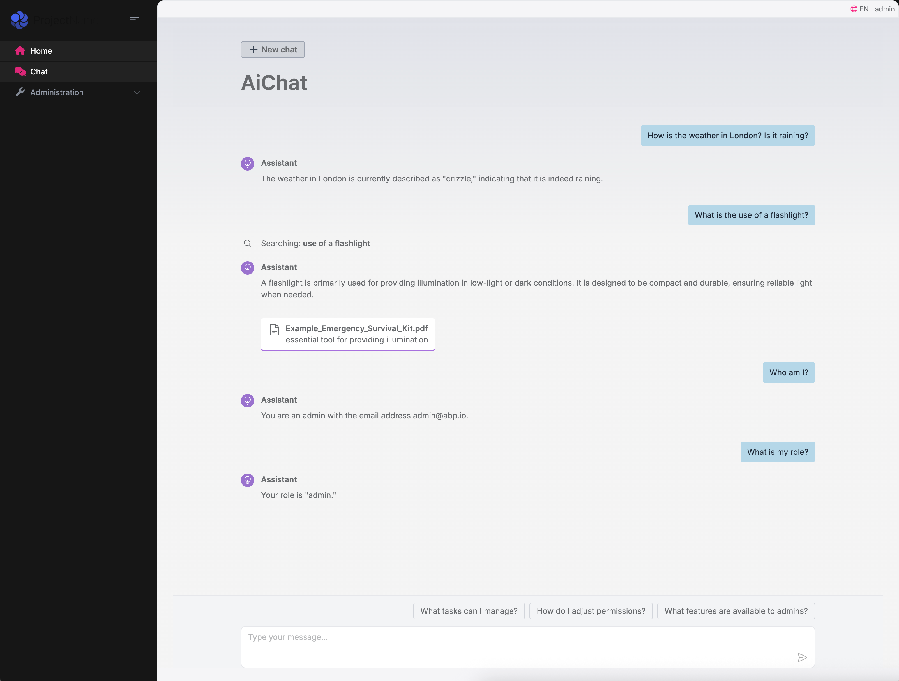

# Integrating .NET AI Chat Template with ABP Framework

This article demonstrates how to integrate the .NET AI Chat Template into an ABP Framework application, enabling powerful AI chat capabilities in your ABP-based solution.


## Step 1: Create a New ABP Project

First, let's create a new [single-layer Blazor Server project](https://abp.io/docs/latest/solution-templates/single-layer-web-application/overview) named `AbpAiChat` using ABP Studio, You can also use the following ABP CLI command to create the project:

```bash
abp new AbpAiChat -t app-nolayers --ui-framework blazor-server --use-open-source-template
```

## Step 2: Integrate AI Chat Template

The integration process involves copying and adapting the .NET AI Chat Template code into our ABP project. The template code is already included in our sample project, so you don't need to install it separately.

### 2.1 Project Structure Changes

1. Copy Blazor components to the `Components` folder
2. Copy AI service classes to the `Services` folder
3. Add required entities(`IngestedDocument`, `IngestedRecord`) to the `AbpAiChatDbContext` and add new migration
4. Copy frontend resources to the `wwwroot` folder
5. Adjust some styles to capatible with the ABP theme

### 2.2 Required NuGet Packages

Add the following packages to `AbpAiChat.csproj`:

```xml
<PackageReference Include="Microsoft.Extensions.AI.OpenAI" Version="9.4.3-preview.1.25230.7" />
<PackageReference Include="Microsoft.EntityFrameworkCore.Sqlite" Version="9.0.4" />
<PackageReference Include="Microsoft.Extensions.AI" Version="9.4.3-preview.1.25230.7" />
<PackageReference Include="Microsoft.SemanticKernel.Core" Version="1.47.0" />
<PackageReference Include="PdfPig" Version="0.1.9" />
<PackageReference Include="System.Linq.Async" Version="6.0.1" />
```

### 2.3 Configure AI Services

Add the following configuration to `AbpAiChatModule.cs`:

```csharp
private void ConfigureAi(ServiceConfigurationContext context)
{
    var credential = new ApiKeyCredential(context.Services.GetConfiguration()["GitHubToken"] ?? throw new InvalidOperationException("Missing configuration: GitHubToken. See the README for details."));
    var openAiOptions = new OpenAIClientOptions()
    {
        Endpoint = new Uri("https://models.inference.ai.azure.com")
    };

    var ghModelsClient = new OpenAIClient(credential, openAiOptions);
    var chatClient = ghModelsClient.GetChatClient("gpt-4o-mini").AsIChatClient();
    var embeddingGenerator = ghModelsClient.GetEmbeddingClient("text-embedding-3-small").AsIEmbeddingGenerator();

    var vectorStore = new JsonVectorStore(Path.Combine(AppContext.BaseDirectory, "vector-store"));

    context.Services.AddSingleton<IVectorStore>(vectorStore);
    context.Services.AddScoped<DataIngestor>();
    context.Services.AddSingleton<SemanticSearch>();
    context.Services.AddChatClient(chatClient).UseFunctionInvocation().UseLogging();
    context.Services.AddEmbeddingGenerator(embeddingGenerator);

    context.Services.Configure<AbpAspNetCoreContentOptions>(options =>
    {
        options.ContentTypeMaps.Add(".mjs", "application/javascript");
    });
}
```

### 2.4 Configure GitHub Token

Add your GitHub Personal Access Token to `appsettings.json`:

```json
{
    "GitHubToken": "your-github-token"
}
```

You can obtain your token from [GitHub Personal Access Tokens](https://github.com/settings/personal-access-tokens).

## Step 3: Add Custom AI Functionality

Let's add a custom AI function to retrieve the current user's information. Update the `Chat.razor` component:

```csharp
chatOptions.Tools =
[
    AIFunctionFactory.Create(SearchAsync),
    AIFunctionFactory.Create(GetWeather),
    AIFunctionFactory.Create(GetCurrentUserInfo)
];

[Description("Get current user information")]
private Task<string> GetCurrentUserInfo()
{
    return Task.FromResult(CurrentUser.IsAuthenticated ?
        $"UserId: {CurrentUser.Id}, Name: {CurrentUser.UserName}, Email: {CurrentUser.Email}, Roles: {string.Join(", ", CurrentUser.Roles)}" :
        "No user information available.");
}
```

## Step 4: Add Navigation

Add a `Chat` menu item in `AbpAiChatMenuContributor` to navigate to the AI Chat component.

## Running the Application

After completing the integration, you can run the application and access the AI chat functionality. The chat interface allows you to:

- Get weather information
- Ask questions about PDF content
- Retrieve current user information
- And more!



## Conclusion

This integration demonstrates how to leverage the power of AI in your ABP Framework applications. The .NET AI Chat Template provides a solid foundation for building intelligent chat interfaces, and ABP Framework makes it more powerful.

## References

- [ABP Single Layer Solution](https://abp.io/docs/latest/solution-templates/single-layer-web-application/overview)
- [AbpAiChat Source Code](https://github.com/abpframework/abp/tree/dev/samples/AbpAiChat)
- [.NET AI Template Documentation](https://devblogs.microsoft.com/dotnet/announcing-dotnet-ai-template-preview1/)
- [GitHub Personal Access Tokens Guide](https://docs.github.com/en/authentication/keeping-your-account-and-data-secure/managing-your-personal-access-tokens)
