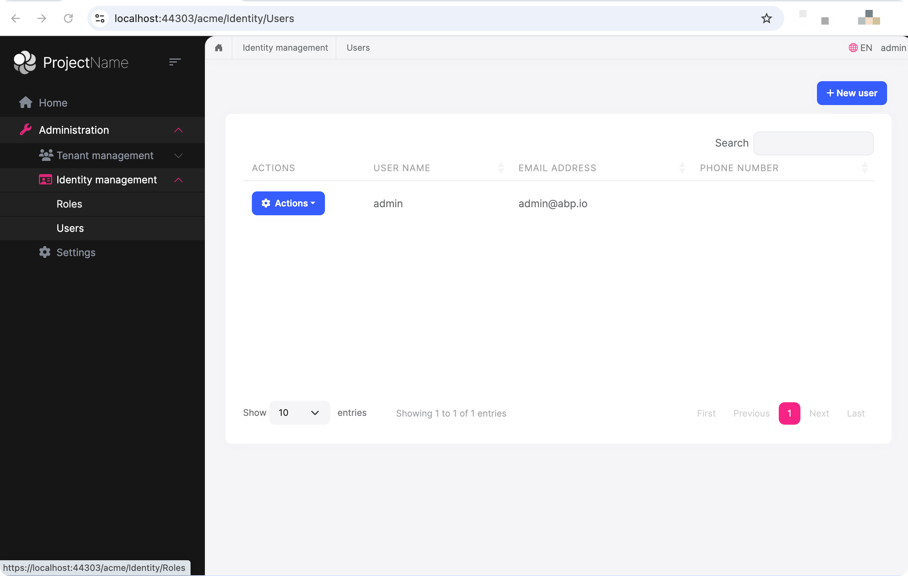

# Resolving Tenant from Route in ABP Framework


The ABP Framework provides multi-tenancy support with various ways to resolve tenant information, including: Cookie, Header, Domain, Route, and more.

This article will demonstrate how to resolve tenant information from the route.

## Tenant Information in Routes

In the ABP Framework, tenant information in routes is handled by the `RouteTenantResolveContributor`.

Let's say your application is hosted at `https://abp.io` and you have a tenant named `acme`. You can add the `{__tenant}` variable to your controller or page routes like this:

```csharp
[Route("{__tenant}/[Controller]")]
public class MyController : MyProjectNameController
{
    [HttpGet]
    public IActionResult Get()
    {
        return Ok("Hello My Page");
    }
}
```

```cshtml
@page "{__tenant?}/mypage"
@model MyPageModel

<html>
<body>
    <h1>My Page</h1>
</body>
</html>
```

When you access `https://abp.io/acme/my` or `https://abp.io/acme/mypage`, ABP will automatically resolve the tenant information from the route.

## Adding __tenant to Global Routes

While we've shown how to add `{__tenant}` to individual controllers or pages, you might want to add it globally to your entire application. Here's how to implement this:

```cs
using System;
using System.Collections.Generic;
using System.Linq;
using Microsoft.AspNetCore.Mvc.ApplicationModels;

namespace MyCompanyName;

public class AddTenantRouteToPages : IPageRouteModelConvention, IApplicationModelConvention
{
    public void Apply(PageRouteModel model)
    {
        var selectorCount = model.Selectors.Count;
        var selectorModels = new List<SelectorModel>();
        for (var i = 0; i < selectorCount; i++)
        {
            var selector = model.Selectors[i];
            selectorModels.Add(new SelectorModel
            {
                AttributeRouteModel = new AttributeRouteModel
                {
                    Template = AttributeRouteModel.CombineTemplates("{__tenant:regex(^[a-zA-Z0-9]+$)}", selector.AttributeRouteModel!.Template!.RemovePreFix("/"))
                }
            });
        }
        foreach (var selectorModel in selectorModels)
        {
            model.Selectors.Add(selectorModel);
        }
    }
}

public class AddTenantRouteToControllers :IApplicationModelConvention
{
    public void Apply(ApplicationModel application)
    {
        var controllers = application.Controllers;
        foreach (var controller in controllers)
        {
            var selector = controller.Selectors.FirstOrDefault();
            if (selector == null || selector.AttributeRouteModel == null)
            {
                controller.Selectors.Add(new SelectorModel
                {
                    AttributeRouteModel = new AttributeRouteModel
                    {
                        Template = AttributeRouteModel.CombineTemplates("{__tenant:regex(^[[a-zA-Z0-9]]+$)}", controller.ControllerName)
                    }
                });
                controller.Selectors.Add(new SelectorModel
                {
                    AttributeRouteModel = new AttributeRouteModel
                    {
                        Template = controller.ControllerName
                    }
                });
            }
            else
            {
                var template = selector.AttributeRouteModel?.Template;
                template = template.IsNullOrWhiteSpace() ? "{__tenant:regex(^[[a-zA-Z0-9]]+$)}" : AttributeRouteModel.CombineTemplates("{__tenant:regex(^[[a-zA-Z0-9]]+$)}", template.RemovePreFix("/"));
                controller.Selectors.Add(new SelectorModel
                {
                    AttributeRouteModel = new AttributeRouteModel
                    {
                        Template = template
                    }
                });
            }
        }
    }
}
```

Register the services:

```cs
public override void ConfigureServices(ServiceConfigurationContext context)
{
    //...
    
    PostConfigure<RazorPagesOptions>(options =>
    {
        options.Conventions.Add(new AddTenantRouteToPages());
    });

    PostConfigure<MvcOptions>(options =>
    {
        options.Conventions.Add(new AddTenantRouteToControllers());
    });
    
    // Configure cookie path to prevent authentication cookie loss
    context.Services.ConfigureApplicationCookie(x =>
    {
        x.Cookie.Path = "/";
    });
    //...
}
```

After implementing this, you'll notice that all controllers in your Swagger UI will have the `{__tenant}` route added:


## Handling Navigation Links

To ensure navigation links automatically include tenant information, we need to add middleware that dynamically adds the tenant to the PathBase:

```cs
public override void OnApplicationInitialization(ApplicationInitializationContext context)
{
    //...
    app.Use(async (httpContext, next) =>
    {
        var tenantMatch = Regex.Match(httpContext.Request.Path, "^/([^/.]+)(?:/.*)?$");
        if (tenantMatch.Groups.Count > 1 && !string.IsNullOrEmpty(tenantMatch.Groups[1].Value))
        {
            var tenantName = tenantMatch.Groups[1].Value;
            if (!tenantName.IsNullOrWhiteSpace())
            {
                var tenantStore = httpContext.RequestServices.GetRequiredService<ITenantStore>();
                var tenantNormalizer = httpContext.RequestServices.GetRequiredService<ITenantNormalizer>();
                var tenantInfo = await tenantStore.FindAsync(tenantNormalizer.NormalizeName(tenantName)!);
                if (tenantInfo != null)
                {
                    if (httpContext.Request.Path.StartsWithSegments(new PathString(tenantName.EnsureStartsWith('/')), out var matchedPath, out var remainingPath))
                    {
                        var originalPath = httpContext.Request.Path;
                        var originalPathBase = httpContext.Request.PathBase;
                        httpContext.Request.Path = remainingPath;
                        httpContext.Request.PathBase = originalPathBase.Add(matchedPath);
                        try
                        {
                            await next(httpContext);
                        }
                        finally
                        {
                            httpContext.Request.Path = originalPath;
                            httpContext.Request.PathBase = originalPathBase;
                        }
                        return;
                    }
                }
            }
        }

        await next(httpContext);
    });
    app.UseRouting();
    app.MapAbpStaticAssets();
    //...
}
```



After setting the PathBase, we need to add a custom tenant resolver to extract tenant information from the `PathBase`:

```cs
public class MyRouteTenantResolveContributor : RouteTenantResolveContributor
{
    public const string ContributorName = "MyRoute";

    public override string Name => ContributorName;

    protected override Task<string?> GetTenantIdOrNameFromHttpContextOrNullAsync(ITenantResolveContext context, HttpContext httpContext)
    {
        var tenantId = httpContext.GetRouteValue(context.GetAbpAspNetCoreMultiTenancyOptions().TenantKey) ?? httpContext.Request.PathBase.ToString();
        var tenantIdStr = tenantId?.ToString()?.RemovePreFix("/");
        return Task.FromResult(!tenantIdStr.IsNullOrWhiteSpace() ? Convert.ToString(tenantIdStr) : null);
    }
}
```

Register the MyRouteTenantResolveContributor with the ABP Framework:

```cs
public override void ConfigureServices(ServiceConfigurationContext context)
{
    //...
    Configure<AbpTenantResolveOptions>(options =>
    {
        options.TenantResolvers.Add(new MyRouteTenantResolveContributor());
    });
    //...
}
```

### Modifying abp.appPath

```csharp
public override void ConfigureServices(ServiceConfigurationContext context)
{
    //...
    context.Services.AddOptions<AbpThemingOptions>().Configure<IServiceProvider>((options, rootServiceProvider) =>
    {
        var currentTenant = rootServiceProvider.GetRequiredService<ICurrentTenant>();
        if (!currentTenant.Name.IsNullOrWhiteSpace())
        {
            options.BaseUrl = currentTenant.Name.EnsureStartsWith('/').EnsureEndsWith('/');
        }
    });

    context.Services.RemoveAll(x => x.ServiceType == typeof(IOptions<AbpThemingOptions>));
    context.Services.Add(ServiceDescriptor.Scoped(typeof(IOptions<>), typeof(OptionsManager<>)));
    //...
}
```

Browser console output:

```cs
> https://localhost:44303/acme/
> abp.appPath
> '/acme/'
```

## Summary

By following these steps, you can implement tenant resolution from routes in the ABP Framework and handle navigation links appropriately. This approach provides a clean and maintainable way to manage multi-tenancy in your application.


## References

- [ABP Multi-Tenancy](https://docs.abp.io/en/abp/latest/Multi-Tenancy)
- [Routing in ASP.NET Core](https://learn.microsoft.com/en-us/aspnet/core/fundamentals/routing)
- [HTML base tag](https://developer.mozilla.org/en-US/docs/Web/HTML/Element/base)
