# Multi-Tenancy with Separate Databases in .NET and ABP Framework

[Multi-tenancy](https://abp.io/architecture/multi-tenancy) is a common architectural concept for modern SaaS applications, enabling a single application to serve multiple customers (each known as a tenant) while maintaining data isolation, scalability, and operational efficiency. The "Separate database per tenant" approach offers the highest level of data isolation, making it ideal for scenarios with strict data privacy, security, and performance requirements.

In this article, we’ll explore how to use this advanced multi-tenancy model using the powerful capabilities of the ABP Framework and the .NET platform.

> In this article, I will use [ABP Studio](https://abp.io/studio) for creating the application. ABP Studio allows to select "separate database per tenant" option only for [commercial licenses](https://abp.io/pricing).

## Understanding Database Models for a Multi-Tenant Application

In the next sections, I will explain various models for database models of a multi-tenant solution:

* Single (shared) Database Model
* Separate Tenant Databases Model
* Hybrid Multi-Tenant Database Model

Let's start with the first one...

### Single (shared) Database Model

In the shared database model, all the application data stored in a single physical database. In the following diagram, you see different kind of users use the application, and the application stored their data in a main database:

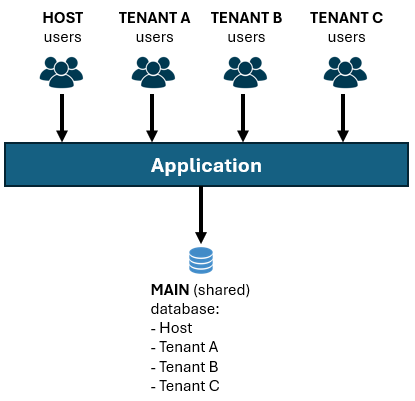

This is the default behavior when you [create a new ABP application](https://abp.io/docs/latest/get-started), because it is simple to begin with and proper for must applications.

In this model, a single database table may contain data of multiple tenants. Each row in these tables have a `TenantId` field which is used to distinguish the tenant data and isolate a tenant's data from other tenant users. To make your entities multi-tenant aware, all you have to do is to implement the `IMultiTenant` interface provided by the ABP Framework.

Here, is an example `Product` entity that should support multi-tenancy:

````csharp
using System;
using Volo.Abp.Domain.Entities;
using Volo.Abp.MultiTenancy;

namespace MtDemoApp
{
    public class Product : AggregateRoot<Guid>, IMultiTenant //Implementing the interface
    {
        public Guid? TenantId { get; set; } //Defined by the IMultiTenant interface
        public string Name { get; set; }
        public float Price { get; set; }
    }
}
````

In this way, ABP Framework automatically isolates data using the `TenantId` property. You don't need to care about how to set `TenantId` or filter data when you need to query from database - all automated.

### Separate Tenant Databases Model

In the separate tenant database model, each tenant has a dedicated physical database (with a separate connection string), as shown below:

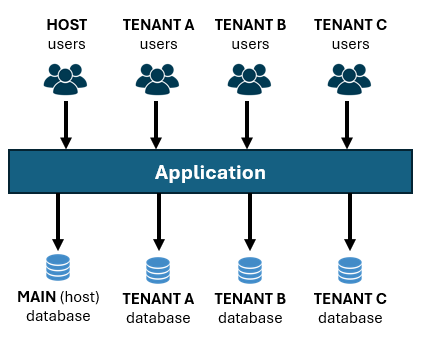

ABP Framework can automatically select the right database from the current user's tenant context. Again, it is completely automated. You just need to set a connection string for a tenant, as we will do later in this article.

Even each tenant has a separate database, we still need to a main database to store host-side data, like a table of tenants, their connection strings and some other management data for tenants. Also, tenant-independent (or tenant-shared) application data is stored in the main database.

### Hybrid Multi-Tenant Database Model

Lastly, you may want to have a hybrid model, where some tenants shares a single database (they don't have separate databases) but some of them have dedicated databases. In the following figure, Tenant C has its own physical database, but all other tenants data stored in the main database of the application.

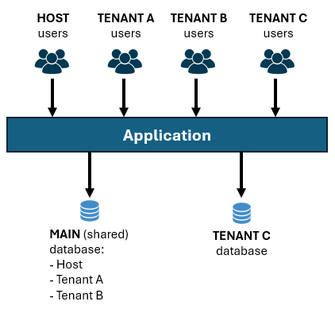

ABP Framework handles the complexity: If a tenant has a separate database it uses that tenant's database, otherwise it filters the tenant data by the `TenantId` field in shared tables.

## Understanding the Separate Tenant Schema Approach

When you create a new ABP solution, it has a single `DbContext` class (for Entity Framework Core) by default. It also includes the necessary EF Core code-first database migrations to create and update the database. As a result of this approach, the main database schema (tables and their fields) will be identical with a tenant database schema. As a drawback of that, tenant databases have some tables that are not meaningful and not used. For example, Tenants table (a list of tenants) will be created in the tenant database, but will never be used (because tenant list is stored in the main database).

As a solution to that problem, ABP Studio provides a "Use separate tenant schema" option on the Multi-Tenancy step of the solution creation wizard:

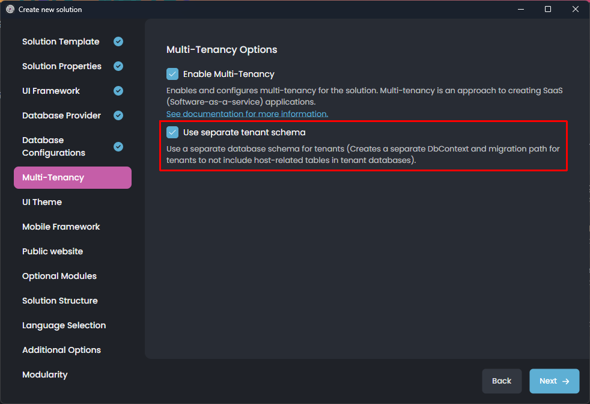

This option is only available for the [Layered Monolith (optionally Modular) Solution Template](https://abp.io/docs/latest/get-started/layered-web-application). We don't provide that option in other templates, because:

* [Single-Layer](https://abp.io/docs/latest/get-started/single-layer-web-application) template is recommended for more simpler applications with an easy-to-understand architecture. We don't want to add these kind of complications in that template.
* [Microservice](https://abp.io/docs/latest/get-started/microservice) template already has a separate database for each service. Having multiple database schema (and multiple `DbContext` classes) for each service makes it over complicated without bringing much value.

While you can manually convert your applications so they support separate database schema approach (ABP is flexible), it is not recommended to do it for these solution types.

> Note that "Separate database per tenant" approach is already supported by default for the Single-Layer template too. "Separate tenant schema" is something different as I explained in this section.

## Creating a new Application

Follow the *[Get Started tutorial](https://abp.io/docs/latest/get-started/layered-web-application)* to create a new ABP application. Remember to select the "*Use separate tenant schema*" option since I want to demonstrate it in this article.

## Understanding the DbContext Structure

When you open the solution in your IDE, you will see the following structure under the `.EntityFrameworkCore` project:

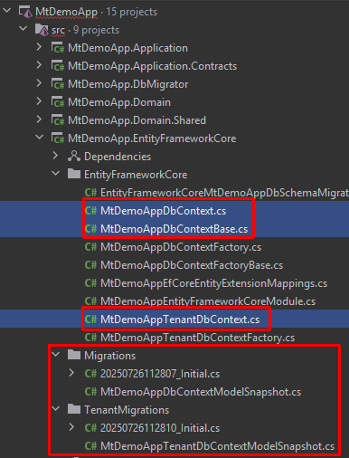

There are 3 DbContext-related classes here (MtDemoApp is your application name):

* `MtDemoAppDbContext` class is used to map entities for the main (host + shared) database.
* `MtDemoAppTenantDbContext` class is used to map entities for tenant that have separate physical databases.
* `MtDemoAppDbContextBase` is an abstract base class for the classes explained above. In this way, you can configure common mapping logic here.

Let's see these classes a bit closer...

### The Main `DbContext` Class

Here the main `DbContext` class:

````csharp
public class MtDemoAppDbContext : MtDemoAppDbContextBase<MtDemoAppDbContext>
{
    public MtDemoAppDbContext(DbContextOptions<MtDemoAppDbContext> options)
        : base(options)
    {
    }

    protected override void OnModelCreating(ModelBuilder builder)
    {
        builder.SetMultiTenancySide(MultiTenancySides.Both);

        base.OnModelCreating(builder);
    }
}
````

* It inherits from the `MtDemoAppDbContextBase` as I mentioned before. So, any configuration made in the base class is also valid here.
* `OnModelCreating` overrides the base method and sets the multi-tenancy side as `MultiTenancySides.Both`. `Both` means this database can store host data as well as tenant data. This is needed because we store data in this database for the tenants who don't have a separate database.

### The Tenant `DbContext` class

Here is the tenant-specific `DbContext` class:

````csharp
public class MtDemoAppTenantDbContext : MtDemoAppDbContextBase<MtDemoAppTenantDbContext>
{
    public MtDemoAppTenantDbContext(DbContextOptions<MtDemoAppTenantDbContext> options)
        : base(options)
    {
    }

    protected override void OnModelCreating(ModelBuilder builder)
    {
        builder.SetMultiTenancySide(MultiTenancySides.Tenant);

        base.OnModelCreating(builder);
    }
}
````

The only difference is that we used `MultiTenancySides.Tenant` as the multi-tenancy side here, since this `DbContext` will only have entities/tables for tenants that have separate databases.

### The Base `DbContext` Class

Here is the base `DbContext` class:

````csharp
public abstract class MtDemoAppDbContextBase<TDbContext> : AbpDbContext<TDbContext>
    where TDbContext : DbContext
{
    
    public MtDemoAppDbContextBase(DbContextOptions<TDbContext> options)
        : base(options)
    {

    }

    protected override void OnModelCreating(ModelBuilder builder)
    {
        base.OnModelCreating(builder);

        /* Include modules to your migration db context */

        builder.ConfigurePermissionManagement();
        builder.ConfigureSettingManagement();
        builder.ConfigureBackgroundJobs();
        builder.ConfigureAuditLogging();
        builder.ConfigureIdentityPro();
        builder.ConfigureOpenIddictPro();
        builder.ConfigureFeatureManagement();
        builder.ConfigureLanguageManagement();
        builder.ConfigureSaas();
        builder.ConfigureTextTemplateManagement();
        builder.ConfigureBlobStoring();
        builder.ConfigureGdpr();

        /* Configure your own tables/entities inside here */

        //builder.Entity<YourEntity>(b =>
        //{
        //    b.ToTable(MtDemoAppConsts.DbTablePrefix + "YourEntities", MtDemoAppConsts.DbSchema);
        //    b.ConfigureByConvention(); //auto configure for the base class props
        //    //...
        //});

        //if (builder.IsHostDatabase())
        //{
        //    /* Tip: Configure mappings like that for the entities only
               * available in the host side,
        //     * but should not be in the tenant databases. */
        //}
    }
}
````

This `DbContext` class configures database mappings for all the [application modules](https://abp.io/docs/latest/modules) used by this application by calling their extension methods, like `builder.ConfigureBackgroundJobs()`. Each of these extension methods are defined as multi-tenancy aware and care about what you've set for the multi-tenancy side.

### Where to Configure Your Entities?

You can configure your entity mappings in the `OnModelCreating` method in any of the `DbContext` classes that was explained:

* If you configure in the main `DbContext` class, these configuration will be valid only for the main database. So, don't configure tenant-related configuration here, otherwise, it won't be applied for the tenants who have separate databases.
* If you configure in the tenant `DbContext` class, it will be valid only for the tenants with separate databases. You rarely need to do that. You typically want to make same configuration in the base `DbContext` to support hybrid scenarios (some tenants use the main (shared) database and some tenants have separate databases).
* If you configure in the base `DbContext` class, it will be valid for the main database and tenant databases. You typically define tenant-related configuration here. That means, if you have a multi-tenant `Product` entity, then you should define its EF Core database mapping configuration here, so the Products table is created in the main database as well as in the tenant databases.

The recommended approach is to configure all the mapping in the base class, but add controls like `builder.IsHostDatabase()` and `builder.IsTenantDatabase()` to conditionally configure the mappings:

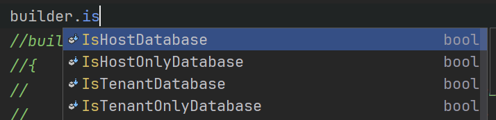

## Adding Database Migrations

In this section, I will show how to configure your entity mappings, generate database migrations and apply to the database.

### Defining an Entity

Let's define a `Product` entity in the `.Domain` layer of your application:

````csharp
using System;
using Volo.Abp.Domain.Entities;
using Volo.Abp.MultiTenancy;

namespace MtDemoApp
{
    public class Product : AggregateRoot<Guid>, IMultiTenant
    {
        public Guid? TenantId { get; set; }
        public string Name { get; set; }
        public float Price { get; set; }
    }
}
````

### Configuring the Database Mapping

Open the `MtDemoAppDbContextBase` class and add the following property to the class:

````csharp
public DbSet<Product> Products { get; set; }
````

Then add the following mapping code inside the `OnModelCreating` method (after all other existing code):

````csharp
builder.Entity<Product>(b =>
{
    b.ToTable(MtDemoAppConsts.DbTablePrefix + "Products", MtDemoAppConsts.DbSchema);
    b.ConfigureByConvention(); //auto-configure for the base class props
    b.Property(x => x.Name).IsRequired().HasMaxLength(100);
});
````

We made the configuration in the base class since the `Products` table should be created in all databases, not only in the main database.

>`DbTablePrefix` and `DbSchema` are optional and configurable in your application. You can change or remove them.

### Add a New Database Migration for the Main Database

To add a new EF Core database migration, we can use ABP Studio UI or EF Core command-line commands. I will show both of these approaches here.

#### Using the ABP Studio "Add Migrations" UI

You can right-click the `.EntityFrameworkCore` package in the ABP Studio's *Solution Explorer* panel and select *EF Core CLI* -> *Add Migration* command as shown below:

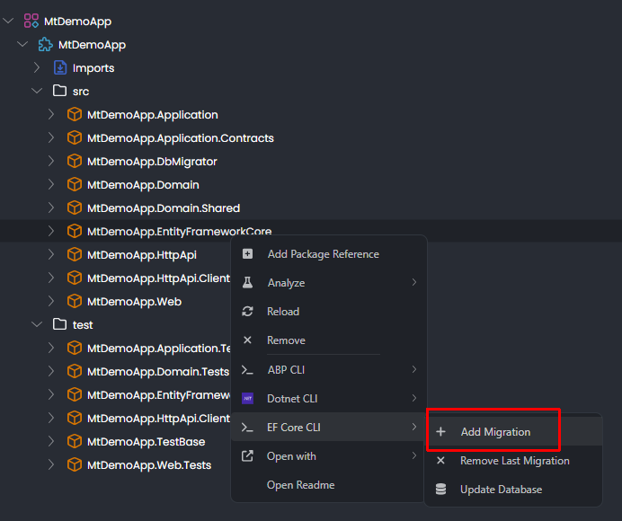

You set a migration name on the opened dialog:

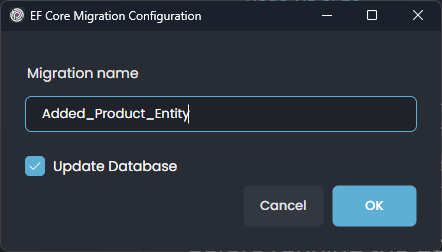

If you select the *Update Database* checkbox it will apply changes to the database after generating the migration code.

Lastly, select the main DbContext class for this migration:

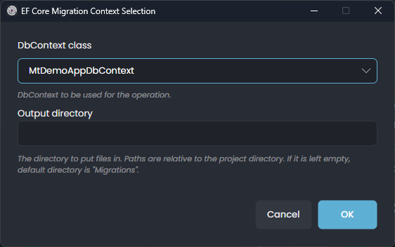

This dialog is shown when your application has multiple `DbContext` classes. Once you click the *OK* button, a new migration class is added under the `Migrations` folder of the `.EntityFrameworkCore` project (you can see in your coding editor):

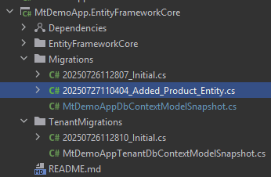

Since we selected the *Update Database* option, the database table is also created. The following screenshot shows the `AppProducts` table (`App` is the default prefix for your tables, but you can change or remove it) in Microsoft SQL Server Management Studio:

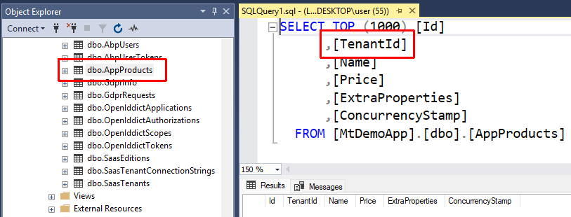

#### Using a Command-Line Terminal

If you prefer to use the command-line terminal (instead of ABP Studio UI), open a command-line terminal in the directory of the `.EntityFrameworkCore` project. As a shortcut, you can right-click the `.EntityFrameworkCore` project in ABP Studio, then select *Open with* -> *Terminal* command as shown in the following figure:

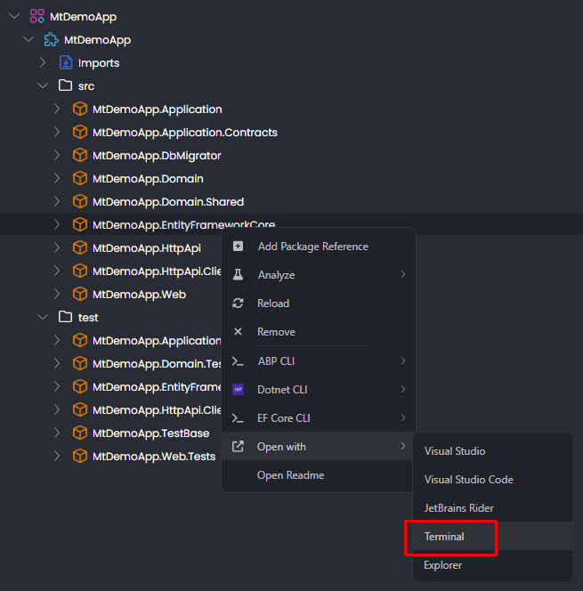

Then you can use the [EF Core command-line tool](https://learn.microsoft.com/en-us/ef/core/cli/dotnet) to add a new database migration:

````bash
dotnet ef migrations add "Added_Product_Entity" --context MtDemoAppDbContext
````

It is important to set the `--context` parameter since we have two DbContext classes in the same project.

After adding the migration, you can update the database:

````bash
dotnet ef database update "Added_Product_Entity" --context MtDemoAppDbContext
````

> If you are using Visual Studio, you can also use the [Package Manager Console](https://learn.microsoft.com/en-us/ef/core/cli/powershell) inside your IDE to add migrations and update the database.

### Add a New Database Migration for the Tenant Database

We added a database migration for the main (shared) database. We also need to add a new database migration for tenants who have separate databases.

This time, no need to configure the DbContext since we did it in the base DbContext class, so it is valid for both of the DbContext classes. Just right-click the `.EntityFrameworkCore` package in the ABP Studio's *Solution Explorer* panel and select *EF Core CLI* -> *Add Migration* command as shown below:


You can set the same or a different migration name here:


The important part is to select the Tenant DbContext in the next dialog, because we want to change the tenant database this time:

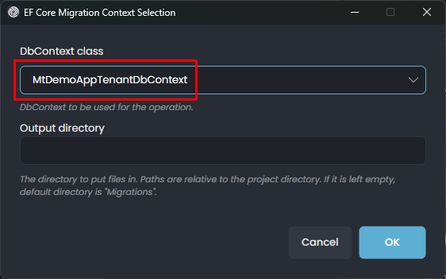

After clicking the *OK* button, it will add a new database migration class, but this time to the `TenantMigrations` folder:

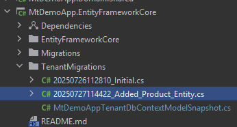

ABP Studio is smart enough to select the right folder name for the new migration by mapping with the DbContext name. However, you could manually type `TenantMigrations` in the *Output directory* textbox.

Since we selected the *Update Database* option, it also applied changes to the database. But, which database? Interestingly, it automatically creates a second database for tenants with the project name + `_Tenant` suffix:

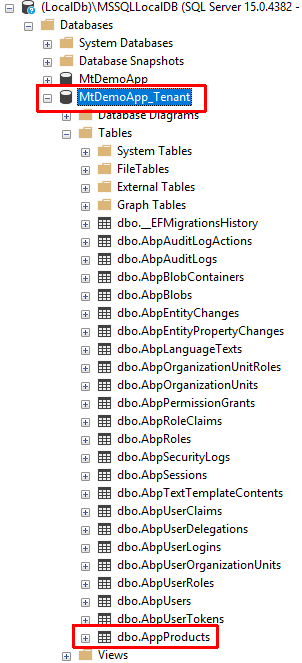

> This new database is never used on runtime or production. It is only created to allow you to see the schema (tables and their fields) on development time to be sure that everything is as expected. As you see, some tables (like `Saas*` and `OpenIddict*`) are not available in that database, since they are used on the host side and only necessary to be in the main database.
>
> So, where is the real tenant database? If a tenant's database is dedicated (separate), it is created on runtime as I will explain in the *Managing Tenant Databases and Connection Strings* section later.

You can see that database's connection string in the `appsettings.development.json` file of the `.DbMigrator` project in the solution. If you want to understand how it works, you can check source code of the `DbContextFactory` classes in the `.EntityFrameworkCore` project:

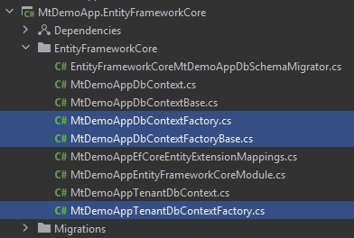

These factory classes are used to create `DbContext` instances when you execute *Add Migration* and *Update Database* commands.

## Managing Tenant Databases and Connection Strings

Until now, we even didn't run the application. It is the time to do it.

### Running the Application with ABP Studio

You can run the `.Web` project in your IDE. But I prefer to use ABP Studio's *[Solution Runner](https://abp.io/docs/latest/studio/running-applications)* feature here. You can open the *Solution Runner* panel in *ABP Studio* and click the play icon near to the solution root (`MyDemoApp`):

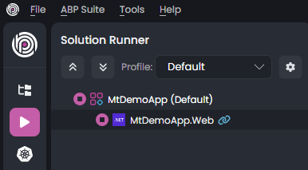

Once the application runs (and you see the blue link icon near to it), right click and select the *Browse* command:

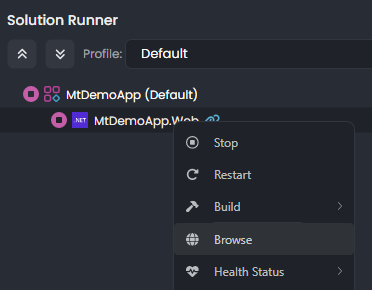

It will open the application's UI in the built-in browser of ABP Studio. You can Login the application (with `admin` as user name and `1q2w3E*` as the default password) and navigate to the *Saas* -> *Tenants* page.

### Creating a New Tenant with the Shared Database

The *Tenants* page of the [SaaS module](https://abp.io/modules/Volo.SaaS) is shown below:

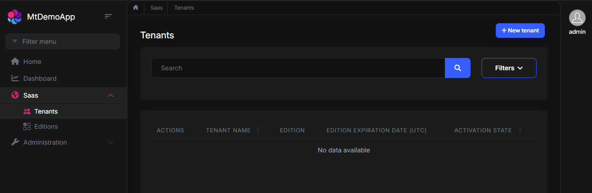

As you see, there is no tenant at the beginning. I can click the *+ New tenant* button to create the first tenant:

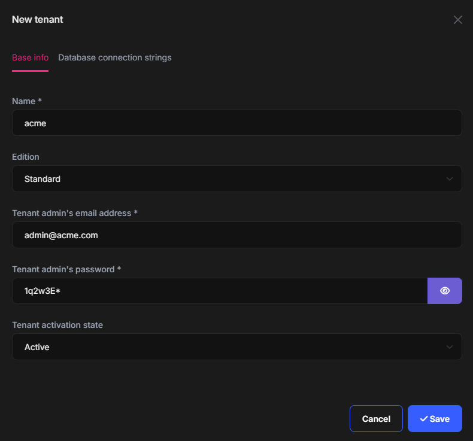

On this screen, we can set the base tenant information. If you click the *Database connection strings* tab, you can see the following UI:

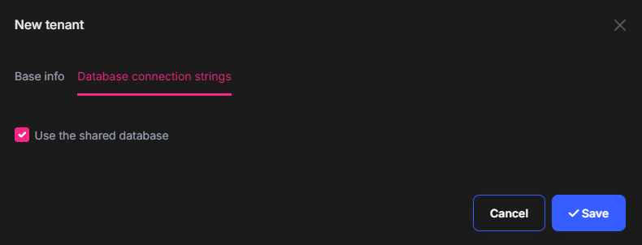

For this first tenant, I will keep it as default and use the shared (main) database for this tenant's data. After clicking the *Save* button, the tenant is created and an initial [data seed](https://abp.io/docs/latest/framework/infrastructure/data-seeding) operation is automatically performed for us. To see an example, you can open the database, show rows of the `AbpUsers` table:

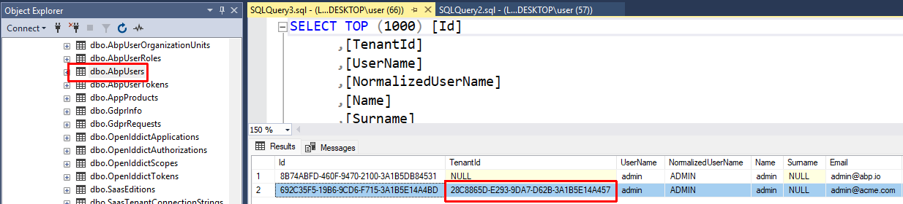

As you see, a new `admin` user has been created with a `TenantId`. The first row is the `admin` user of the host side. So, ABP allows to define same user name in different tenants, because their data (users in this example) are completely isolated from each other.

### Sign in with the new Tenant

We created a new tenant. In this step, we will sign in with the new tenant's `admin` user to see the application UI by that new tenant. To do that, we should logout from the host admin user first. Click the user name (`admin`) on the top right area of the application and select the *Log out* command:


Click the *Login* button again, which redirects you to the *Login* page:

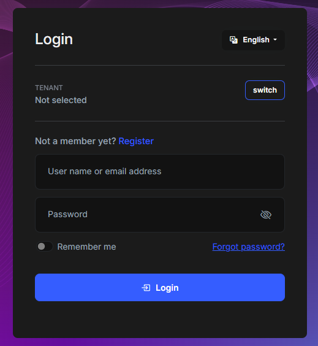

In this page, click the *switch* button near to the *TENANT* selection area and type `acme` as *Name*:

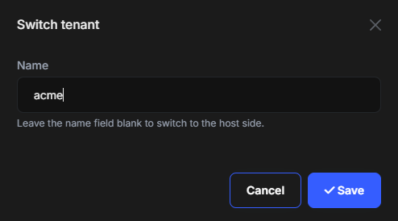

Once you click the *Save* button, you are now in the acme tenant's context. You can see it on the *TENANT* selection area:

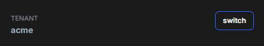

> This kind of tenant switch feature is very useful in development to quickly change tenants to test your application. However, in production, you typically want to use subdomain/domain names or another mechanism to determine tenants automatically. When you configure domain based resolution, the tenant selection area is automatically disappears from the login page. You can check the [multi-tenant document](https://abp.io/docs/latest/framework/architecture/multi-tenancy) to learn how to configure it.

After switching to the `acme` tenant, we can use `admin` as user name and the password you set during the tenant creation (I had set it as `1q2w3E*`) to login to the application.

Here a screenshot from the *Roles* page after signing in as the `acme` tenant's `admin` user:


> Notice that each tenant has its own roles, users, permissions, and other data. If you change roles here, it doesn't affect other tenants or the host side.
>
> Also, you can see that there are less menu items compared to host side. For example, tenant management page is not available for tenants as you can expect.

### Switch Back to the Host Side

To switch back to the host side to add a new tenant, logout from the application, click the *Login* button again to open the login page and then again click the *switch* button to change the current tenant context:

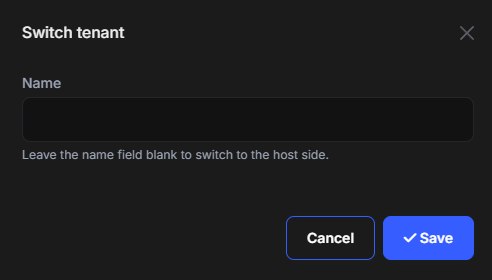

In this dialog, clear the *Name* field and then *Save* the dialog to switch back to the host side. Then you can use the standard `admin` user name with `1q2w3E*` password to login to the application as the host administrator.

### Creating a New Tenant with a Separate Database

Finally, we came to the point that we will create a new tenant with a separate, dedicated database. Open the *Tenants* page of the SaaS module and click the *+ New tenant* button:

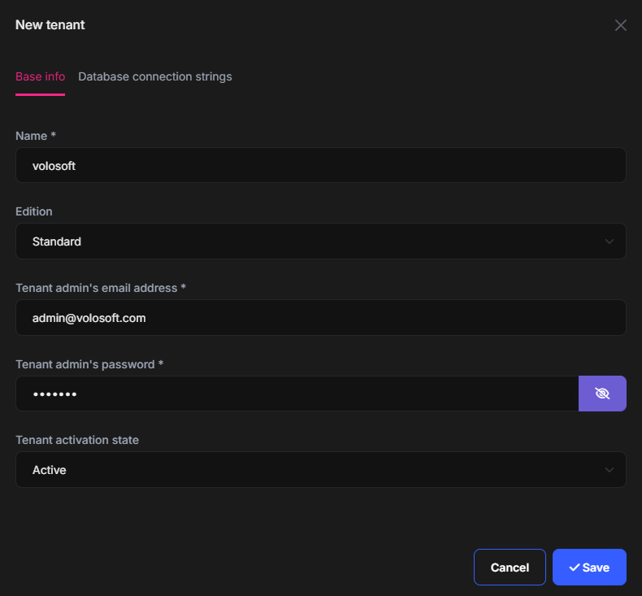

Just fill these information as you wish, then open the *Database connection strings* tab:

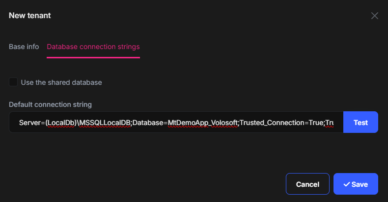

Uncheck the *Use the shared database* option and set a connection string to the *Default connection string* for this tenant. I used `Server=(LocalDb)\MSSQLLocalDB;Database=MtDemoApp_Volosoft;Trusted_Connection=True;TrustServerCertificate=true` as the connection string value. The database name is `MtDemoApp_Volosoft`. You can Test the connection string to be sure that it is a valid connection string.

Once you click the *Save* button, the new tenant is created, a new database is created on the fly, all the database migrations are applied and the initial data seed is performed. You can open the SQL Server Management Studio to see the new database:

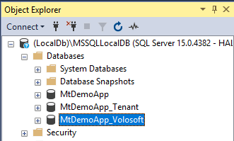

You can check the tables (e.g. `AbpUsers`) to see that only this new tenant's data is stored in this database. To test the application, switch to the Volosoft tenant (as like explained in the *Sign in with the new Tenant* section before), create a new role or user and check the database.

## Migrating Existing Tenant Databases

In the previous section, we've seen that a tenant database is automatically created on runtime if you set a connection string for that tenant. Also, all the current migrations are automatically applied to the database, so it becomes up to date.

But what about existing tenant databases when a new migration is added to the application? Maybe you have a few tenants with their separate databases, or you may have thousands of tenants with separate databases. How will you apply database schema changes to all of these databases?

The startup template comes with a solution to this problem. There is a `.DbMigrator` console application in the solution that is responsible to apply schema (table and their fields) changes to all of the databases in the system (the main database and all the separate tenant databases). It also executes the data seeding if seed data is available. All you need to do is to execute this application on your production environment while deploying a new version of your application (of course, it is also very useful in the development environment). It checks and upgrades all the databases before the new version of your application is deployed.

Here is the console log screen when I run the `.DbMigrator` application on my development environment:

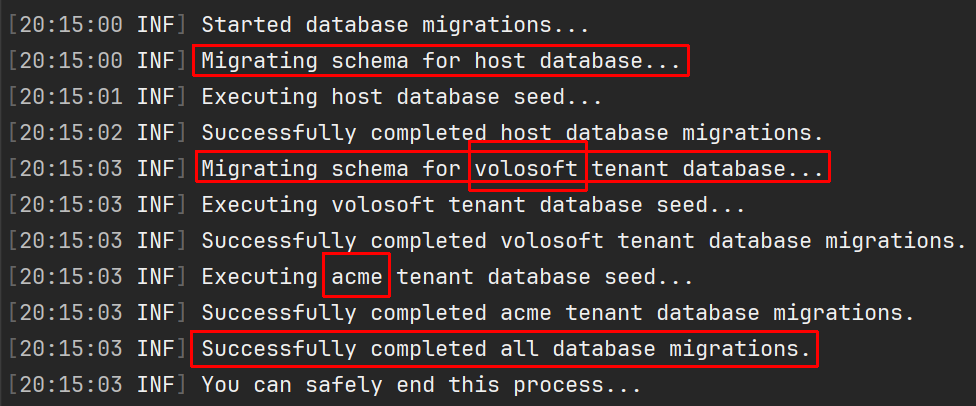

As you can see in the logs, it first migrates for the main (host) database, then migrates the tenant databases one by one. It doesn't make schema migration for the `acme` tenant since it has not a separate database, but uses the main database.

In brief, when you make changes on your entity classes;

1) Add a new migration for the main DbContext class as I explained in this article.
2) Add a new migration for the tenant DbContext class as I explained in this article.
3) Run the `.DbMigrator` application in your development environment to ensure all the databases are up to date.
4) When you deploy your application to production or test environments, remember to run the `.DbMigrator` application first, then update your application. Or better, setup a CI/CD pipeline that automates this process. You can run the `.DbMigrator` every time while deploying the application, regardless of whether there is a schema change or not.

> If you have too many tenants with separate database, then the migration process may take too much time. `.DbMigrator` provides the fundamental solution. But for more advanced scenarios or bigger systems, you can always develop your own solution. Just check the `.DbMigrator` application to understand how it was implemented. All the necessary code located in your solution, so you can easily understand and freely customize.

## Conclusion

In this article, I covered two important aspects of multi-tenant application development:

* How ABP startup templates provide a multi-tenant application setup, so some tenants may store their data in a single (main, shared) database while some others may have their own dedicated database.
* Demonstrate how it can manage database migration process on the fly for multiple databases.

I started by defining different database models for multi-tenant applications (Single database, separate databases, and hybrid), showed how to create an ABP application that supports hybrid model, explained the DbContext structure that is coming with the solution template, demonstrated how to define entities, create and apply database migrations in such an application.

I hope this article gives you a good understanding the problem and the solution provided by the ABP Framework. Please write your questions or comments under this article.

Enjoy coding! :)

## Further Reading

* [ABP Multi-Tenancy document](https://abp.io/docs/latest/framework/architecture/multi-tenancy)
* [Multi-Tenancy Architecture with .NET](https://abp.io/architecture/multi-tenancy)