# Get Started with ABP: Creating a Single Layer Web Application

````json
//[doc-params]
{
    "UI": ["MVC", "Blazor", "BlazorServer", "BlazorWebApp", "NG"],
    "DB": ["EF", "Mongo"]
}
````

In this quick start guide, you will learn how to create and run a single layer web application using [ABP Studio](../studio/index.md).

## Setup your development environment

First things first! Let's setup your development environment before creating the first project. The following tools should be installed on your development machine:

* [Visual Studio 2022](https://visualstudio.microsoft.com/) or another IDE that supports [.NET 9.0+](https://dotnet.microsoft.com/download/dotnet) development.
* [.NET 9.0+](https://dotnet.microsoft.com/en-us/download/dotnet){{ if UI != "Blazor" }}
* [Node v22.11+](https://nodejs.org/){{ end }}{{ if UI == "NG" }}
* [Yarn v1.22+ (not v2+)](https://classic.yarnpkg.com/en/docs/install) or npm v10+ (already installed with Node){{ end }}

> Check the [Pre-requirements document](pre-requirements.md) for more detailed information about these tools.

## Creating a New Solution

> 🛈 This document uses [ABP Studio](../studio/index.md) to create new ABP solutions. You can also use the [ABP CLI](../cli/index.md) to create new solutions and use the [getting started page](https://abp.io/get-started) to easily build ABP CLI commands.

> ABP startup solution templates have many options for your specific needs. If you don't understand an option that probably means you don't need it. We selected common defaults for you, so you can leave these options as they are.

Assuming that you have [installed and logged in](../studio/installation.md) to the application, you should see the following screen when you open ABP Studio:


Select the *File* -> *New Solution* in the main menu, or click the *New solution* button on the *Welcome* screen to open the *Create new solution* wizard:

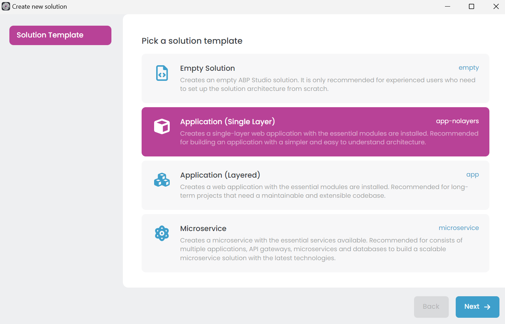

We will use the *Application (Single Layer)* solution template for this tutorial, so pick it and click the *Next* button:

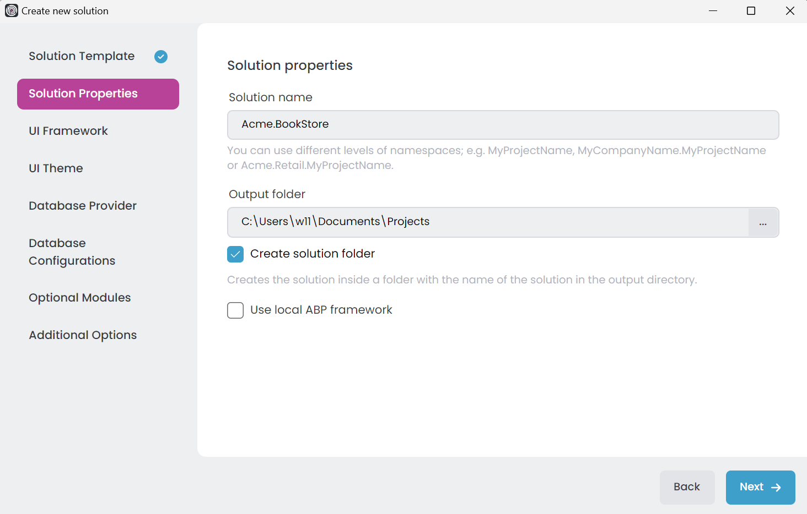

On that screen, you choose a name for your solution. You can use different levels of namespaces; e.g. `BookStore`, `Acme.BookStore` or `Acme.Retail.BookStore`.

Then select an *output folder* to create your solution. The *Create solution folder* option will create a folder in the given output folder with the same name of your solution.

Once your configuration is done, click the *Next* button to navigate to the *UI Framework* selection:

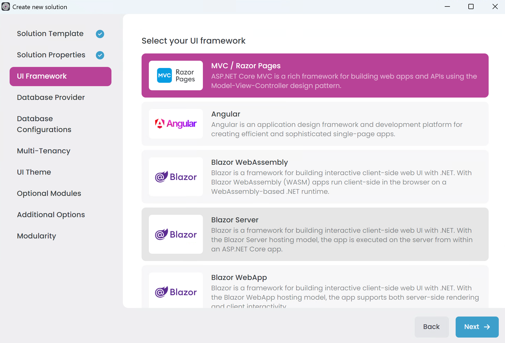

Here, you see all the possible UI options supported by that startup solution template. Pick the **{{ UI_Value }}**.

Notice that; Once you select a UI type, some additional options will be available under the UI Framework list. You can further configure the options or leave them as default and click the *Next* button for the *UI Theme* selection screen:


LeptonX is the suggested UI theme that is proper for production usage. Select one of the themes, configure the additional options, and click the *Next* button for the *Database Provider* selection:

{{ if DB == "EF" }}

{{ else }}
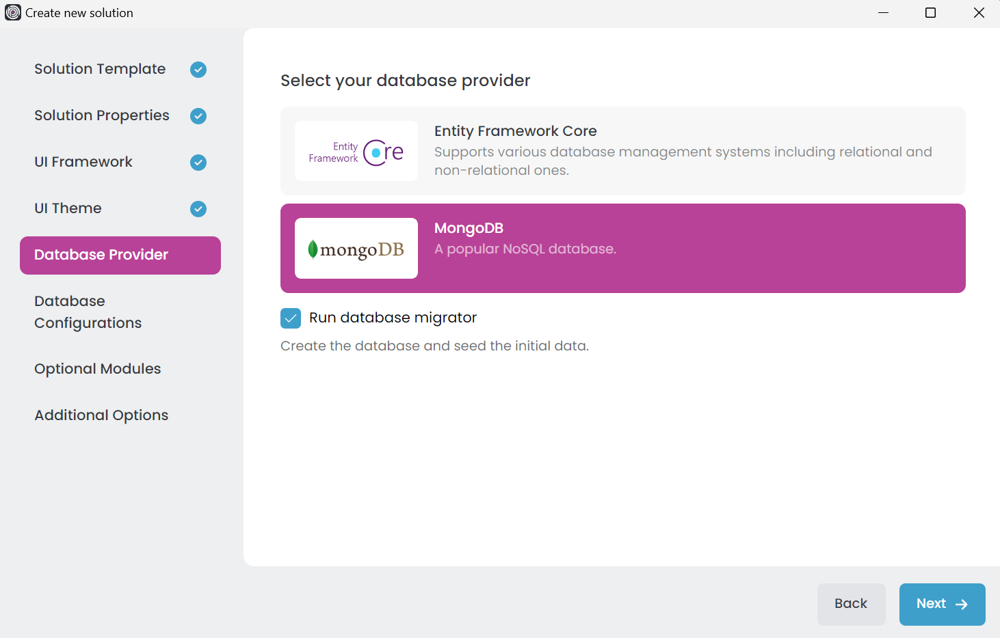
{{ end }}

On that screen, you can decide on your database provider by selecting one of the provided options. There are some additional options for each database provider. Leave them as default or change them based on your preferences, then click the *Next* button for additional *Database Configurations*:

{{ if DB == "EF" }}
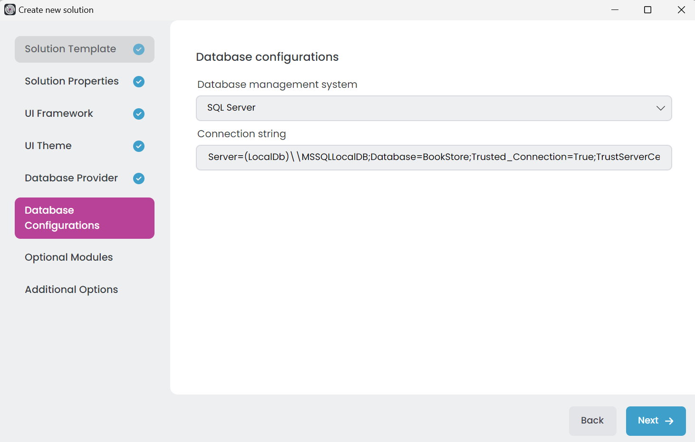
{{ else }}
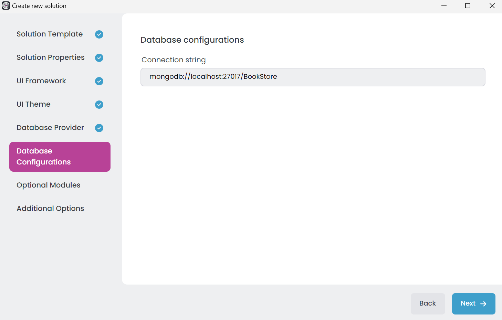
{{ end }}

Here, you can select the database management systems (DBMS){{ if DB == "EF" }} and the connection string{{ end }}. Then, you can select optional modules and enable additional options according to your preferences. 

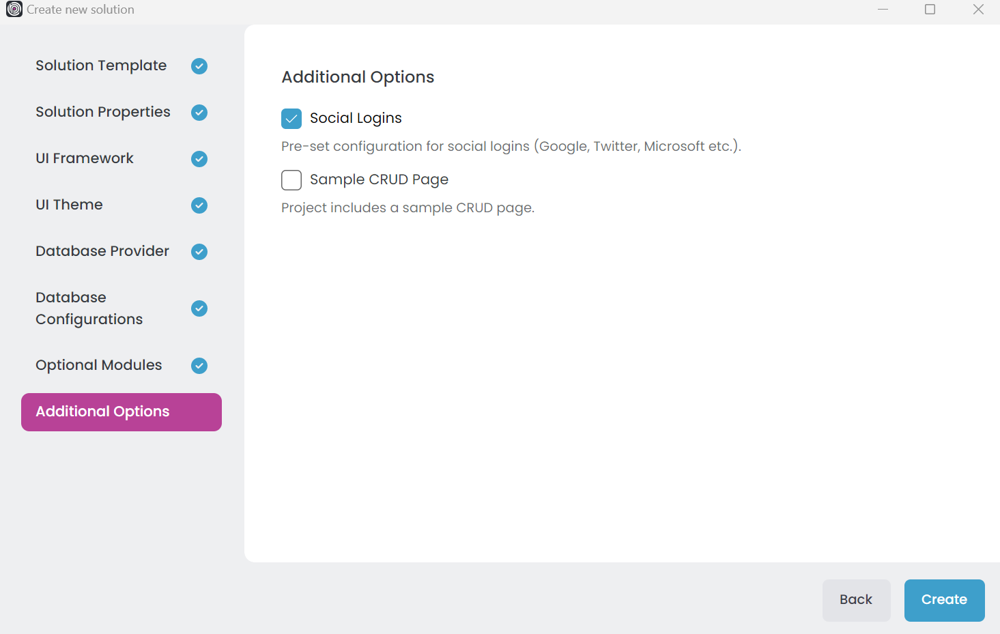

Now, we are ready to allow ABP Studio to create our solution. Just click the *Create* button and let the ABP Studio do the rest for you.

After clicking the *Create* button, the dialog is closed and your solution is loaded into ABP Studio:

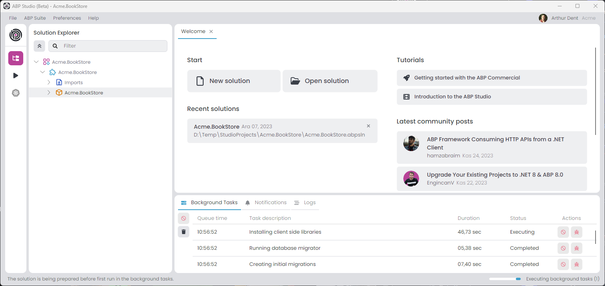

You can explore the solution, but you need to wait for background tasks to be completed before running any application in the solution.

## Running the Application

After creating your solution, you can open it in your favorite IDE (e.g. Visual Studio, Visual Studio Code or Rider) and start your development. However, ABP Studio provides a *Solution Runner* system. You can use it to easily run and browse your applications in your solution without needing an external tool.

Open the [Solution Runner](../studio/running-applications.md) section on the left side of ABP Studio as shown in the following figure:

> The solution runner structure can be different in your case based on the options you've selected.

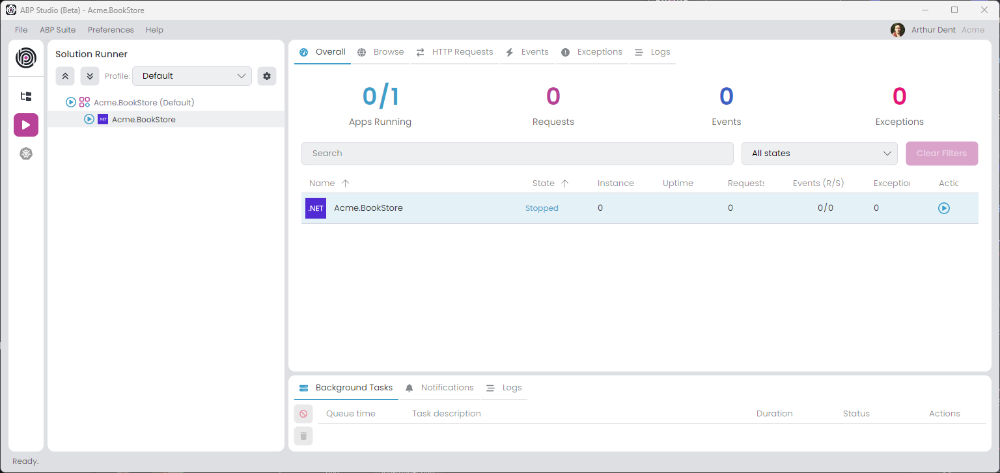

Once you click the *Play* icon on the left side, the section is open in the same place as the Solution Explorer section. ABP Studio also opens the *Application Monitor* view on the main content area. *Application Monitor* shows useful insights for your applications (e.g. *HTTP Request*, *Events*, and *Exceptions*) in real-time. You can use it to see the happenings in your applications, so you can easily track errors and many helpful details.

In the Solution Runner section (on the left side) you can see all the runnable applications in the current solution. For the MVC website example, we have only one application:

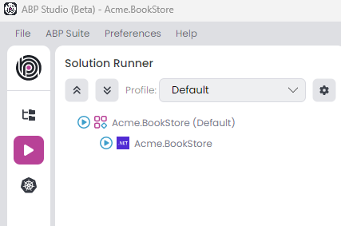

To start an application, either click the *Play* icon near to the application or right-click and select the *Run* -> *Start* context menu item.

You can start the `Acme.BookStore`{{ if UI == "NG" }} and `Acme.BookStore.Angular`{{ end }}. 

Once the `Acme.BookStore{{ if UI == "NG" }}.Angular{{ end }}` application started, you can right-click it and select the *Browse* command:

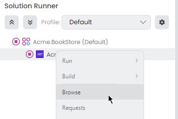

The *Browse* command opens the UI of the web application in the built-in browser:


You can browse your application in a full-featured web browser in ABP Studio. Click the *Login* button in the application UI, enter `admin` as username and `1q2w3E*` as password to login to the application.

The following screenshot was taken from the *User Management* page of the [Identity module](../modules/identity.md) that is pre-installed in the application:

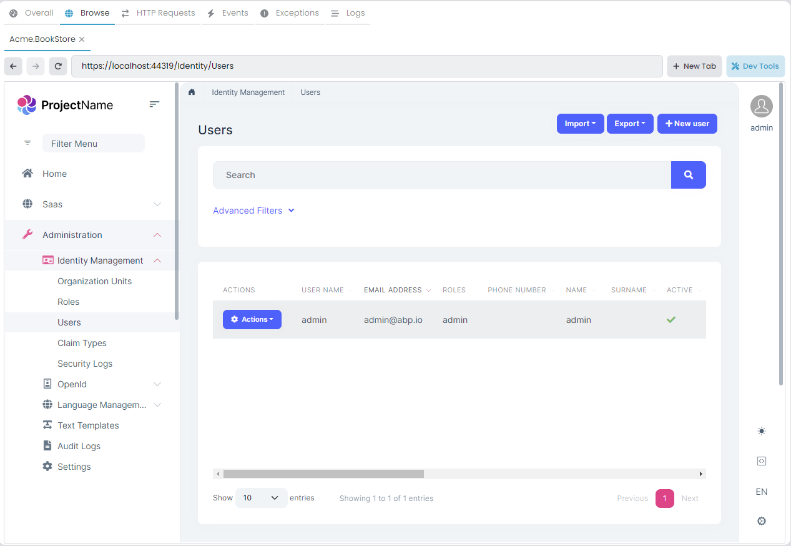

## Open the Solution in Visual Studio

You can use any IDE (e.g. Visual Studio, Visual Studio Code or Rider) to develop your solution. Here, we will show Visual Studio as an example.

First of all, we can stop the application(s) in ABP Studio, so it won't conflict when we run it in Visual Studio.

You can use ABP Studio to open the solution with Visual Studio. Right-click to the `Acme.BookStore` [module](../modules), and select the *Open with* -> *Visual Studio* command:

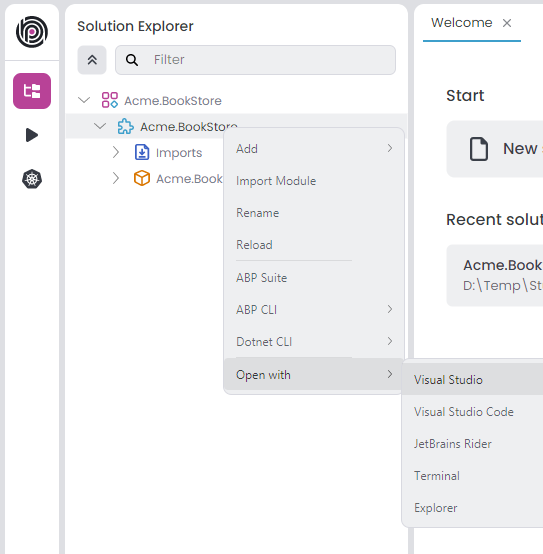

If the *Visual Studio* command is not available, that means ABP Studio could not detect it on your computer. You can open the solution folder in your local file system (you can use the *Open with* -> *Explorer* as a shortcut) and manually open the solution in Visual Studio.

Once the solution is opened in Visual Studio, you should see a screen like shown below:

> The solution structure can be different in your case based on the options you've selected.


You can then hit *F5* or *Ctrl + F5* to run the web application. It will run and open the application UI in your default browser:

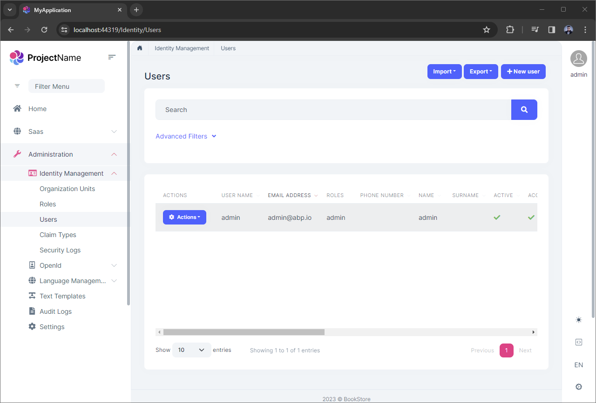

You can use `admin` as username and `1q2w3E*` as default password to login to the application.
