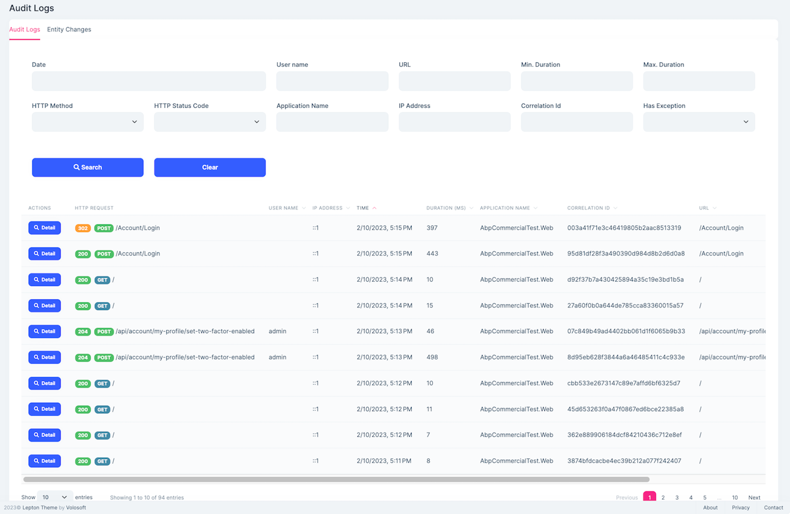
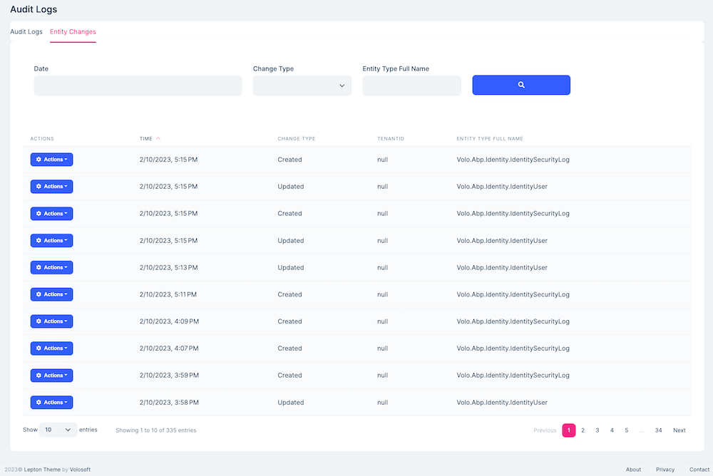
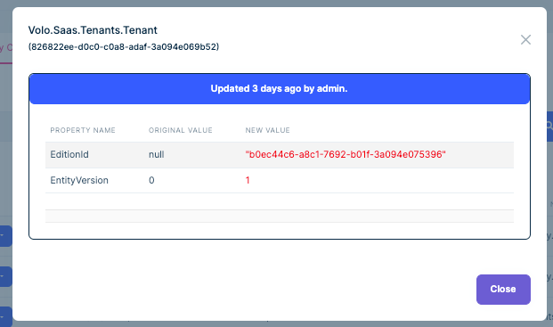
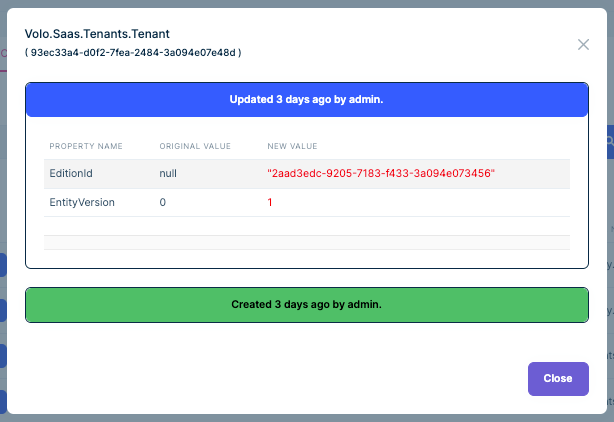
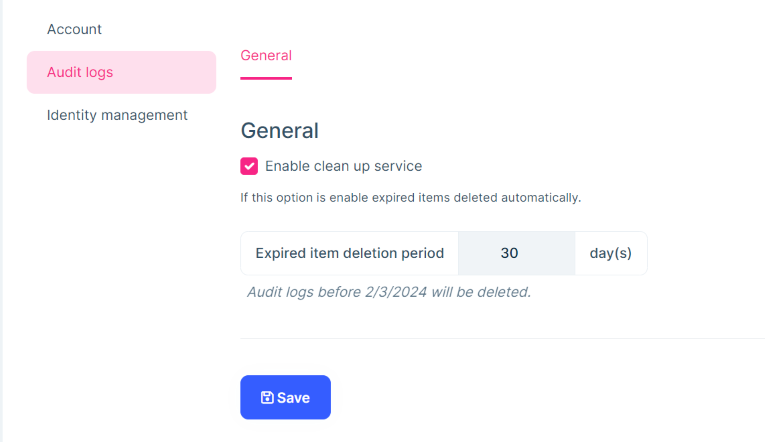

# Audit Logging Module (Pro)

> You must have an ABP Team or a higher license to use this module.

This module implements the Audit Logging system of an application;

* See all audit logs of the system and filter audit logs easily.
* View audit log details, executed actions and changed entities.
* See all changes of entities and filter entity change logs.
* View details of an entity change. 
* View all changes of an entity. 
* Export audit logs and entity changes to Excel.
* Receive email notifications for completed or failed exports.
* This module also defines reusable "Average Execution Duration Per Day" and "Error Rate" widgets.
* Periodic clean up of audit logs.

See [the module description page](https://abp.io/modules/Volo.AuditLogging.Ui) for an overview of the module features.

## How to install

Identity is pre-installed in [the startup templates](../solution-templates). So, no need to manually install it.

### Packages

This module follows the [module development best practices guide](../framework/architecture/best-practices) and consists of several NuGet and NPM packages. See the guide if you want to understand the packages and relations between them.

You can visit [Audit Logging module package list page](https://abp.io/packages?moduleName=Volo.AuditLogging.Ui) to see list of packages related with this module.

## User interface

### Menu items

Audit logs module adds the following items to the "Main" menu, under the "Administration" menu item:

* **Audit Logs**: List, view and filter audit logs and entity changes.

`IAbpAuditLoggingMainMenuNames` class has the constants for the menu item names.

### Pages

#### Audit Logs

Audit logs tab is used to list, view and filter audit logs and entity changes in the system. 




Each line on the list contains basic information about an audit log like HTTP Status Code, HTTP Method, Execution Time etc...

##### Audit Log Details

You can view details of an audit log by clicking the magnifier icon on each audit log line:


* **Overall:** This tab contains detailed information about audit log.
* **Actions:** This tab shows list of actions (controller actions and application service method calls with their parameters) executed during a web request.
* **Changes:** This tab shows changed entities during the web request.

##### Export to Excel

You can export audit logs to Excel by clicking the "Export to Excel" button in the toolbar. If the result set is small (less than a configurable threshold), the file will be generated and downloaded immediately. For larger result sets, the export will be processed as a background job and you'll receive an email with a download link once the export is completed.

#### Entity Changes

Entity changes tab is used to list, view and filter entity change logs. 




Each line on the list contains basic information about an entity change log like Time (time of change), Change Type etc...

##### Change Details Modal

You can view details of an entity change log by clicking the "Change Details" action item in the entity change log list:




##### Full Change History Modal

You can view details of all changes of an entity by clicking the "Full Change History" action item in the entity change log list:



##### Export to Excel

You can export entity changes to Excel by clicking the "Export to Excel" button in the toolbar. Similar to audit logs export, for large datasets the export will be processed as a background job and you'll receive an email notification once completed.

#### Audit Log Settings

The *Audit Log* settings tab is used to configure audit log settings. You can enable or disable the clean up service system wide. This way, you can shut down the clean up service for all tenants and host. If the system wide clean up service is enabled, you can configure the global *Expired Item Deletion Period* for all tenants and host.


When configuring the global settings for the audit log module from the host side in this manner, ensure that each tenant and host uses the global values. If you want to set tenant/host-specific values, you can do so under *Settings* -> *Audit Log* -> *General*. This way, you can disable the clean up service for specific tenants or host. It overrides the global settings.



To view the audit log settings, you need to enable the feature. For the host side, navigate to *Settings* -> *Feature Management* -> *Manage Host Features* -> *Audit Logging* -> *Enable audit log setting management*. For the tenant side, you can use either [Tenant Features](./saas.md#tenant-features) or [Edition Features](./saas.md#edition-features).

> If you don't enable the *Cleanup Service System Wide* from the host side under *Settings* -> *Audit logs* -> *Global*, it won't remove the expired audit logs, even if there are tenant specific settings.

## Data seed

This module doesn't seed any data.

## Options

### AbpAuditingOptions

`AbpAuditingOptions` can be configured in the UI layer, in the `ConfigureServices` method of your [module](../framework/architecture/modularity/basics.md). Example:

````csharp
Configure<AbpAuditingOptions>(options =>
{
    //Set options here...
});
````

To see `AbpAuditingOptions` properties, please see its [documentation](../framework/infrastructure/audit-logging.md#abpauditingoptions).

### ExpiredAuditLogDeleterOptions

`ExpiredAuditLogDeleterOptions` can be configured in the UI layer, within the `ConfigureServices` method of your [module](../framework/architecture/modularity/basics.md). Example:

```csharp
Configure<ExpiredAuditLogDeleterOptions>(options =>
{
    options.Period = (int)TimeSpan.FromSeconds(30).TotalMilliseconds;
    options.CronExpression = "0 23 * * *"; // This Cron expression only works if Hangfire or Quartz is used for background workers.
});
```

The *Period* doesn't mean the *Expired Item Deletion Period*. It's the period of the worker to run clean up service system wide. The default value is 1 day.

### AuditLogExcelFileOptions

`AuditLogExcelFileOptions` can be configured in the UI layer, within the `ConfigureServices` method of your [module](../framework/architecture/modularity/basics.md). Example:

```csharp
Configure<AuditLogExcelFileOptions>(options =>
{
    options.FileRetentionHours = 24; // How long to keep files before cleanup (default: 24 hours)
    options.DownloadBaseUrl = "https://yourdomain.com"; // Base URL for download links in emails
    options.ExcelFileCleanupOptions.Period = (int)TimeSpan.FromHours(24).TotalMilliseconds; // Interval of the cleanup worker (default: 24 hours)
    options.ExcelFileCleanupOptions.CronExpression = "0 23 * * *"; // This Cron expression only works if Hangfire or Quartz is used for background workers. 
});
```

> Note: The `FileRetentionHours` value determines when files become eligible for deletion, but actual deletion depends on when the cleanup worker runs. If the worker hasn't run after the retention period expires, files will remain accessible. Therefore, `FileRetentionHours` represents the minimum intended retention time, but the actual retention time might be longer depending on the worker's execution schedule.

These settings control where Excel export files are stored, how long they are kept before automatic cleanup, and what base URL is used in email download links.

> You must use a valid [BLOB Storage Provider](https://abp.io/docs/latest/framework/infrastructure/blob-storing#blob-storage-providers) to use this feature.

## Internals

### Domain layer

#### Aggregates

This module follows the [Entity Best Practices & Conventions](../framework/architecture/best-practices/entities.md) guide.

##### AuditLog

An audit log is a security-relevant chronological record, set of records, and/or destination and source of records that provide documentary evidence of the sequence of activities that have affected at any time a specific operation, procedure, or event.

* `AuditLog` (aggregate root): Represents an audit log in the system.
  * `EntityChange` (collection): Changed entities of audit log.
  * `AuditLogAction` (collection): Executed actions of audit log.

#### Repositories

This module follows the [Repository Best Practices & Conventions](../framework/architecture/best-practices/repositories.md) guide.

Following custom repositories are defined for this module:

* `IAuditLogRepository`

### Application layer

#### Application services

* `AuditLogsAppService` (implements `IAuditLogsAppService`): Implements the use cases of the audit logs management UI.

#### Email Templates

The module provides email templates for notifications:

* `AuditLogExportCompleted`: Sent when an audit log export is successfully completed, including a download link.
* `AuditLogExportFailed`: Sent when an audit log export fails, including error details.
* `EntityChangeExportCompleted`: Sent when an entity change export is successfully completed, including a download link.
* `EntityChangeExportFailed`: Sent when an entity change export fails, including error details.

### Database providers

#### Common

##### Table / collection prefix & schema

All tables/collections use the `Abp` prefix by default. Set static properties on the `AbpAuditLoggingDbProperties` class if you need to change the table prefix or set a schema name (if supported by your database provider).

##### Connection string

This module uses `AbpAuditLogging` for the connection string name. If you don't define a connection string with this name, it fallbacks to the `Default` connection string.

See the [connection strings](../framework/fundamentals/connection-strings.md) documentation for details.

#### Entity Framework Core

##### Tables

* **AbpAuditLogs**
  * AbpAuditLogActions
  * AbpEntityChanges
    * AbpEntityPropertyChanges

#### MongoDB

##### Collections

* **AbpAuditLogs**

### Permissions

See the `AbpAuditLoggingPermissions` class members for all permissions defined for this module.


### Angular UI

#### Installation

In order to configure the application to use the `AuditLoggingModule`, you first need to import `AuditLoggingConfigModule` from `@volo/abp.ng.audit-logging/config` to root module. `AuditLoggingConfigModule` has a static `forRoot` method which you should call for a proper configuration.

```js
// app.module.ts
import { AuditLoggingConfigModule } from '@volo/abp.ng.audit-logging/config';

@NgModule({
  imports: [
    // other imports
    AuditLoggingConfigModule.forRoot(),
    // other imports
  ],
  // ...
})
export class AppModule {}
```

The `AuditLoggingModule` should be imported and lazy-loaded in your routing module. It has a static `forLazy` method for configuration. Available options are listed below. It is available for import from `@volo/abp.ng.audit-logging`.

```js
// app-routing.module.ts
const routes: Routes = [
  // other route definitions
  {
    path: 'audit-logs',
    loadChildren: () =>
      import('@volo/abp.ng.audit-logging').then(m => m.AuditLoggingModule.forLazy(/* options here */)),
  },
];

@NgModule(/* AppRoutingModule metadata */)
export class AppRoutingModule {}
```

> If you have generated your project via the startup template, you do not have to do anything, because it already has both `AuditLoggingConfigModule` and `AuditLoggingModule`.

<h4 id="h-audit-logging-module-options">Options</h4>

You can modify the look and behavior of the module pages by passing the following options to `AuditLoggingModule.forLazy` static method:

- **entityActionContributors:** Changes grid actions. Please check [Entity Action Extensions for Angular](../framework/ui/angular/entity-action-extensions.md) for details.
- **toolbarActionContributors:** Changes page toolbar. Please check [Page Toolbar Extensions for Angular](../framework/ui/angular/page-toolbar-extensions.md) for details.
- **entityPropContributors:** Changes table columns. Please check [Data Table Column Extensions for Angular](../framework/ui/angular/data-table-column-extensions.md) for details.


#### Services / Models

Audit Logging module services and models are generated via `generate-proxy` command of the [ABP CLI](../cli/index.md). If you need the module's proxies, you can run the following command in the Angular project directory:

```bash
abp generate-proxy --module auditLogging
```

#### Replaceable Components

`eAuditLoggingComponents` enum provides all replaceable component keys. It is available for import from `@volo/abp.ng.audit-logging`.

Please check [Component Replacement document](../framework/ui/angular/component-replacement.md) for details.


#### Remote Endpoint URL

The Audit Logging module remote endpoint URL can be configured in the environment files.

```js
export const environment = {
  // other configurations
  apis: {
    default: {
      url: 'default url here',
    },
    AbpAuditLogging: {
      url: 'Audit Logging remote url here'
    }
    // other api configurations
  },
};
```

The Audit Logging module remote URL configuration shown above is optional. If you don't set a URL, the `default.url` will be used as fallback.

## Distributed Events

This module doesn't define any additional distributed event. See the [standard distributed events](../framework/infrastructure/event-bus/distributed).
