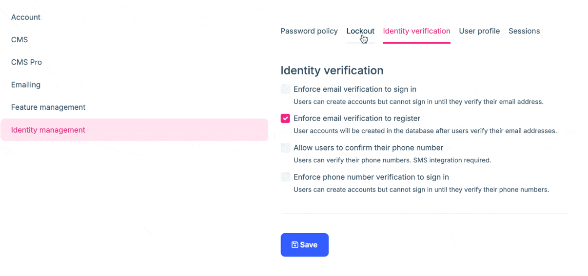

# ABP Version 9.2 Migration Guide

This document is a guide for upgrading ABP v9.x solutions to ABP v9.2. There are some changes in this version that may affect your applications, please read it carefully and apply the necessary changes to your application.

## Open-Source (Framework)

### Added `ApplicationName` Property to Isolate Background Jobs & Background Workers

When multiple applications share the same storage for [ABP's Background Jobs Module](../../modules/background-jobs.md), jobs from one application might be visible to another application. This can lead to the following issues:

1. Applications may attempt to process jobs that don't belong to them
2. These attempts fail with "Undefined background job for the job name" error
3. Failed jobs are marked as `IsAbandoned = true`
4. The original application can no longer process these abandoned jobs

To fix this, we added the `ApplicationName` property to the `AbpBackgroundJobWorkerOptions` class. This property allows you to specify the application name, which helps isolate jobs between different applications. (See the [PR](https://github.com/abpframework/abp/pull/22169) for more details.)

**By default there is no breaking change. However, you need to create a migration for the database to add the `ApplicationName` column to the relevant table and apply it to your database.**

### Upgraded `MongoDB.Driver` to `3.1.0`

In this version, we upgraded `MongoDB.Driver` to `3.1.0`. To migrate your application, please refer to our [MongoDB Driver 2 to 3 Migration Guide](./MongoDB-Driver-2-to-3.md) document.

### Replaced Toastr with Custom Implementation (without depending on any 3rd party library)

In this version, we replaced Toastr with a custom implementation that does not depend on any 3rd party library. This is a breaking change if you are using the `Toastr` library. 

Here are the migration steps:

1. Remove any direct Toastr dependencies from your application
2. Update your notification calls to use the new API
3. Migrate any custom styles or configurations

For detailed implementation guidelines and API documentation, see:

- [Notify Documentation](../../framework/ui/mvc-razor-pages/javascript-api/notify.md)
- [PR #21940 for more information](https://github.com/abpframework/abp/pull/21940)


## PRO

> Please check the **Open-Source (Framework)** section before reading this section. The listed topics might affect your application and you might need to take care of them.

If you are a paid-license owner and using the ABP's paid version, then please follow the following sections to get informed about the breaking changes and apply the necessary ones:

### Identity Pro Module: Require Email Verification to Register

In this version, we added a new setting to the Identity Pro module to require email verification to register. This is a security measure to prevent spam registrations:



Typically, no changes are required. However, if you have inherited from the `AccountAppService` class and implemented your own logic, you'll need to update your constructor to match the new signature since two new services are now injected:

```diff
//code omitted for brevity...

+ protected IDistributedCache<EmailConfirmationCodeCacheItem> EmailConfirmationCodeCache { get; }
+ protected IdentityErrorDescriber IdentityErrorDescriber { get; }

  public AccountAppService(
-           IdentityUserTwoFactorChecker identityUserTwoFactorChecker)
+        IdentityUserTwoFactorChecker identityUserTwoFactorChecker,
+        IdentityErrorDescriber identityErrorDescriber)
```
