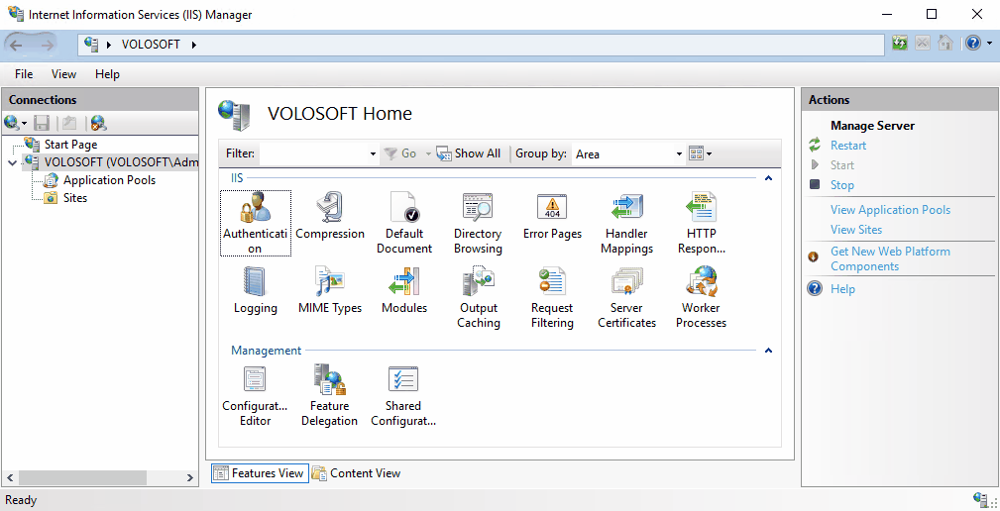
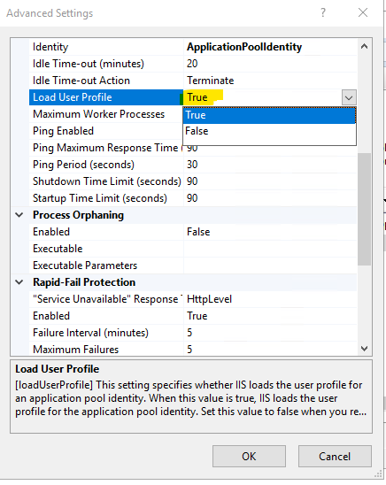
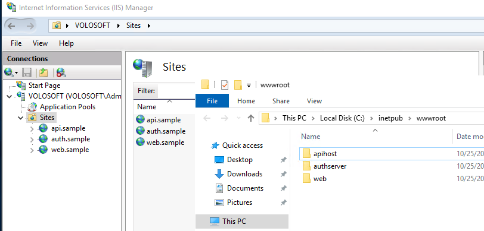

# IIS Deployment

````json
//[doc-params]
{
    "UI": ["MVC", "Blazor", "BlazorServer", "NG"],
    "DB": ["EF", "Mongo"],
    "Tiered": ["Yes", "No"]
}
````

> This document assumes that you prefer to use **{{ UI_Value }}** as the UI framework and **{{ DB_Value }}** as the database provider. For other options, please change the preference on top of this document.

## Prerequisites

- An IIS Server that is ready for deployment.

- Install the [hosting bundle](https://learn.microsoft.com/en-us/aspnet/core/host-and-deploy/iis/hosting-bundle).

- **{{ DB_Value }}** database must be ready to use with your project.

- If you want to publish in a local environment, this guide will use mkcert to create self-signed certificates. Follow the [installation guide](https://github.com/FiloSottile/mkcert#installation) to install mkcert.

{{ if Tiered == "Yes" }}

- A Redis instance prepared for caching.

{{end}}

## Generate an Authentication Certificate

If you're using OpenIddict, you need to generate an authentication certificate. You can execute this command in {{ if Tiered == "Yes" }}AuthServer{{ else if UI == "NG" || UI == "Blazor" }}HttpApi.Host{{ else if UI == "BlazorServer" }}Blazor{{ else }}Web{{ end }} folder.

````bash
dotnet dev-certs https -v -ep authserver.pfx -p 00000000-0000-0000-0000-000000000000
````

> `00000000-0000-0000-0000-000000000000` is the password of the certificate, you can change it to any password you want.

## Creating the Publish Files

You can execute this commands in your project root folder.

````bash
dotnet publish ./src/Volo.Sample.DbMigrator/Volo.Sample.DbMigrator.csproj -c Release -o ./publish/dbmigrator # Replace with your project name
````

{{ if UI == "NG" }}

````bash
cd angular && yarn build:prod --output-path ../publish/angular && cd ..
dotnet publish ./aspnet-core/src/Volo.Sample.HttpApi.Host/Volo.Sample.HttpApi.Host.csproj -c Release -o ./publish/apihost # Replace with your project name
{{ if Tiered == "Yes" }}
dotnet publish ./aspnet-core/src/Volo.Sample.AuthServer/Volo.Sample.AuthServer.csproj -c Release -o ./publish/authserver # Replace with your project name
{{ end }}
````

{{ else if UI == "Blazor" }}

````bash
dotnet publish ./src/Volo.Sample.Blazor/Volo.Sample.Blazor.csproj -c Release -o ./publish/blazor # Replace with your project name
dotnet publish ./src/Volo.Sample.HttpApi.Host/Volo.Sample.HttpApi.Host.csproj -c Release -o ./publish/apihost # Replace with your project name
{{ if Tiered == "Yes" }}
dotnet publish ./src/Volo.Sample.AuthServer/Volo.Sample.AuthServer.csproj -c Release -o ./publish/authserver # Replace with your project name
{{ end }}
````

{{ else if UI == "BlazorServer" }}

````bash
dotnet publish ./src/Volo.Sample.Blazor/Volo.Sample.Blazor.csproj -c Release -o ./publish/blazor # Replace with your project name
{{ if Tiered == "Yes" }}
dotnet publish ./src/Volo.Sample.HttpApi.Host/Volo.Sample.HttpApi.Host.csproj -c Release -o ./publish/apihost # Replace with your project name
dotnet publish ./src/Volo.Sample.AuthServer/Volo.Sample.AuthServer.csproj -c Release -o ./publish/authserver # Replace with your project name
{{ end }}
````

{{ else }}

````bash
dotnet publish ./src/Volo.Sample.Web/Volo.Sample.Web.csproj -c Release -o ./publish/web # Replace with your project name
{{ if Tiered == "Yes" }}
dotnet publish ./src/Volo.Sample.HttpApi.Host/Volo.Sample.HttpApi.Host.csproj -c Release -o ./publish/apihost # Replace with your project name
dotnet publish ./src/Volo.Sample.AuthServer/Volo.Sample.AuthServer.csproj -c Release -o ./publish/authserver # Replace with your project name
{{ end }}
````

{{ end }}

## Run the DbMigrator With Your Custom Settings

Update the connection string and OpenIddict section with your domain names. Run the DbMigrator app.

> For example, in a tiered MVC project.

````json
{
  "ConnectionStrings": {
    "Default": "Server=volo.sample;Database=Sample;User Id=sa;Password=1q2w3E**;TrustServerCertificate=true"
  },
  "Redis": {
    "Configuration": "volo.sample"
  },
  "OpenIddict": {
    "Applications": {
      "Sample_Web": {
        "ClientId": "Sample_Web",
        "ClientSecret": "1q2w3e*",
        "RootUrl": "https://web.sample"
      },
      "Sample_Swagger": {
        "ClientId": "Sample_Swagger",
        "RootUrl": "https://api.sample"
      }
    }
  }
}
````

## Preparing for Local Deployment

You can skip this part if you're going to deploy on a server with real domain names.

### Creating a Self-Signed Certificate with mkcert

You can execute this command in your command prompt.

````bash
cd Desktop # or another path
mkcert -pkcs12 auth.sample api.sample web.sample # Replace with your domain names  
````

Rename the created file extension to ".pfx"

Import the certificate to IIS



### Add domain names to hosts file

Add domain names to hosts file(in Windows: `C:\Windows\System32\drivers\etc\hosts`, in Linux and macOS: `/etc/hosts`).

> For example, in a tiered MVC project.
````json
127.0.0.1 auth.sample
127.0.0.1 api.sample
127.0.0.1 web.sample
````

## Publish the Application(s) On IIS

### Update the appsettings

Update the appsettings according to your project type and domain names.

> For example, in a tiered MVC project.

````json
//AuthServer
{
  "App": {
    "SelfUrl": "https://auth.sample",
    "CorsOrigins": "https://api.sample,https://web.sample",
    "RedirectAllowedUrls": "https://api.sample,https://web.sample",
    "DisablePII": "false"
  },
  "ConnectionStrings": {
    "Default": "Server=volo.sample;Database=Sample;User Id=sa;Password=1q2w3E**;TrustServerCertificate=true"
  },
  "AuthServer": {
    "Authority": "https://auth.sample",
    "RequireHttpsMetadata": "true"    
  },
  "StringEncryption": {
    "DefaultPassPhrase": "f9uRkTLdtAZLmlh3"
  },
  "Redis": {
    "Configuration": "volo.sample"
  }
}
//HttpApi.Host
{
  "App": {
    "SelfUrl": "https://api.sample",
    "CorsOrigins": "https://web.sample",
    "DisablePII": "false",
    "HealthCheckUrl": "/health-status"
  },
  "ConnectionStrings": {
    "Default": "Server=volo.sample;Database=Sample;User Id=sa;Password=1q2w3E**;TrustServerCertificate=true"
  },
  "Redis": {
    "Configuration": "volo.sample"
  },
  "AuthServer": {
    "Authority": "https://auth.sample",
    "RequireHttpsMetadata": "true",
    "SwaggerClientId": "Sample_Swagger"
  },
  "StringEncryption": {
    "DefaultPassPhrase": "f9uRkTLdtAZLmlh3"
  }
}
//Web
{
  "App": {
    "SelfUrl": "https://web.sample",
    "DisablePII": "false"
  },
  "RemoteServices": {
    "Default": {
      "BaseUrl": "https://api.sample/"
    },
    "AbpAccountPublic": {
      "BaseUrl": "https://auth.sample/"
    }
  },
  "Redis": {
    "Configuration": "volo.sample"
  },
  "AuthServer": {
    "Authority": "https://auth.sample",
    "RequireHttpsMetadata": "true",
    "ClientId": "Sample_Web",
    "ClientSecret": "1q2w3e*"
  },
  "StringEncryption": {
    "DefaultPassPhrase": "f9uRkTLdtAZLmlh3"
  }
}
````

### Copy the .pfx file

You need to copy pfx file from ./src/{{ if Tiered == "Yes" }}AuthServer{{ else if UI == "NG" || UI == "Blazor" }}HttpApi.Host{{ else if UI == "BlazorServer" }}Blazor{{ else }}Web{{ end }} to ./publish/{{ if Tiered == "Yes" }}authserver{{ else if UI == "NG" || UI == "Blazor" }}apihost{{ else if UI == "BlazorServer" }}blazor{{ else }}web{{ end }} folder.

### Publish the Applications(s)

You can add as website from IIS. 

> For {{ if Tiered == "Yes" }}authserver{{ else if UI == "NG" || UI == "Blazor" }}apihost{{ else if UI == "BlazorServer" }}blazor{{ else }}web{{ end }} we need to enable load user profile to true from application pool for created web site.



> For local deployment select the SSL certificate when you add the web site.


The final result should look like this (depending on your project type).



We can visit the websites from a browser.


## Fix 405 Method Not Allowed Error

Remove `WebDAV` modules and handlers from the `Web.config` file.

```xml
<?xml version="1.0" encoding="UTF-8"?>
<configuration>
  <system.webServer>
    <modules>
      <remove name="WebDAVModule" />
    </modules>
    <handlers>
      <remove name="WebDAV" />
    </handlers>
  </system.webServer>
</configuration>
```

Also remove the `WebDAV Publishing` feature from your computer if it's not being used. To do so, follow these steps:

1. Select Start, type Turn Windows features on or off in the Start Search box, and then select Turn Windows features on or off.
2. In the Windows Features window, expand Internet Information Services -> World Wide Web Services -> Common HTTP Features.
3. Uncheck the WebDAV Publishing feature.

See:

- https://learn.microsoft.com/en-us/aspnet/web-api/overview/testing-and-debugging/troubleshooting-http-405-errors-after-publishing-web-api-applications#resolve-http-405-errors
- https://learn.microsoft.com/en-us/troubleshoot/developer/webapps/iis/site-behavior-performance/http-error-405-website#resolution-for-cause-3

## How to get stdout-log

If your application is running on IIS and getting errors like `502.5, 500.3x`, you can enable stdout logs to see the error details.

To enable and view stdout logs:

1. Navigate to the site's deployment folder on the hosting system.
2. If the logs folder isn't present, create the folder. For instructions on how to enable MSBuild to create the logs folder in the deployment automatically, see the [Directory structure topic](https://learn.microsoft.com/en-us/aspnet/core/host-and-deploy/directory-structure?view=aspnetcore-8.0).
3. Edit the `web.config` file. Set `stdoutLogEnabled` to `true` and change the `stdoutLogFile` path to point to the logs folder (for example, `.\logs\stdout`). stdout in the path is the log file name prefix. A timestamp, process id, and file extension are added automatically when the log is created. Using stdout as the file name prefix, a typical log file is named `stdout_20180205184032_5412.log`.
4. Ensure your application pool's identity has write permissions to the logs folder.
5. Save the updated `web.config` file.
6. Make a request to the app.
7. Navigate to the logs folder. Find and open the most recent stdout log.

> The following sample aspNetCore element configures stdout logging at the relative path `.\log\.` Confirm that the AppPool user identity has permission to write to the path provided.

```xml
<aspNetCore processPath="dotnet"
    arguments=".\MyAbpApp.dll"
    stdoutLogEnabled="true"
    stdoutLogFile=".\logs\stdout"
    hostingModel="inprocess">
</aspNetCore>
```

Reference:

[IIS log creation and redirection](https://learn.microsoft.com/en-us/aspnet/core/host-and-deploy/iis/logging-and-diagnostics)

[Troubleshoot ASP.NET Core on Azure App Service and IIS](https://learn.microsoft.com/en-us/aspnet/core/test/troubleshoot-azure-iis)

## What's next?

- [Docker Deployment using Docker Compose](deployment-docker-compose.md)

- [Azure Deployment using Application Service](deployment-azure-application-service.md)
