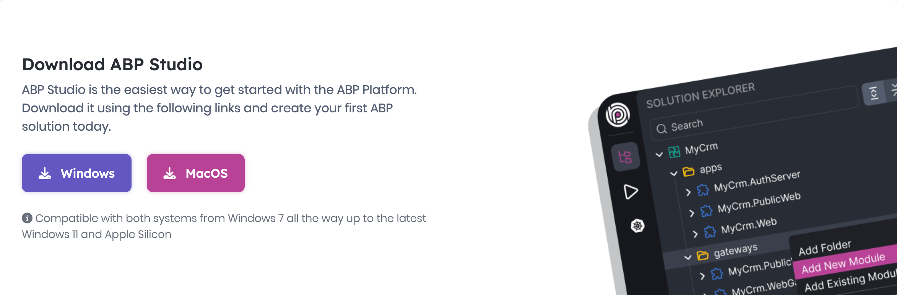
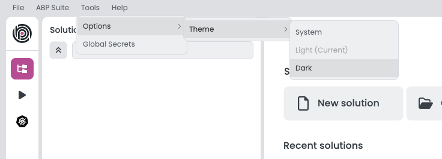
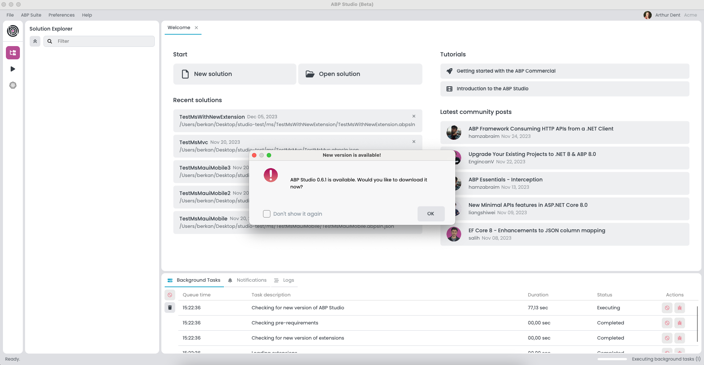

# Installing ABP Studio

> **Warning: Beta Version Information**\
> Currently, ABP Studio is in its beta phase and available for everyone. To access the beta version, kindly visit [this web page](https://abp.io/studio).

## Pre-requirements

ABP Studio now features automatic installation of most required dependencies. When you first launch the application, it will check for and install the following components:

* .NET SDK
* Node.js
* ABP CLI
* mkcert (for HTTPS development)
* WireGuard (for Kubernetes operations)

The only manual installation required is:

### Docker (Required for Kubernetes Operations)
ABP Studio needs [Docker](https://www.docker.com/) for [Kubernetes](https://kubernetes.io/) operations. Install Docker by following the guidelines on the official [Docker website](https://docs.docker.com/get-docker/).

### Package Manager Prerequisites
* **Windows:** The automatic installation process uses `winget`. If not already installed, ABP Studio will attempt to install it.
* **macOS:** The automatic installation process uses `brew`. If not already installed, you'll need to install it manually from [brew.sh](https://brew.sh/).

## Installation
Follow these steps to install ABP Studio:

1. **Download ABP Studio:** Visit [abp.io](https://abp.io/studio) to download the latest version of ABP Studio.

2. **Run the Installer:** Execute the installer and follow the on-screen instructions to install ABP Studio on your computer.

3. **First Launch:** When you first launch ABP Studio, it will automatically check for and install required dependencies. This process may take several minutes, and you'll see progress indicators for each component being installed.

## Login
After installation is complete, you can log in to access all features:

1. **Launch ABP Studio:** Open ABP Studio on your desktop.

2. **Login Credentials:** Enter your [abp.io](https://abp.io/) login credentials when prompted.

## Changing the UI Theme
ABP Studio allows you to customize the user interface theme according to your preferences. You can change the UI theme as in the image below:

## Upgrading
ABP Studio periodically checks for updates in the background, and when a new version of ABP Studio is available, you will be notified through a modal. 
The modal will prompt you to update to the latest version as below:

When you see the "New Version Available" window, follow these steps to upgrade ABP Studio seamlessly:

1. Click the "OK" button in the modal to initiate the download of the new version.
2. A progress indicator will display the download status.
3. Once the download is complete, a new modal will appear with the "Install and Relaunch" buttons.
4. Click on the "Install and Relaunch" button to complete the installation process.
