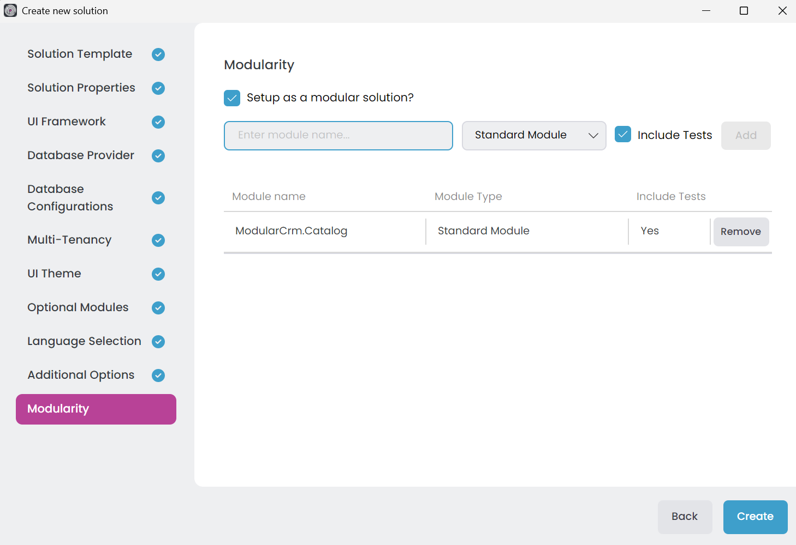
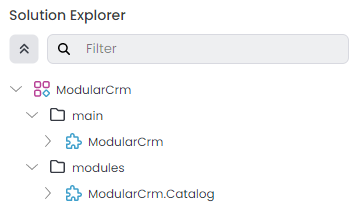
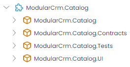

# Creating the Initial Solution

````json
//[doc-nav]
{
  "Previous": {
    "Name": "Overview",
    "Path": "tutorials/modular-crm/index"
  },
  "Next": {
    "Name": "Setting Up the Catalog Module",
    "Path": "tutorials/modular-crm/part-02"
  }
}
````

In this first part of this tutorial, we will create a new ABP solution with modularity enabled.

## Getting Started with a new ABP Solution

Follow the *[Get Started](../../get-started/single-layer-web-application.md)* guide to create a single layer web application with the following configuration:

* **Solution name**: `ModularCrm`
* **UI Framework**: ASP.NET Core MVC / Razor Pages
* **Database Provider**: Entity Framework Core

You can select the other options based on your preference but at the **Modularity** step, check the _Setup as a modular solution_ option and add a new **Standard Module** named `ModularCrm.Catalog`:



Since modularity is a key aspect of the ABP Framework, it provides an option to create a modular system from the beginning. Here, you're creating a `ModularCrm.Catalog` module using the *Standard Module* template.

> **Note:** This tutorial will guide you through creating two modules: `Catalog` and `Ordering`. We've just created the `Catalog` module in the _Modularity_ step. You could also create the `Ordering` module at this stage. However, we'll create the `Ordering` module later in this tutorial to better demonstrate ABP Studio's module management capabilities and to simulate a more realistic development workflow where modules are typically added incrementally as the application evolves.

### About the Module Templates

The *Standard Module* template is suggested for building modular monolith applications (a single application consists of multiple modules interacting each other) and it will be used in this tutorial, while the *DDD Module* is suggested for creating reusable application modules (a generic module is used in different applications) that supports different kind of architectures. To learn more about the DD Module template, see *[Application Module Template](../../solution-templates/application-module/index.md)* document.

## The Solution Structure

> **Please complete the [Get Started](../../get-started/single-layer-web-application.md) guide and run the web application before going further.**

The initial solution structure should be like the following in ABP Studio's *[Solution Explorer](../../studio/solution-explorer.md)*:



Initially, you see a `ModularCrm` solution with two solution folders:

* `main`: That folder contains the `ModularCrm` ABP Studio Module, which is the main executable web application of the solution.
* `modules`: A folder to place your modules. It contains the `ModularCrm.Catalog` module initially.

> An **ABP Studio Module** is typically a separate .NET solution. On the other hand, an **ABP Studio Solution** is an umbrella concept for multiple .NET Solutions (see the [concepts](../../studio/concepts.md) document for details).

## Catalog Module's Packages

If you expand it, you can see the .NET projects (ABP Studio Packages) of the `ModularCrm.Catalog` module:



- `ModularCrm.Catalog`: The main module project that contains your [entities](../../framework/architecture/domain-driven-design/entities.md), [application service](../../framework/architecture/domain-driven-design/application-services.md) implementations and other business objects
- `ModularCrm.Catalog.Contracts`: Basically contains [application service](../../framework/architecture/domain-driven-design/application-services.md) interfaces and [DTOs](../../framework/architecture/domain-driven-design/data-transfer-objects.md). These interfaces then can be used by client modules for integration purposes or by the user interface to perform use cases related to that module
- `ModularCrm.Catalog.Tests`: Unit and integration tests (if you selected the _Include Tests_ option) for that module
- `ModularCrm.Catalog.UI`: Contains user interface pages and components for the module

## Summary

You've created the initial single layer monolith modular solution with a Catalog module included. In the [next part](part-02.md), you will learn how install the Catalog module to the main application.
