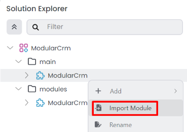
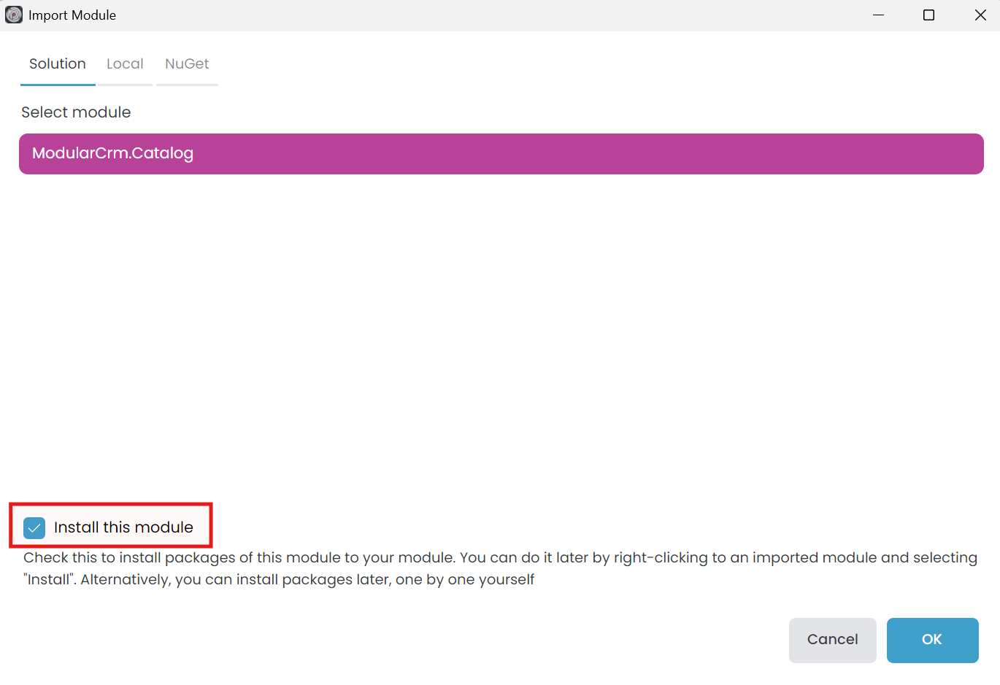
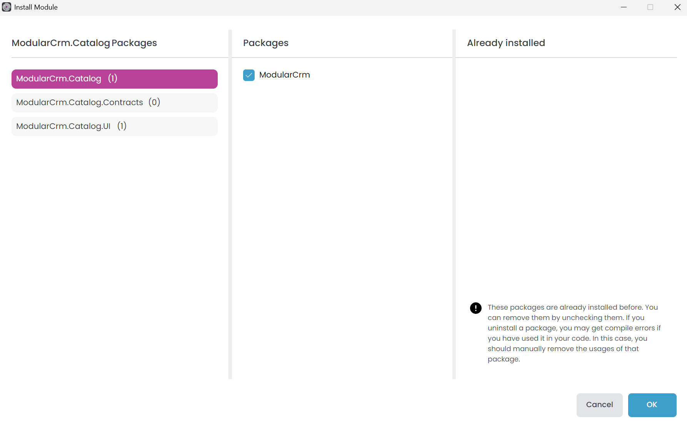
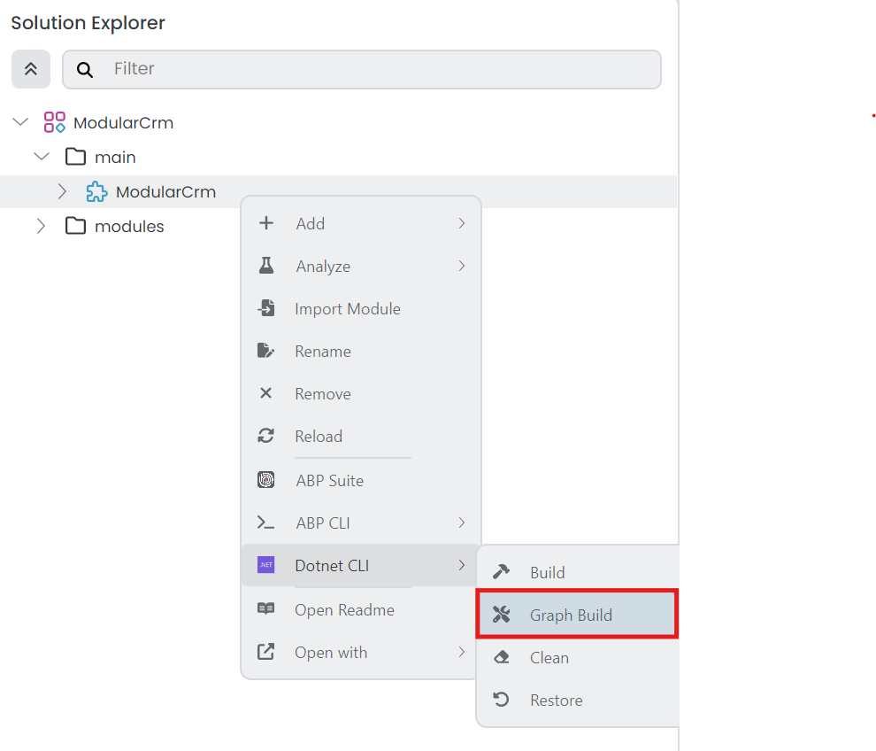
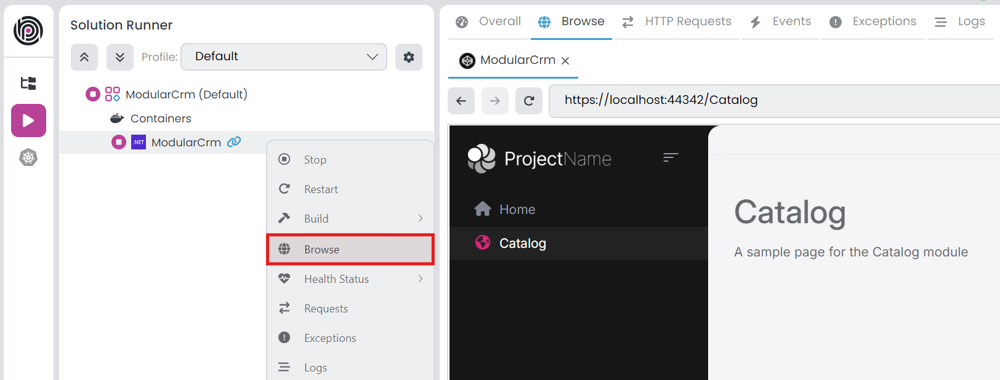

# Setting Up the Catalog Module

````json
//[doc-nav]
{
  "Previous": {
    "Name": "Creating the initial solution",
    "Path": "tutorials/modular-crm/part-01"
  },
  "Next": {
    "Name": "Building the Catalog module",
    "Path": "tutorials/modular-crm/part-03"
  }
}
````

In this part, you will install the `ModularCrm.Catalog` module to the main application, which was created in the [previous part](part-01.md).

## Installing the Catalog Module to the Main Application

A module does not contain an executable application inside. The `ModularCrm.Catalog.UI` project is just a class library project, not an executable web application. A module should be installed in an executable application to run it.

> **Ensure that the web application is not running in [Solution Runner](../../studio/running-applications.md) or in your IDE. Installing a module to a running application will produce errors.**

The product module has yet to be related to the main application. Right-click on the `ModularCrm` module (inside the `main` folder) and select the *Import Module* command:



The *Import Module* command opens a dialog as shown below:



Select the `ModularCrm.Catalog` module and check the *Install this module* option. If you don't check that option, it only imports the module but doesn't set project dependencies. Importing a module without installation can be used to set up your project dependencies manually. We want to make it automatically, so check the *Install this module* option.

When you click the *OK* button, ABP Studio opens the *Install Module* dialog:



Select the `ModularCrm.Catalog` and `ModularCrm.Catalog.UI` packages from the left area and ensure the  `ModularCrm` package from the middle area was checked as shown in the preceding figure. Finally, click _OK_.

## Building the Main Application

After the installation, build the entire solution by right-clicking on the `ModularCrm` module (under the `main` folder) and selecting the *Dotnet CLI* -> *Graph Build* command:



Graph Build is a dotnet CLI command that recursively builds all the referenced dotnet projects, even if they are not part of the root solution.

> While developing multi-module solutions with ABP Studio, you may need to perform *Graph Build* on the root/main module if you change the depending modules.

## Running the Main Application

Open the *Solution Runner* panel, click the *Play* button (near to the solution root), right-click the `ModularCrm` application and select the *Browse* command. It will open the web application in the built-in browser. Then you can navigate to the *Catalog* page on the main menu of the application to see the Catalog page that is coming from the `ModularCrm.Catalog` module:



## Summary

In this part, you installed the `ModularCrm.Catalog` module to the main application and run the solution to test if it has successfully installed. In the [next part](part-03.md), you will learn how to create entities, services and a basic user interface for the catalog module.
