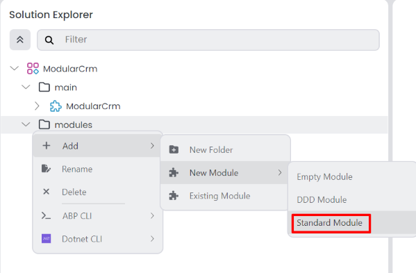
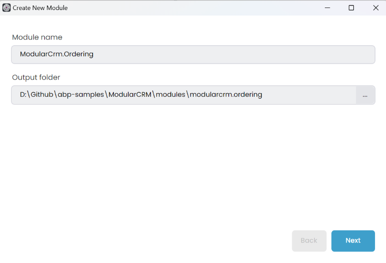
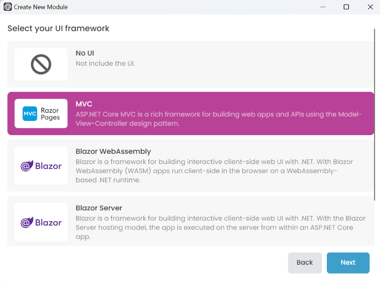
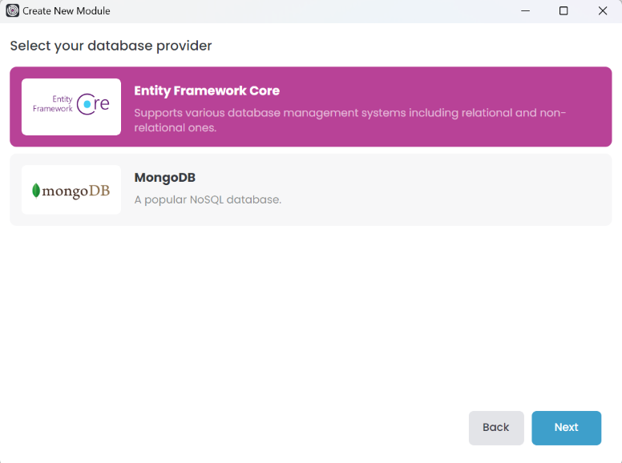
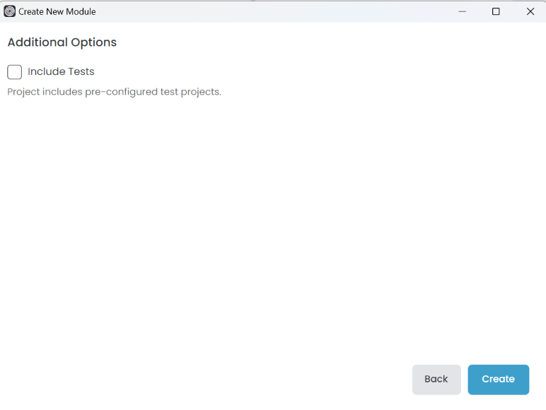
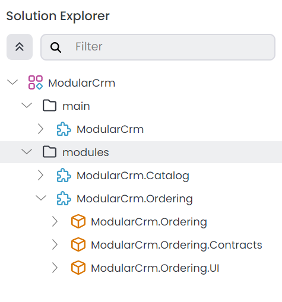
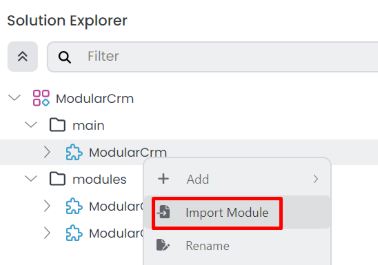
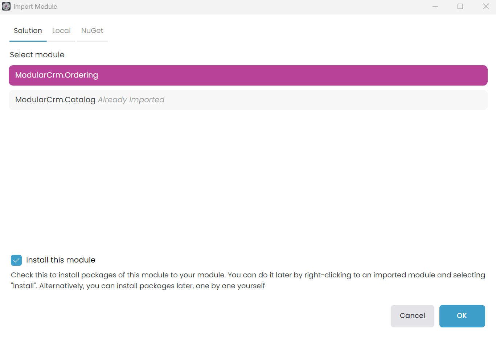
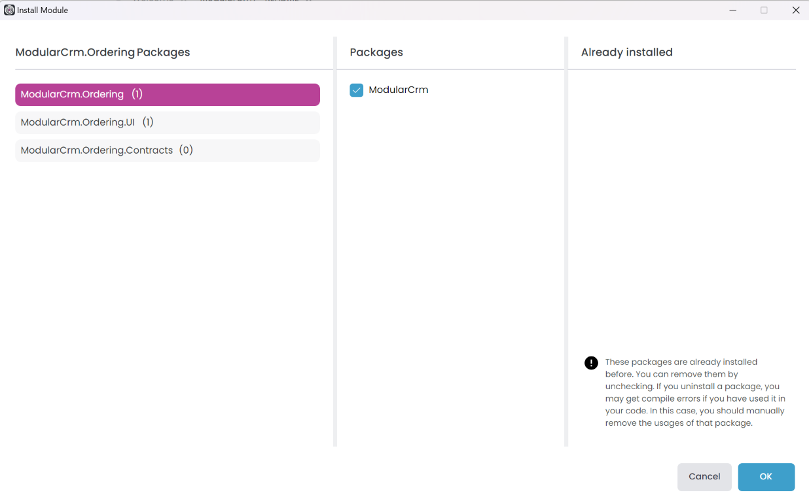

# Creating the Initial Ordering Module

````json
//[doc-nav]
{
  "Previous": {
    "Name": "Building the Catalog Module",
    "Path": "tutorials/modular-crm/part-03"
  },
  "Next": {
    "Name": "Building the Ordering module",
    "Path": "tutorials/modular-crm/part-05"
  }
}
````

In this part, you will build a new module for placing orders and install it in the main CRM application.

## Creating a Standard Module

In the first part of this tutorial, you created the `ModularCrm` solution with modularity enabled by selecting the _Setup as a modular solution_ option. At that time, you also created your first module - `ModularCrm.Catalog` - using the *Standard Module* template.

Now, you will create a second module for the `ModularCrm` solution through ABP Studio. This new module, called `Ordering`, will handle all order related functionality in the application.

To add a new module, right-click the `modules` folder on the *Solution Explorer* panel, and select the *Add* -> *New Module* -> *Standard Module* command:



That command opens a dialog to define the properties of the new module:



Set `ModularCrm.Ordering` as the *Module name*, leave the *Output folder* as is and click the *Next* button.



You can choose the type of UI you want to support in your module or select *No UI* if you don't need a user interface. In this example, we'll select the *MVC* option and click *Next*. One difference is that, for a standard module, you can only choose one UI type.



The same limitation applies to the database selection. You can only choose one database provider for a standard module. Select the *Entity Framework Core* option and click *Next*.



You can uncheck the *Include Tests* option to keep the module simple. Click the *Create* button to create the module.



## Installing into the Main Application

In this section, you will install the `ModularCrm.Ordering` module in the main application so it can be part of the system.

> Before the installation, please ensure the web application is not running.

Right-click the `ModularCrm` module (under the `main` folder) and select the *Import Module* command:



That command opens the *Import Module* dialog:



Select the `ModularCrm.Ordering` module and check the *Install this module* option as shown in the preceding figure. When you click the OK button, a new dialog is shown to select the packages to install:



Select the `ModuleCrm.Ordering` and `ModularCrm.Ordering.UI` packages from the left area and the `ModularCrm` package from the middle area as shown in the preceding figure. Finally, click *OK*.

## Summary

In this part of the tutorial, you've created a standard module. This allows you to create modules or applications with a different structure. In the next part, you will add functionality to the Ordering module.
