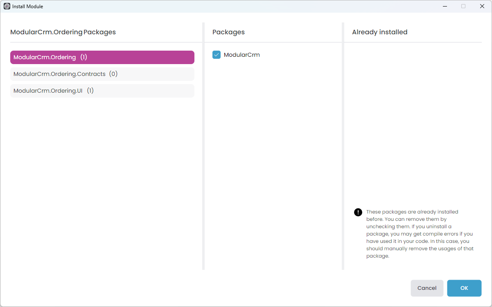

# Creating the Initial Ordering Module

````json
//[doc-nav]
{
  "Previous": {
    "Name": "Building the Catalog Module",
    "Path": "tutorials/modular-crm/part-03"
  },
  "Next": {
    "Name": "Building the Ordering module",
    "Path": "tutorials/modular-crm/part-05"
  }
}
````

In this part, you will build a new module for placing orders and install it in the main CRM application.

## Creating a Standard Module

In the first part of this tutorial, you created the `ModularCrm` solution with selecting the _Setup as a modular solution_ option and adding a module named `ModularCrm.Catalog` using the *Standard Module* template.

Now, you will create a second module for the `ModularCrm` solution through ABP Studio's *Solution Explorer*. This new module, called `ModularCrm.Ordering`, will handle all order related functionality in the application.

To add a new module, right-click the `modules` folder on the *Solution Explorer* panel, and select the *Add* -> *New Module* -> *Standard Module* command:


That command opens a dialog to define the properties of the new module:


Set `ModularCrm.Ordering` as the *Module name*, leave the *Output folder* as is and click the *Next* button.


You can choose the type of UI you want to support in your module or select *No UI* if you don't need a user interface. In this example, we'll select the *MVC* option and click *Next*.


In this screen, select the *Entity Framework Core* option and click *Next*.


You can include or not include unit tests for the new module here. We are unchecking the *Include Tests* option this time to show a different structure for this example. Click the *Create* button to create the module.

Here is the final solution structure after adding the `ModularCrm.Ordering` module:


## Installing into the Main Application

In this section, you will install the `ModularCrm.Ordering` module in the main application so it can be part of the monolith application.

> Before the installation, please ensure the web application is not running.

Right-click the `ModularCrm` module (under the `main` folder) and select the *Import Module* command:


That command opens the *Import Module* dialog:


Select the `ModularCrm.Ordering` module and check the *Install this module* option as shown in the preceding figure. When you click the OK button, a new dialog is shown to select the packages to install:



Select the `ModularCrm.Ordering` and `ModularCrm.Ordering.UI` packages from the left area and ensure the  `ModularCrm` package from the middle area was checked as shown in the preceding figure. Finally, click _OK_.

## Summary

In this part of the tutorial, you've created a new module and installed it into the main solution. In the [next part](part-05), you will add functionality to the new Ordering module.
