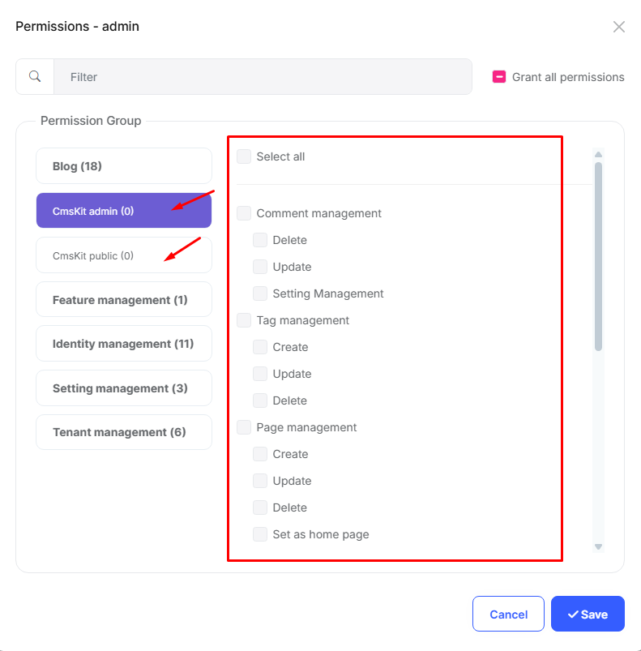

# Installation Notes for CMS Kit Module

The ABP CMS Kit module provides a set of reusable Content Management System (CMS) features for your ABP-based applications. It offers ready-to-use UI components and APIs for common content management requirements.

This module is part of the ABP Framework and provides features like comments, ratings, tags, blogs, and more to help you build content-rich applications.

## Required Configurations

The CmsKit module requires **permission** settings to be configured after installation. Ensure that the necessary roles have the appropriate access rights for managing blogs, posts, comments and others.

### Enable CmsKit

To enable the CmsKit module, add the following line to the `GlobalFeatureConfigurator` class of your module:

```csharp
public static void Configure()
{
    OneTimeRunner.Run(() =>
    {
        /* You can configure (enable/disable) global features of the used modules here.
        * Please refer to the documentation to learn more about the Global Features System:
        * https://docs.abp.io/en/abp/latest/Global-Features
        */
        
        GlobalFeatureManager.Instance.Modules.CmsKit(cmsKit =>
        {
            cmsKit.EnableAll();
            // or
            // cmsKit.Tags.Enable();
            // cmsKit.Comments.Enable();
        });
    });
}
```

### Database Migrations

The CmsKit module requires database migrations to be applied. After enable **CmsKit**, Add a new migration and update the database to create the necessary tables.

### Permissions

Enable the following permissions for the roles that require access to the CmsKit module:



## Documentation

For detailed information and usage instructions, please visit the [CMS Kit documentation](https://abp.io/docs/latest/modules/cms-kit). 