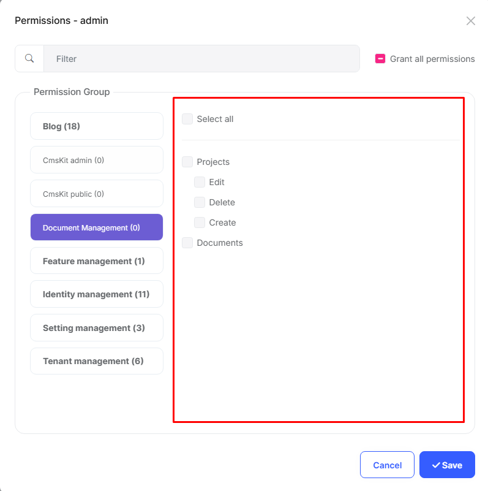

# Installation Notes for Docs Module

The ABP Docs module provides a complete documentation system for ABP applications. It allows you to create, manage, and publish documentation from various sources like GitHub, GitLab, or local file system. The module includes both a public interface for readers and an admin interface for documentation management.

Key features of the Docs module:
- Multiple documentation projects support
- Version control integration
- Markdown support
- Navigation generation
- Full-text search
- Multi-language support
- Admin interface for documentation management

## Required Configurations

The Docs module requires **permission** settings to be configured after installation and database update.

### Update Database

The Docs module requires database migrations to be applied. Following installation, you must update the database to create the necessary tables.

### Permissions

Enable the following permissions for the roles that require access to the Docs module:

## Documentation

For detailed information and usage instructions, please visit the [Docs Module documentation](https://abp.io/docs/latest/Modules/Docs). 